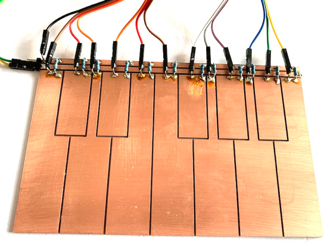
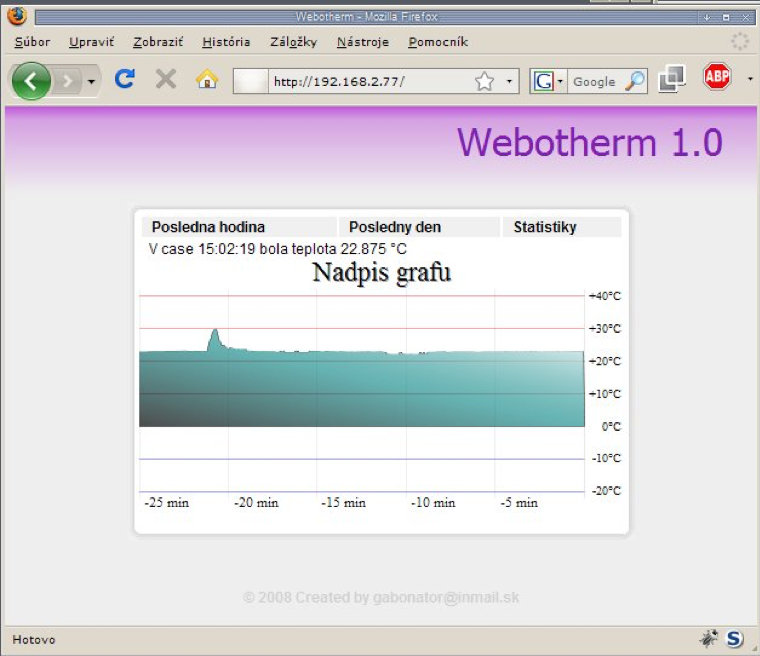
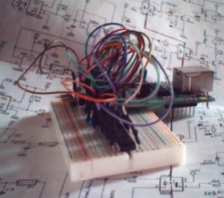
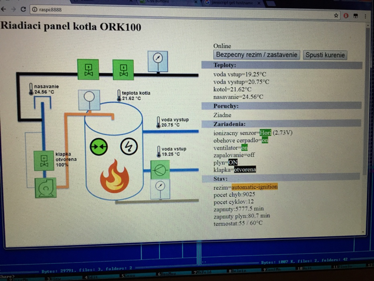
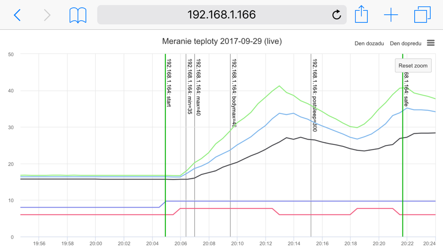
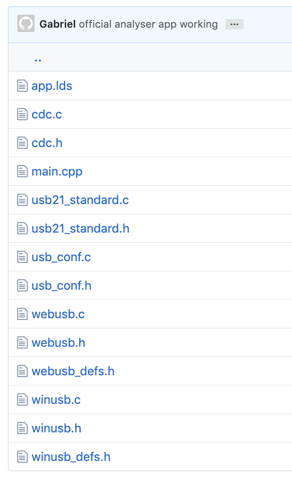
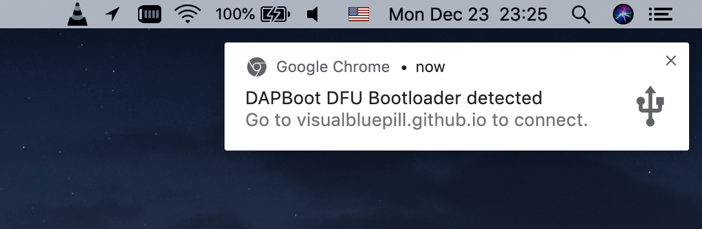
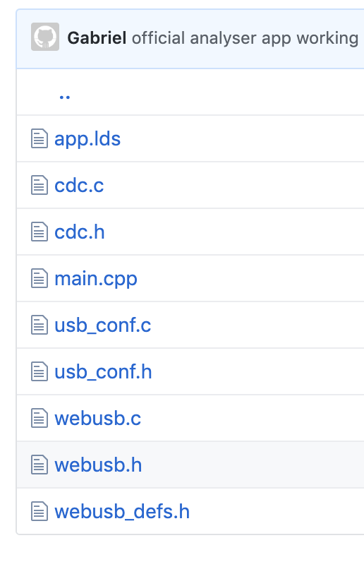
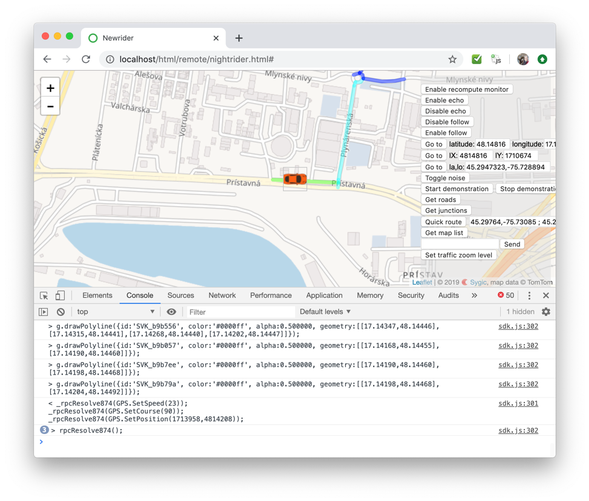

# WebUsb: Micro controllers and web browsers

## First steps

Few months ago I was leading an [Arduino workshop](https://github.com/gabonator/Education/tree/master/2019/MidiSynth) on how to create simple one octave synthesizer with capacitive touch sensing. The idea was simple, take arduino, attach it to a keyboard made from PCB and generate square signal for the piezo speaker when a key was touched. This looked too boring, with no option to produce polyphonic sounds. So, I was thinking I will ask the attendees to install some open source DAW software or software MIDI synthesizer. My colleague told me that there is no point in installing anything, because there are javascript based software synthesizers running right in the web browser. I was very curious about this idea, so I tried it. And it worked very well! And there was an idea in my head - if it is possible to communicate bidirectionally from the web site to the synthesizer connected with USB to the computer, why not to use this technology for some experiments and build a device that behaves as a fake USB MIDI peripheral, but instead of midi events, it will stream some simple commands or results of some measurement.



Usually when I wanted to build user interface for microcontroller project I always preferred combination of HTML&javascript over desktop applications. Of course, you need some technology to allow you to communicate with your microcontroller. In my case it was websocket connection using ser2net utility (serial port to websocket bridge). So, in the result you had your device (arduino or anything with serial port), USB to UART converter, ser2web service running in the background and your webpage. Later I switched to my own nodejs implementation of websocket to uart bridge which allowed me to take full control of enumeration of available ports and handle connection failures… But still this wasn’t very convenient method how to talk to your device from browser.

## But why?

Why would someone need to connect microcontroller to web browser? Because web browser offers you endless possibilities how to present your results in visually appealing way. And the development of web interface is much easier and faster than developing desktop application which does the same job. Imagine you are measuring temperature of multiple temperature probes and you want to display graph of temperatures for last 5 hours. How would you do that? Attach EEPROM memory or sdcard to Arduino and spend weeks by designing simple user interface shown on 128x128 pixel display controlled by four buttons? Or use WIFI enabled microcontroller such as ESP8266 or ESP32 and serve the webpage right from the MCU. Much better solution!

In the 2008 I made my first [web server](ext/webotherm_firmware/) based on Microchip PIC18F2685 running at 6 MHz and Microchip ENC28J60 ethernet controller and some EEPROM to store measured data. This device was able to generate very nice interactive antialiased graph of temperature. In that time there were many hardware engineers that believed microcontrollers should be programmed only in assembly, since they are very weak and slow (especially PIC microcontrollers with terrible instruction and weak support for programming in C). When you needed to generate a graph showing cpu/memory utilization you would usually use a linux tool called **gnuplot** which produced ugly graphs in form of GIF image.


[](ext/webotherm_mirror/)

So, what was the trick to generate nice antialiased graph with gradients? The answer is called SVG. SVG is an XML based image format which can be written by hand, or easily generated by software. It supports drawing antialiased lines, polygons, gradients, fonts. Anything. So, my webserver had some template which served (html files, images, stylesheet, SVG file) and specific parts of the SVG file were replaced dynamically with the list of measured values in a form that [SVG renderer could understand](ext/webotherm_mirror/table1.svg). Short javascript code refreshed the embedded chart every minute and temperature value in 5 second intervals by reloading hidden iframe which passed the measurement value to parent window. Whole project was built on a bread board, but worked well:



## How far can we go?

Here is a [control system](https://github.com/gabonator/Projects/tree/master/Ork100Firmware) for 100kW turbo gas boiler. It controls the gas valves, spark generator and fan while checking temperatures, water pump, safety pressure sensors, ionization sensor (to monitor the flame in combustion chamber)... For this automation project I decided to use Arduino Uno which is based on ATMega328 8bit microcontroller. Arduino handles all critical tasks, timing and safety checks. It can be controlled with a single button to turn the boiler on or off at the boiler's control panel. The Arduino has Bluetooth module attached to the UART which reports the system state in regular intervals in form of a json string, and also it serverd as a remote control and configuration interface. In another room, there is Raspberry pi hosting simple user interface and talking wirelessly to the boiler and logging everything boiler reports:





> By taking advantage of HTML as presentation layer or graphical user interface, we achieve broad compatibility with computers, mobile phones and tablets completely independent on the operating system. Designing user interfaces in HTML is much faster than in any other language. 
> Websockets seemed as perfect solution for quick bidirectional communication between web and any service or peripheral. With the help of ser2net or another websocket to serial port bridge utility we can talk to any hardware which exposes serial port to the operating system.

## WebUsb

WebUsb allows you to take advantage of the USB devices in the web browser without writing native drivers. This technology allows the web to enumerate USB devices, and to communicate with them. But there is a catch - your microcontroller needs to advertise this ability by adding specific descriptor in its USB implementation. See the [arduino WebUSB](https://github.com/webusb/arduino/blob/gh-pages/library/WebUSB/WebUSB.cpp) implementation for reference 

### First experiments

For my initial experiments, I took the [STM32 blue pill web usb implementation](https://medium.com/@ly.lee/stm32-blue-pill-usb-bootloader-how-i-fixed-the-usb-storage-serial-dfu-and-webusb-interfaces-36d7fe245b5c) by Lup Yuen Lee which was based on work by [Michal Moskal and Devan Lai](https://github.com/mmoskal/uf2-stm32f103) and [Trezor developers](https://github.com/trezor/trezor-mcu). The web interface for uploading new firmware to STM32 can be found [here](https://devanlai.github.io/webdfu/dfu-util/).

I was curious if this code could be ported to my simple [operating system for LA104](https://github.com/gabonator/LA104) based on STM32F103. So I took all the necessary files from this [repository](https://github.com/lupyuen/bluepill-bootloader/tree/master/src), removed the startup code and flashing related stuff and this is what [I have got](https://github.com/gabonator/LA104/tree/master/system/apps_usb/test67_webusb/source):



Main function in bluepill bootloader just configured the hardware and in an endless loop it was polling and handling USB requests. In my case I moved the polling function into the interrupt handler USB_LP_CAN_RX0_IRQ

```c
usbd_dev = usb_setup();

BIOS::OS::SetInterruptVector(BIOS::OS::IUSB_LP_CAN_RX0_IRQ, []() {
  usbd_poll(usbd_dev);
});
```

After reconnecting the USB cable, a chrome popup window appeared on the screen:


Device identification can be easily changed in source code:
```c
static const char* origin_url = "visualbluepill.github.io";

static char serial_number[USB_SERIAL_NUM_LENGTH+1];

static const char *usb_strings[] = {
    "Devanarchy",              //  USB Manufacturer
    "DAPBoot DFU Bootloader",  //  USB Product
    serial_number,             //  Serial number
    //"Blue Pill DFU",         //  DFU
    "DAPBoot DFU",             //  DFU
    "Blue Pill MSC",           //  MSC
    "Blue Pill Serial Port",   //  Serial Port
    "Blue Pill COMM",          //  COMM
    "Blue Pill DATA",          //  DATA
};

#define MSC_VENDOR_ID "BluePill"  //  Max 8 chars
#define MSC_PRODUCT_ID "UF2 Bootloader"  //  Max 16 chars
#define MSC_PRODUCT_REVISION_LEVEL "2.1"  //  Max 4 chars
#define USB_CLASS_MISCELLANEOUS 0xef  //  Copy from microbit.
```

Now I just wanted to try if I am able to transfer some messages from browser into the device and back. As a reference I took this code [WebUSB-LED](https://github.com/maarten-pennings/WebUSB-LED) for arduino Pro Micro for remote controlling a LED diode. The serial.js responsible for transferring data through webusb was taken from [this repository](https://github.com/webusb/arduino/blob/gh-pages/demos/serial.js), where the communication endpoints and device is automatically identified instead of hardcoded interface and endpoint numbers.

## Single file implementation

For me it seemed that the webusb support code for microcontroller was still too complex and I wanted to reduce it into minimum working solution. After removing support for WinUSB and USB21_standard I reduced the number of files into 7, but still it was depending on libopencm3 library (29 files). [Here is the result](https://github.com/gabonator/LA104/tree/master/system/apps_usb/test67_webusb/source_minimal)



WebUsb is a powerful technology and I planned to use it more extensively in the future, so I wanted to merge all the source files into one single file and get rid of the libopencm3 library. By including one header and adding one source code to the codebase of any project, you would get webusb support. Here is the [single file implementation](https://github.com/gabonator/LA104/tree/master/system/apps_usb/test67_webusb/source_single)

Later I decided to isolate the libopencm3 source codes from the webusb implementation, so it would be easier to apply some fixes and changes to the webusb code and configuration. Scripts for automatic code generation [are here](https://github.com/gabonator/LA104/tree/master/system/apps_usb/test67_webusb/joiner), sample program echoing all received data back to the browser is [here](https://github.com/gabonator/LA104/tree/master/system/apps_usb/test67_webusb/source_single2) with the web code [here](https://github.com/gabonator/LA104/tree/master/system/apps_usb/test67_webusb/web). **Most recent version recommended for production** with CDC synchronization fixes is [here](https://github.com/gabonator/LA104/tree/master/system/apps/test70_webusb/source/webusb). 


The minimal code to use this is following:
```c
#include "webusb/webusb.h"

int main(void)
{
  static usbd_device* usbd_dev = nullptr;
  usbd_dev = usb_setup();

  cdc_set_receive_callback([](uint8_t* buf, int len)
  {
    cdc_transmit(buf, len); // echo back
  });
  
  BIOS::OS::SetInterruptVector(BIOS::OS::IUSB_LP_CAN_RX0_IRQ, []() {
    usbd_poll(usbd_dev);
  });

  BIOS::KEY::EKey key;
  while ((key = BIOS::KEY::GetKey()) != BIOS::KEY::Escape)
  {
    EVERY(1000)
    {
      static int counter = 0;
      char msg[32];
      sprintf(msg, "Ahoj-%d, ", counter++);
      cdc_transmit((uint8_t*)msg, strlen(msg));
    }
  }
  return 0;
}
```

I noticed following issues:
- if the web address in the notification is not secure (https), you won't get any notification
- The web needs to be running from web server (local or remote), just by opening HTML from local disk won't give you access to the webusb api. I am using node/http-server for hosting these files locally

> By using webusb technology, our microcontroller can bidirectionally talk to web browser. After attaching the device to the USB, chrome automatically displays notification on screen which opens our web application. Provided implementation in 4 files allows easy integration of webusb technology into any STM32F103 based project.

## Remote procedure call

How to effectively use this technology to remotely control operating system running on LA104? Lets define two goals:
1. Expose all OS methods in the to the browser,
2. Human readable protocol to speed up fixing possible communication issues.

### Reverse polish notation evaluator

I already had some experience in remote controlling software by web browser. In Sygic I developed simple solution which allowed the tester to remotely control the car navigation software, e.g. by simulating the GPS coordinates by a keyboard controlled car running on google maps. For this purpose, the application creates two servers: One for serving the web page and scripts and the second for websocket connection. The commands sent from browser to the application were in C-like syntax and the application evaluates these calls using RPN evaluator and returns back the result. All received commands in opposite direction are evaluated in javascript using setTimeout function and allowed the application to draw road geometry or labels on map for debugging purposes.




Simplified code for RPN evaluator for microcontroller use (no dynamic allocations) can be found [here](https://github.com/gabonator/DS203/blob/master/Source/Framework/Eval.h) and integration with existing methods can be seen [here](https://github.com/gabonator/DS203/blob/master/Source/Core/Sdk.h):
```c
static const CEvalToken* getOperators()
{
  static const CEvalToken myTokens[] =
  {
    { "ADC::Count", CEvalToken::PrecedenceFunc, _ADC_Count },
    { "ADC::Get", CEvalToken::PrecedenceFunc, _ADC_Get },
    { "CH1::Coupling", CEvalToken::PrecedenceVar, _CH1_Coupling },
    { "CH1::Offset", CEvalToken::PrecedenceVar, _CH1_Offset },
    { "CH1::Resolution", CEvalToken::PrecedenceVar, _CH1_Resolution },
    { "CH1::Color", CEvalToken::PrecedenceVar, _CH1_Color },
```

This approach requires to create a list of methods and stub function for each method which takes the arguments, verifies the types and passes them to the underlying method:

```c
static CEvalOperand _Sleep( CArray<CEvalOperand>& arrOperands )
{
	_SAFE( arrOperands.GetSize() == 1 );
	_SAFE( arrOperands[-1].Is( CEvalOperand::eoInteger ) );

	BIOS::SYS::DelayMs( arrOperands.RemoveLast().GetInteger() );

	return CEvalOperand(CEvalOperand::eoNone);
}

static CEvalOperand _Update( CArray<CEvalOperand>& arrOperands )
{
	MainWnd.WindowMessage( CWnd::WmPaint );
	return CEvalOperand(CEvalOperand::eoNone);
}
```

### Function name resolving

For calling the functions remotely, we need following:
1. Match the function name with its memory address,
2. Call the function with proper arguments placed on stack

The LA104 OS already has [method for matching function name](https://github.com/gabonator/LA104/blob/master/system/os_host/source/main/Shared.h) in form of string into memory address where the function is placed. This method is used during loading ELF images. After flashing the program into ROM/RAM, imported functions are resolved into their real addresses.

When an application imports function ```BIOS::LCD::PutPixel(int x, int y, uint16_t color)``` from library, the import entry is named **_ZN4BIOS3LCD8PutPixelEiit**, this name fully conforms to C identifier rules and we call this C++ name mangling. The last letters of the mangled name define the argument types - int, int, uint16_t. Note that the return type is not specified. Other examples of mangled names:
  - **_ZN4BIOS3LCD8PutPixelEiit** -> void BIOS::LCD::PutPixel(int x, int y, uint16_t color)
  - **_ZN4BIOS3KEY6GetKeyEv** -> BIOS::KEY::EKey BIOS::KEY::GetKey() 
  - **_ZN4BIOS3LCD3BarERK5CRectt** -> void BIOS::LCD::Bar(CRect const&, uint16_t)
  - **_ZN4BIOS3DBG5PrintEPKcz** -> int BIOS::DBG::Print(char*, ...)

### Foreign function call

We have the address of function, we know the arguments we need to pass to it. We could place the arguments on stack and jump to the address obtained in previous step. I have found this library [libffi](https://github.com/libffi/libffi) which solves this problem. But after researching it I have found out, that it requires assembly code and is too complex considering the problem I was solving.

Looking at the declarations of methods I wanted to expose to the RPC interface, I realized that there are not so many different combinations of arguments. And we can exploit the specifics of C++ compiler and calling convetion it is using when passing arguments to the functions - all integral types (```uint8_t```, ```int8_t```, ```uint16_t```, ```int16_t```, ```uint32_t```, ```int32_t```) are converted into native integers ```uint32_t```, and since we are working on 32 bit architecture, all pointers are integers as well regardless of the type/structure they are pointing to. The only special types we need to deal with is our own structure ```CRect``` (four integers), floats and strings. This significantly reduces the number of calling interface variations. Instead of parsing the argument list of the mangled C++ function name I decided to determine the argument signature by scanning the command received by RPC evaluator from javascript. And in future this allows us to use shorter - more natural C++ method names instead of mangled ones. Lets take following example:

```c
BIOS::LCD::Print(20, 30, 0xffff, 0x0000, "Hello!")
```

This string is received through webusb serial port endpoint. The function name is easily isolated from the string **BIOS::LCD::Print**, now we have argument list **20, 30, 0xffff, 0x0000, "Hello"**, first four arguments are integers, and the last one is string. The real declaration of **BIOS::LCD::Print** functions is following:

```
int Print (int x, int y, unsigned short clrf, unsigned short clrb, char* str);
```

We will call it with a bit different calling interface - as if it's declaration was ```int(int, int, int, int, char*) ```, parsing the argument types and calling the function with suitable interface is done in [evaluator.h](https://github.com/gabonator/LA104/blob/master/system/apps/test70_webusb/source/evaluator.h#L90):

```c
if (strcmp(argInterface, "iiiis") == 0)
{
  int a = TakeInt(args); 
  int b = TakeInt(args); 
  int c = TakeInt(args); 
  int d = TakeInt(args); 
  char* e = TakeString(args);
  return ((int(*)(int, int, int, int, char*))(function))(a, b, c, d, e);
}
```

But what about the last string argument? Where is it placed in memory? Don't forget we have received the whole string from CDC endpoint as array of chars, so for the last argument we just use the address of the first letter of the string "Hello!" and the trailing quotation mark will be replaced with zero to build a zero terminated string.

So, it is safe to call a function with different argument list as it was declared? Yes, it is perfectly safe in this case. You can even cast a void returning function into integer returning one, but you will just receive some random numbers. In our case the calling interface is not verified at all in RPC or FFC evaluator and completely relies on the commands formed on javascript side.

### Data transfers

We can now call exported methods from OS remotely, and we can even pass some strings to it. We are limited by the size of the endpoint buffer, which is 64 bytes. My first experiment with data transfers from web browser into LA104 was an application for controlling addressable LEDs. Javascript created data buffer and this buffer was fed through SPI peripheral into network of 24x WS2812 LEDs. Every led has 3 color channels, and every channel is coded by 3 bytes to simulate the WS2812 protocol with SPI data stream. There is also one leading and one trailing byte. So, the total number of bytes to transfer was 218 bytes. Using the human readable encoding, every byte is encoded as two hexadecimal characters, so we need to transfer 436 bytes to update whole network of LEDs.

For the purpose of storing arbitrary data in memory of the LA104, I defined following methods:

- uint32_t RPC::GetBufferPtr() - returns the address of 2KB helper buffer

- void RPC::MemoryWrite(uin32_t address, char* hexstream) - places the hexadecimal values in a string of flexible length starting at the location "address".

So the 218 byte transfer could be split into several calls of RPC::MemoryWrite(...) and when the buffer is ready to transfer, I just called SPI::Transfer(0x????????, 218) with the address I got after calling RPC::GetBuffePtr()

Javascript code looks [like this](https://github.com/gabonator/LA104/blob/master/system/apps_experiments/test68_webusb/web/WebUSB-LED.js):

```javascript
function biosMemGetBufferPtr()
{
  return rpcCall('RPC::GetBufferPtr();')
   .then( json => safeeval(json).ret );
}

function biosMemWrite(addr, data)
{
  return rpcCall('RPC::MemoryWrite(0x'+addr.toString(16)+', "'+data.map(i => ("0"+i.toString(16)).substr(-2) ).join("")+'");');
}

function biosMemBulk(addr, data)
{
  var bulkLen = 40;
  if (data.length < bulkLen)
    return biosMemWrite(addr, data);
  else
  {
    var section = data.splice(0, bulkLen);
    return biosMemWrite(addr, section)
      .then( () => biosMemBulk(addr + section.length, data));
  }
}

function updateLEDs(total)
{
  return biosMemGetBufferPtr()
    .then( ptr => bufferptr = ptr)
    .then( ()=>biosSpiBegin(0) );
    .then( ()=>biosMemBulk(bufferptr, total) )
    .then( ()=>biosSpiWrite(bufferptr, total.length) )
}
```

### Fast data transfers

At this point I decided to move to STM32F103 based oscilloscope DS203 and try to evaluate how fast the data transfer could be. DS203 is oscilloscope with FPGA which stores 4096 samples from AD converter. Every sample consists of three bytes, so we need to transfer 12kB of data to show whole captured signal. For oscilloscopes, the high refresh rate is crucial. I wanted to fully utilize the endpoint size, but transfer of 64 byte blocks caused some problems so I [reduced the size of transferred data](https://github.com/gabonator/LA104/blob/master/system/apps_ds213/69_webusbosc/source/adc.h#L9)
 to 60 bytes. Corresponding javascript code that parses this stream is [here](https://github.com/gabonator/LA104/blob/master/system/apps_ds213/69_webusbosc/web/bios.js#L50)

I am not transferring whole waveform, but only the visible part (about 1000 points), when the user is scrolling through the signal, missing parts are automatically downloaded very quickly (as can be seen in video below).

To achieve high transfer rates, you should request next transfer immediately right after the buffer was transferred into browser in [serial.js](https://github.com/gabonator/LA104/blob/master/system/apps_ds213/69_webusbosc/web/serial.js#L26). If the transfer speed is not critical, you can schedule new transfer using setTimeout with zero value. I used the timeout to prevent  too deep stack traces, but later I realized it is the only way how to achieve very high transfer rates.

```javascript
let readLoop = () => {
  this.device_.transferIn(this.endpointIn_, 64).then(result => {
    this.onReceive(result.data);
    if (this.ilovebill)
      setTimeout(readLoop, 0);
    else
      readLoop();
    }, error => {
      this.onReceiveError(error);
    });
};
```

See it in action (video):

[](https://www.youtube.com/watch?v=aghTg4Pggv4 "WebUsb Oscilloscope")

### Binary data transfers

This time I abandoned the idea of having fully human readable protocol. When needed, the device will transfer raw binary buffers to achieve even higher transfer rates (2x faster than hex encoded buffers). I have used the binary transfer in application for LA104 analyzer which shows the logic levels of input channels in real time. The code which creates the binary buffer is [here](https://github.com/gabonator/LA104/blob/master/system/apps/test70_webusb/source/analyser.h#L202):

```c
int Get()
{
    uint32_t buf[14];

    for (int i=0; i<14; i++)
      buf[i] = FPGA_RW_4Byte(MEM_READ, 3, 0);

    TERMINAL::Write((uint8_t*)buf, sizeof(buf));
    return 0;
}
```
and javascript counterpart [here](https://github.com/gabonator/LA104/blob/master/system/apps/test70_webusb/web/bios.js#L5):
```javascript
var ANAL = {
  Configure: () => BIOS.rpcCall("ANAL::Configure();"),
  Restart: () => BIOS.rpcCall("ANAL::Restart();"),
  Status: () => BIOS.rpcCall("ANAL::Status();").then( json => BIOS.retval(json) ),
  Get: () => BIOS.rpcCallBinary("ANAL::Get();").then( (data) => new Promise((resolve, reject) =>
  { 
    var arr = [];
    for (var i=0; i<data.byteLength; i+=4)
    {
      // ....  ....  .... ....  .... ....  .... ....
      // LOGIC =============time=========  --STATUS-
      var code = data.getUint32(i, true);
      var record = { 
        ch:[(code>>28)&1, (code>>29)&1, (code>>30)&1, (code>>31)&1],
        t: (code>>8)&(0xfffff),
        s: code & 0xff
      };
      arr.push(record);
    }
    COMM.onReceive = () => {COMM.onReceive = null; resolve(arr);}; 
  }) ),
};
```

## Conclusion
                                                                                                                                                                                                  
There is a big trend of moving desktop application into the world of web. For example Google Docs or Microsoft Office live. You can be editing your document and won't notice that you are working in a web browser. It also offers many benefits - your documents are safely stored on cloud and open for collaboration with your frends. Same shift can be seen also in other kinds of software. Consider how many (engineering or work related) applications do you have installed on your computer? How many it was 10 years ago? Many of those applications you were using were replaced with online counterparts. Special software communicating with proprietary hardware was one of the exceptions - it was not feasible to develop laboratory/scientific/engineering tools working with USB or other peripherals in HTML. There were always more suitable technologies available for this purpose like .NET / C# or java desktop applications. All of those have one big disadvantage - the vendor must provide these programs for the customers, most times they provide apps only for Windows platform. With WebUsb technology this problem is solved in very clever way - the vendor does not need to provide anything, their device will have the web address with online application incorporated in the firmware and the only thing the customer needs is a recent version of Chrome and internet connectivity. Update of the application could be done without the cooperation with the customer. Moving from desktop applications to the web simply seems inevitable in all aspects of computing.
