## Arduino

1. Schema Arduino Uno R3 a datasheety
   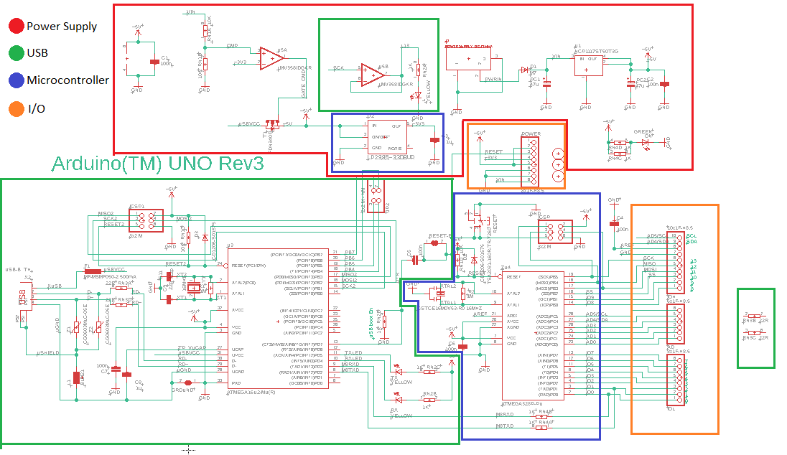
   - Datasheet [ATtiny84](https://www.microchip.com/wwwproducts/en/ATTINY84A)
   - Datasheet [ATmega328p](https://www.microchip.com/wwwproducts/en/ATmega328p)
2. Bootloader
3. Pinout ATTiny84
   

## Navrh plosneho spoja

1. Stiahnut eagle schemu s komponentami [hviezda_base.sch](eagle/hviezda_base.sch)
2. Pospajat podla navodu 

   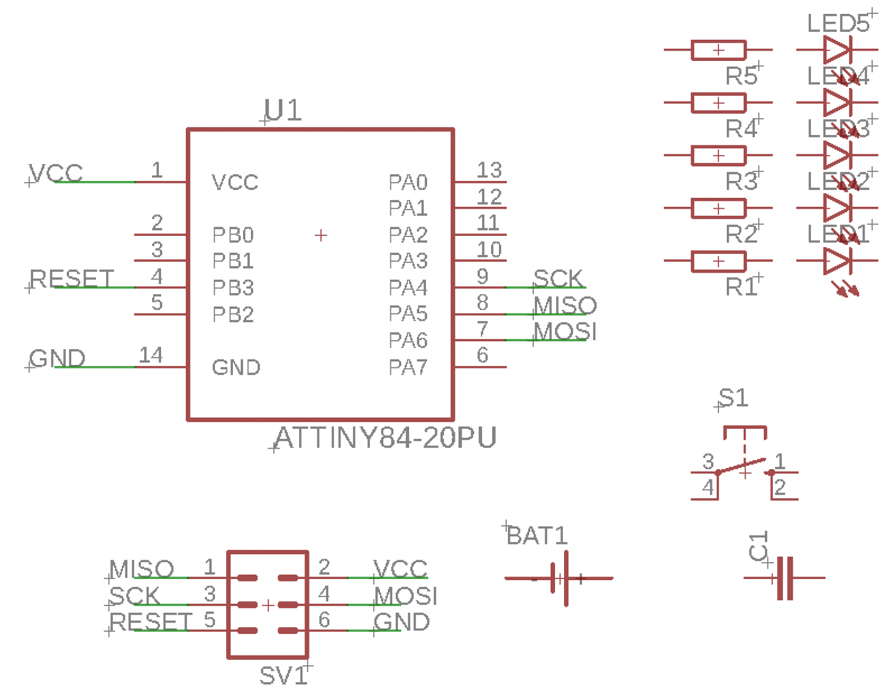
   - 5x LED dioda s predradnym rezistorom
   - spinac, bateria, kondenzator, ICSP konektor
   - Ledky
     - 10 – R1 – LED1 - GND
     - 11 – R2 – LED2 – GND
     - 12 – R3 – LED3 – GND
     - 13 – R4 – LED4 – GND
     - 5 – R5 – LED5 – GND
   - Ostatne 
     - 2 – S1 – GND
     - GND – BAT1 – VDD
     - GND – C1 – VDD
   - ICSP konektor
     - ICSP MISO – 8
     - ICSP VCC – VCC
     - ICSP SCK – 9
     - ICSP MOSI – 7
     - ICSP RESET – 4
     - ICSP GND - GND

3. Prepnut do pohladu na dosku (BRD/SCH)
4. Pouzit vygenerovanu geometriu pre hviezdu [star.js](res/star.js)
   - Layer: 16 bottom, Wire bend straight, Width 20
   - ```
     WIRE (1650 550) (2708 -7) (2505 1171) (3361 2006) (2179 2178) (1650 3250) (1120 2178) (-62 2006) (794 1171) (591 -7) (1649 550)
     CIRCLE (2409 393) (2419 403); CIRCLE (2881 1846) (2891 1856); CIRCLE (1645 2745) (1655 2755); CIRCLE (408 1846) (418 1856); CIRCLE (880 393) (890 403)
     ```
5. Umiestnit komponenty
6. Pospajat
7. Vygenerovat G-kod
8. Pozriet v [ncviewer.com](https://ncviewer.com)
   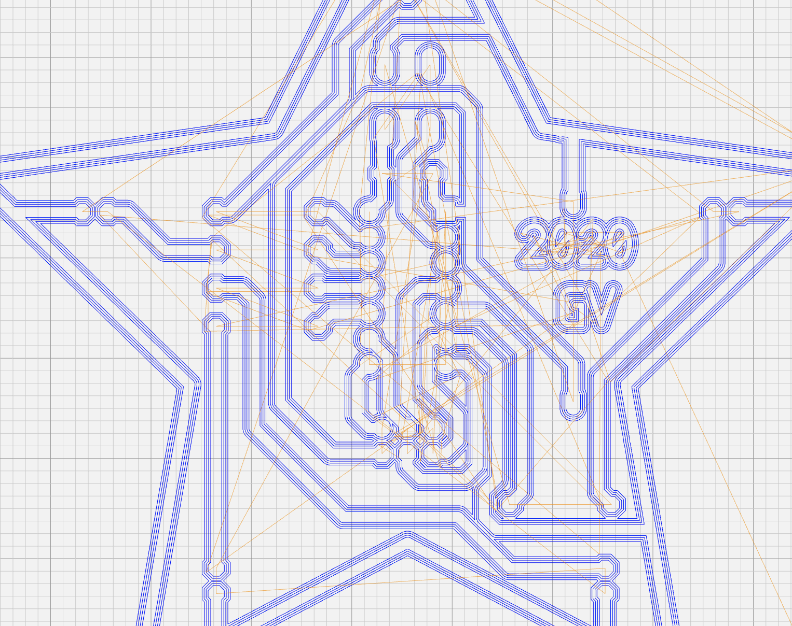
   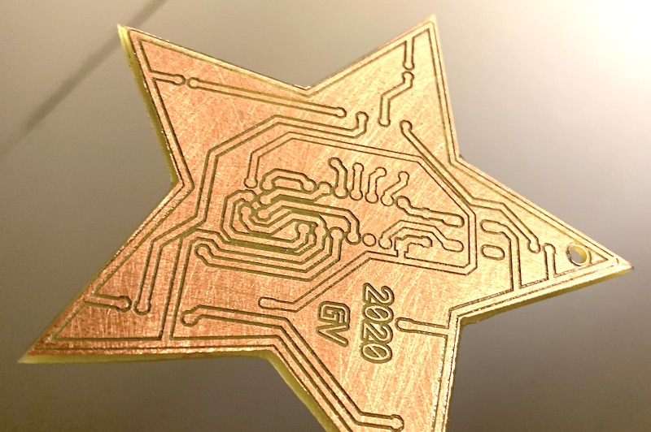

Materialy a riesenie:
  - Schema s komponentami: [hviezda_base.sch](eagle/hviezda_base.sch)
  - Doska s komponentami: [hviezda_base.brd](eagle/hviezda_base.brd)
  - Skript na generovanie hviezdicoveho polygonu: [star.js](res/star.js)
  - Schema riesenie: [hviezda.sch](eagle/hviezda.sch)
  - Doska riesenie: [hviezda.brd](eagle/hviezda.brd)
  - Gcode: [hviezda.bot.etch.tap](eagle/hviezda.bot.etch.tap)

## Osadenie plosneho spoja

1. Podla osadzovacieho planu a schemy osadit dosku
   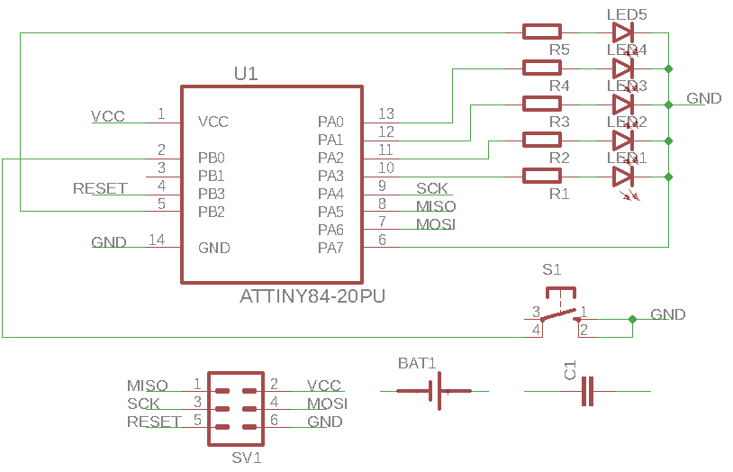
   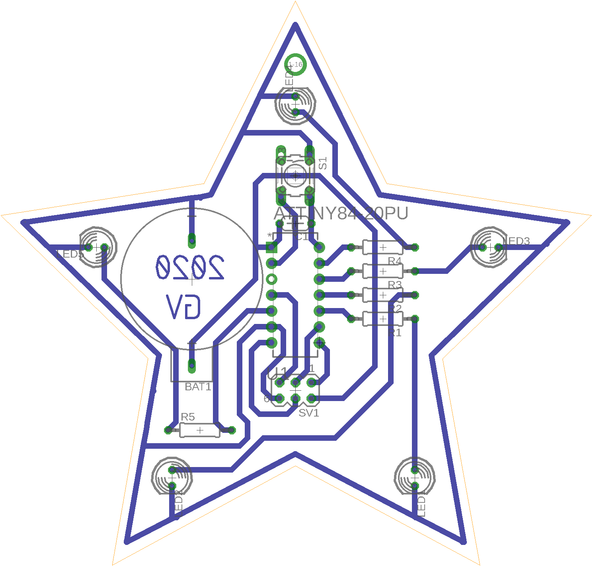
2. Zletovat bez cipu
3. Skontrolovat ci idu LED diody
4. Naletovat cip, pozor na pin 1
   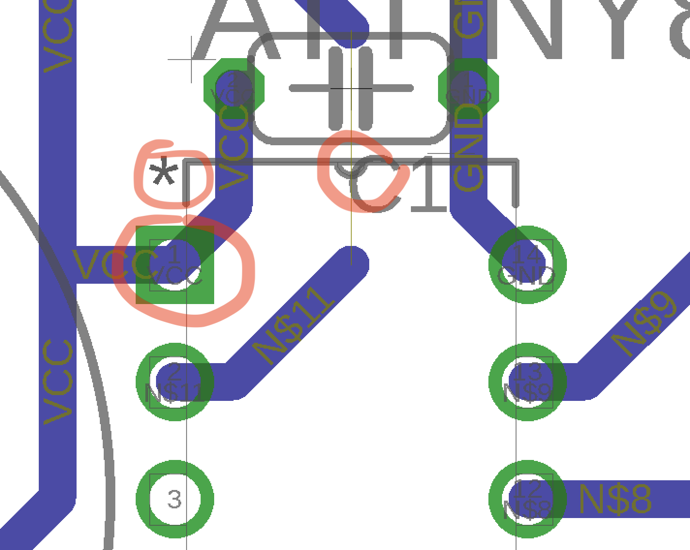
   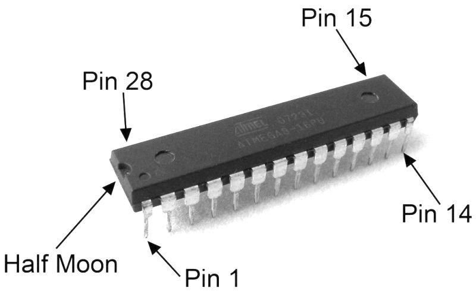

## Ozivenie - programovanie ATTiny84 s AVRISP

0. Potrebujeme
  - Arduino Uno, Nano, alebo iny variant
  - Hviezdicku s ICSP konektorom
  - Prepajacie kable
   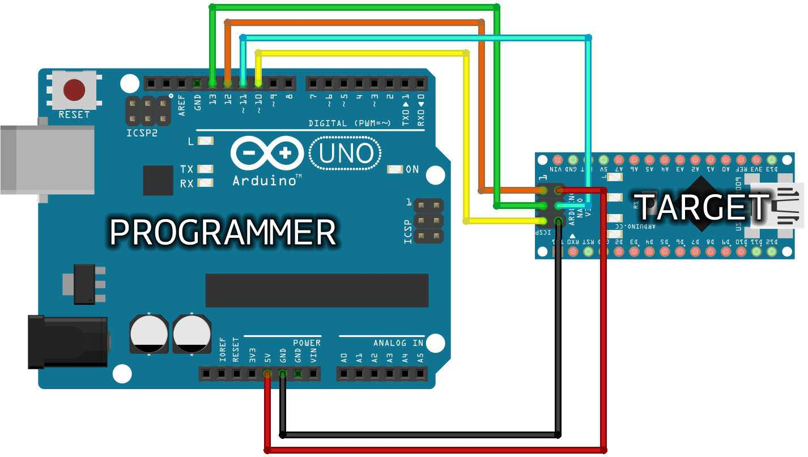

1. Vyskusat blink
  - File -> Examples -> 01. Basics -> Blink
  - Tools -> Board -> Arduino Uno 
    - (alebo v pripade Arduino Nano) 
    - Tools -> Board -> Arduino Nano
    - Processor -> ATmega328p (Old Bootloader)
  - Tools -> Port -> Nastavit port
  - Upload

2. Programator
  - File -> Examples -> 11. Arduino ISP -> Arduino ISP
  - Upload

3. Instalacia podpory pre ATTiny84
  - Arduino Preferences:
  - Do Additional Boards Manager URLs pridame:
  - https://raw.githubusercontent.com/damellis/attiny/ide-1.6.x-boards-manager/package_damellis_attiny_index.json
    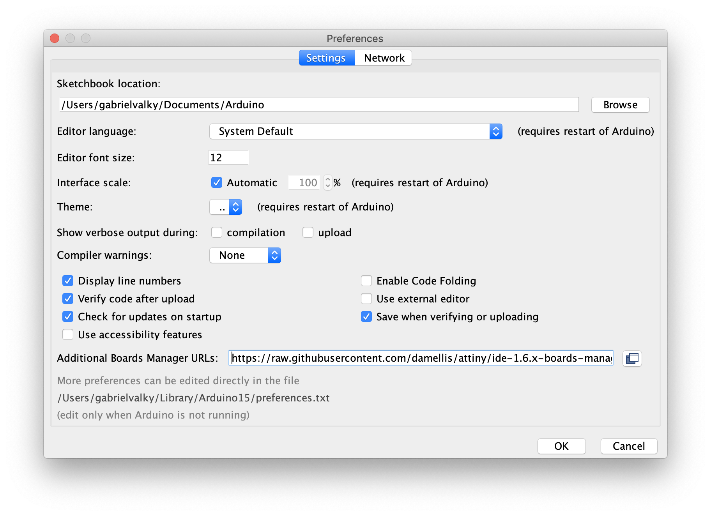

  - Tools -> Board -> Boards manager
  - Vyhladat "attiny"
    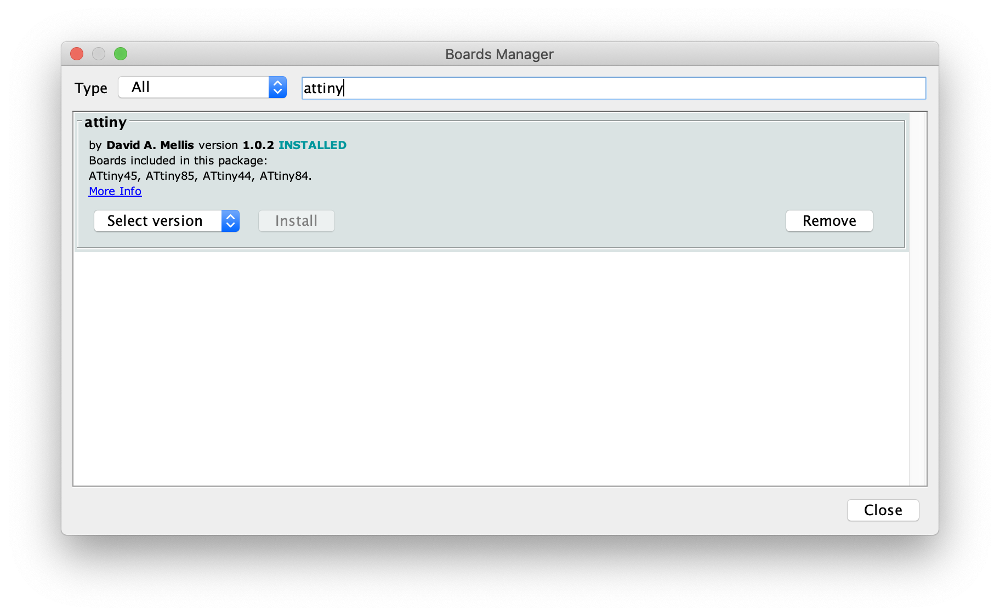

4. Programovanie cez Arduino ISP
  - Port
  - File -> Examples -> 11. Arduino ISP -> Arduino ISP
  - Pripojit arduino ku hviezdicke
   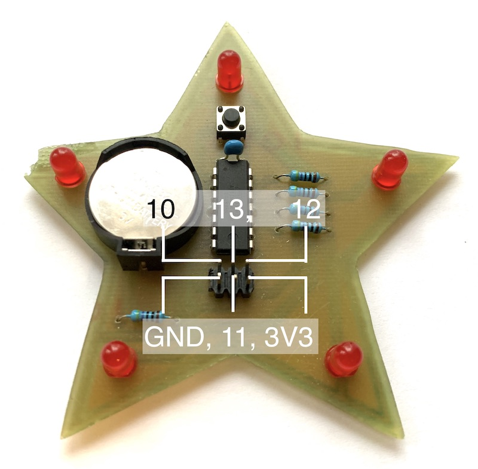
   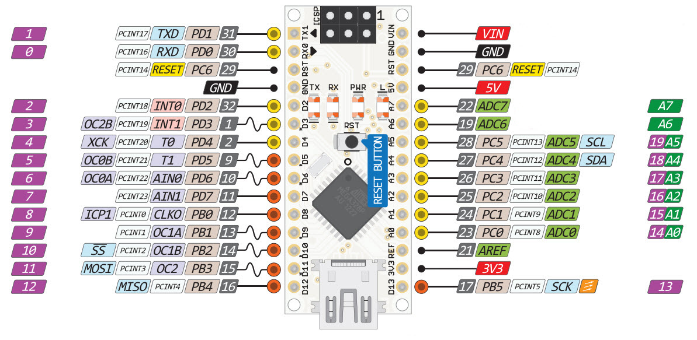
  - Tools -> Programmer -> Arduino as ISP
  - Tools -> Board -> ATtiny24/44/84
  - Processor -> ATtiny84
  - Clock -> Internal 1 MHz
  - V pripade Arduino Nano treba po naprogramovani ArduinoIsp progarmu pripojit ku RST-GND kondenzator 1uF - 10uF, tento potlaci resetovaci signal pri otvarani portu. Arduino sa totiz po otvoreni portu hned resetne a prikazy z programatora avrdude sa dostavaju do bootloadera namiesto do ArduinoIsp [autoreset problem](https://forum.arduino.cc/index.php?topic=91767.msg689235#msg689235)

5. Vyskusat blink na hviezdicke
  - File -> Examples -> 01. Basics -> Blink
  - prepisat cislo pinu na 0
  - Upload
  - [riesenie](arduino/p0.ino)

```C
// the setup function runs once when you press reset or power the board
void setup() {
  // initialize digital pin 0 as an output.
  pinMode(0, OUTPUT);
}

// the loop function runs over and over again forever
void loop() {
  digitalWrite(0, HIGH);   // turn the LED on (HIGH is the voltage level)
  delay(1000);             // wait for a second
  digitalWrite(0, LOW);    // turn the LED off by making the voltage LOW
  delay(1000);             // wait for a second
}
```

## Programujeme

1. Rozsvietit postupne kazdu led diodu v poradi do kruhu
  - definicia pinov nam pomoze pri praci, namiesto ```digitalWrite(8, HIGH);``` mozeme napisat ```digitalWrite(LED5, HIGH);```
```C
enum {LED1 = 0, LED2 = 1, LED3 = 3, LED4 = 2, LED5 = 8, SWITCH = 10};
```
  - [zaklad](arduino/p1a.ino)
  - [riesenie](arduino/p1b.ino)

2. Spustit animaciu 10x po stlaceni tlacidla, pouzit prikaz for, alebo while
  - [zaklad](arduino/p2a.ino)
  - [riesenie](arduino/p2b.ino)

3. Rozsvietit na kratku dobu vsetky ledky naraz
  - [zaklad](arduino/p3a.ino)
  - [riesenie](arduino/p3b.ino)

4. Spinac - rozsvietit hornu LED ked je stlaceny prepinac - prepojit digitalWrite s digitalRead
  - [zaklad](arduino/p4a.ino)
  - [riesenie](arduino/p4b.ino)
  - Toggle - stlacenim vsetky rozsvietit a dalsim stlacenim vypnut - zohladnit debouncing aj ked drzime tlacidlo stlacene
  - [zaklad](arduino/p4a.ino)
  - [riesenie](arduino/p4c.ino)

5. Soft pwm - zvysovat jas kazdej diody (pilovy signal), sledovat linearitu
  - [zaklad](arduino/p5a.ino)
  - [riesenie](arduino/p5b.ino)

6. Trojuholnikovy signal s jednou LED, v prvej faze inkrementujeme jas, po dosiahnuti maxima zacneme dekrementovat az po minimum
  - [zaklad](arduino/p6a.ino)
  - [riesenie](arduino/p6b.ino)

7. Trojuholnikovy signal s roznymi periodami pre kazdu LED, vyuzivame fixed point aritmetiku
  - [zaklad](arduino/p7a.ino)
  - [riesenie](arduino/p7b.ino)

8. Low power a Sleep mode - vypiname zbytocne periferie (ADC) a aktivujeme spankovy rezim. S multimetrom skontrolujeme spotrebu, v spanku by mala byt menej ako 0.1uA
  - Po stlaceni tlacidla prejst do sleep modu
  - [zaklad](arduino/p8a.ino)
  - [riesenie](arduino/p8b.ino)

```C
#include <avr/sleep.h>

void setupLowPower()
{
  #define BODS 7 //BOD Sleep bit in MCUCR
  #define BODSE 2 //BOD Sleep enable bit in MCUCR
  MCUCR |= _BV(BODS) | _BV(BODSE); //turn off the brown-out detector
  ADCSRA &= ~ bit(ADEN); // disable the ADC
  bitSet(PRR, PRADC); // power down the ADC
}

void sleep() 
{
    GIMSK |= _BV(PCIE1);                     // Enable Pin Change Interrupts
    PCMSK1 |= _BV(PCINT8);                   // Use PB3 as interrupt pin   
    set_sleep_mode(SLEEP_MODE_PWR_DOWN);    // replaces above statement
    sleep_enable();                         // Sets the Sleep Enable bit in the MCUCR Register (SE BIT)
    sei();                                  // Enable interrupts
    sleep_cpu();                            // sleep
    
    cli();                                  // Disable interrupts    
    PCMSK1 &= ~_BV(PCINT8);                  // Turn off PB3 as interrupt pin
    sleep_disable();                        // Clear SE bit
    sei();                                  // Enable interrupts
}

ISR(PCINT1_vect) 
{
}
```

9. Bonus: Koleso
  - Upravit program tak, aby sa pohyb zrychloval a potom spomaloval
  - [zaklad](arduino/p9.ino)

10. Finalny program - tento naprogramujeme na zaver, program kombinuje v sebe predosle algoritmy a s pomocou tlacidla ich vieme prepinat
  - [riesenie](arduino/final.ino)

## Finalizacia
- odpojenie od ICSP
- pripojenie baterie CR2032
- skontrolovat spotrebu
- Pozor! Nikdy nemat pripojenie ICSP a bateriu zaroven!
- Odhad vydrze zariadenia na jednu bateriu, [analyza](https://components101.com/batteries/cr2032-lithium-coin-cell-pinout-specs-equivalent-datasheet)
- 


## Problemy
- zdoraznit orientaciu led diod a odcitavanie znaciek z osadzovacieho planu
- ledky zasunut az na doraz
- vysvetlit ako sa pouzivaju pin headery (ktora strana ide do DPS)
- niektore pocitace maju problemy s driverom CH340 na cinskych arduinach, treba mat prichystane prave arduino ako zalohu
- na programovanie radsej pouzit arduino uno, ktory ma novy bootloader, ktory potlaca problem s autoresetom. Novy bootloader ked zisti ze dostava prikazy pre AVRISP, tak hned skonci
- pri letovani najprv naletovat rezistory, ledky (pozor na orientaciu), drziak baterie a pin header
  - skontrolovat multimetrom najprv skrat na baterii
  - skontrolovat dupont kablikom M-F napojenym na VCC (pravy spodny pin) ci sa rozsvietia diody po kontakte kabla s rezistorom
- letovanie zabralo extremne vela casu, treba sa pripravit na samostatnu pracu - ku uloham doplnit presnejsie zadanie
- davat pozor, aby nikto nemal zaroven zapojenu bateriu a ICSP kabel, kvoli bezpecnosti preto radsej napajame zariadenie z 3.3V namiesto 5V ako je na obrazku. Zaroven je 3.3V blizie ku napatiu baterie 3V, co znamena ze nam led diody budu svietit podobnou intenzitou pocas programovania ako aj pri napajani z baterie
- vzhladom na chybnu objednavku sme pouzili 330 Ohm rezistory namiesto 470 Ohm
- pouzite dosky neboli spravne osetrene lakom na DPS a neboli vyrobene podla generovaneho G-kodu, co malo za nasledok zuzenie cesticiek a prelievanie cinu pri letovani

## Casovanie
- zaciatok 17:40
- prezentacia koniec 17:10 (27 min)
- navrh plosneho spoja - schema koniec
- navrh plosneho spoja - doska rozmiestnene 17:42
- navrh plosneho spoja - doska koniec 17:59
- osadenie letovanie - rezistory koniec - 18:35
- osadenie letovanie koniec - individualne
- programator koniec - individualne
- podpora attiny84 koniec - individualne
- programovanie koniec - individualne

## Referencie
- https://learn.circuit.rocks/the-basic-arduino-schematic-diagram
- http://highlowtech.org/?p=1695
- https://components101.com/batteries/cr2032-lithium-coin-cell-pinout-specs-equivalent-datasheet
- https://www.dmcinfo.com/Portals/0/Blog%20Files/High%20pulse%20drain%20impact%20on%20CR2032%20coin%20cell%20battery%20capacity.pdf
