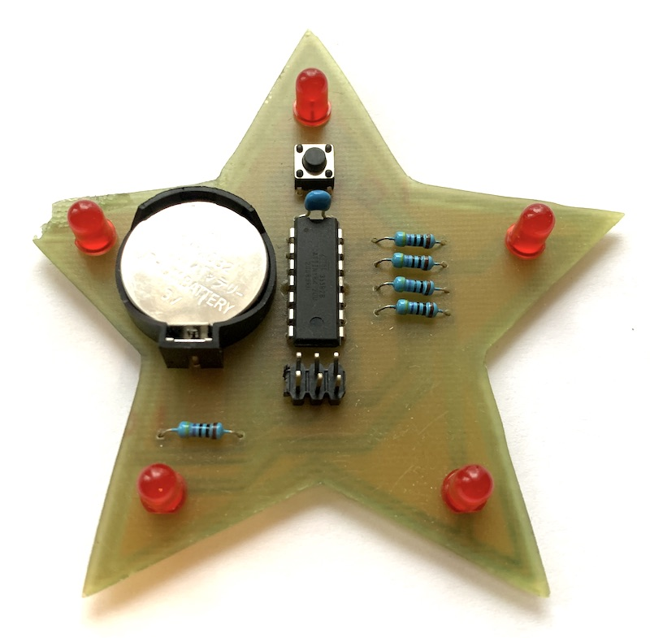

# Electro workshop 4 - Standalone doska

Minimalne zapojenie bateriou napajaneho mikrokontrolera atmel ATTiny84 s diodami a spinacom v tvare Vianocnej hviezdice. Jas diod je riadeny softarovou implementaciou modifikovaneho PWM algoritmu. Mikrokontroler programujeme s pomocou ICSP interfacu, na tento ucel mozeme pouzit vhodny programator alebo lubovolne ine arduino. Pozrieme sa na moznosti, ako predlzit zivotnost bateriou napajaneho zariadenia a ake komponenty vyzaduje mikrokontroler pre svoju prevadzku.

## Video

## Anotacia

Blížia sa Vianoce a Creative Point má pre Vás výnimočnú príležitosť vyrobiť si programovateľnú vianočnú ozdobu, v ktorej bude bežať Váš vlastný program. Navrhneme dosku plošného spoja s mikrokontrolérom ATTiny84, piatimi LED diódami a spínačom v programe Eagle. Celé zariadenie bude plniť funkciu blikajúcej dekoračnej ozdoby na vianočný stromček v tvare päťcípej hviezdy.

Dosku plošného spoja vyrobíme na CNC fréze metódou isolation milling, osadíme súčiastkami a zletujeme. Vysvetlíme si, ako prebieha programovanie prostredníctvom interfacu ICSP a ako použiť Arduino IDE priamo na programovanie mikrokontrolérov Atmel. Pozrieme sa na to, aké sú možnosti zníženia spotreby mikrokontroléra, aby nám batériou napájané zariadenie vydržalo čo najdlhšie.

Vysúšame si zopár jednoduchých animácií s reguláciou jasu LED diódy a na záver si vytvoríte vlastný program, kde tieto animácie skombinujete do výsledného programu v jazyku C, ktorý bude bežať vo Vašom výrobku.

Na workshop potrebujete:
Laptop a USB Mini kábel
Arduino IDE: https://www.arduino.cc/en/software
Autodesk Eagle: https://www.autodesk.com/products/eagle/free-download

## Beseda

Ak sa spomenie pojem Arduino, väčšina z vás si predstaví zelenú doštičku osadenú mikrokontrolérom Atmel s konektormi na pripojenie periférií a USB konektorom na programovanie. Kód, ktorý napíšeme v jazyku C sa po jednom kliknutí v prostredí Arduino IDE skompiluje do inštrukcií a napáli do procesora, ktorý ho bude potom vykonávať. 

Arduino je však prototypovacia platforma, ktorá slúži na jednoduché a rýchle otestovanie zapojenia. Ak by sme náš návrh chceli povýšiť do podoby finálneho zariadenia, je vhodne navrhnúť vlastnú dosku plošného spoja (DPS) s minimálnymi rozmermi a minimálnym počtom komponentov, aby sme znížili výrobné náklady. 

Dosku vyrobíme s využitím technológií, ktoré máme v Creative Pointe k dispozícii. Namiesto obľúbenej technológie výroby plošných spojov “foto cestou” ju vyrobíme na CNC fréze technikou “isolation milling”, kedy z medenej fólie na kuprextite odstránime časti, ktoré nepotrebujeme a ponecháme iba tie, ktoré budú viesť elektricky prúd. Výhodou takéhoto prístupu je rýchla výroba prototypu bez využitia chemikálií.

Ak aj takúto dosku vyrobíme a osadíme súčiastkami, zariadenie ešte nebude fungovať. Je potrebné vykonať ešte jeden dôležitý krok - nahrať firmware do mikrokontroléra. Pri platforme Arduino je to jednoduché - väčšina Arduino dosiek je vybavená konektorom USB na pripojenie počítača. Medzi mikrokontrolérom a USB konektorom je však ďalší komponent, tzv. USB transceiver, ktorý prevádza prijaté USB packety do signálov, ktorým mikrokontrolér rozumie. Ale aj to ho vopred musíme “naučiť”. Po zapnutí mikrokontroléra sa na niekoľko sekúnd aktivuje program, tzv. bootloader, ktorý čaká na signály z počítača a v prípade potreby je pripravený preprogramovať svoju pamäť. Ak sa nič nedeje, bootloader spustí program, ktorý sme tam predtým napálili.

Ak však vyrábame jednoduché jednoúčelové zariadenie, ktoré nebude potrebné preprogramovať, je zbytočné na neho montovať takýto port a ďalšie podporné elektronické komponenty. Každý programovateľný procesor je možné nejakým spôsobom preprogramovať, a každý z výrobcov používa buď vlastný interface a protokol, alebo sa v praxi zaužíval tzv. JTAG interface, ktorý popri programovaní poskytuje možnosť aj odlaďovať (debugovať) bežiaci program.

8 bitové procesory Atmel využívajú vlastný protokol nazvaný ICSP, tento sa na doskách Arduino nachádza v podobe 2x3 pinovej hlavičky. Tá okrem troch komunikačných signálov (clock, data in, data out) obsahuje resetovací signál, zem a napájanie.

V našom projekte využijeme 14 pinový čip ATTiny84, namiesto čipu ATMega328p, ktorý sa nachádza na doskách Arduino Uno R3, alebo Arduino Mini. V závislosti od zložitosti projektu volíme čo najmenší procesor, ktorý nám s dostatočnou rezervou vystačí z hľadiska výkonu (frekvencia procesora), kapacity Flash pamäte (pamäť inštrukcií programu), RAM pamäte (pamäť na premenné), a taktiež z hľadiska dostupných periférií a spotreby elektrickej energie. ATTiny84 sme zvolili z dôvodu nižšieho počtu pinov a celkovo menšieho rozmeru. Pripájať naňho budeme iba 5 LED diód a jeden prepínač. Zároveň potrebujeme 4 piny na programovací interface ICSP. 

Nevýhoda využitia procesora ATTiny84 je tá, že nedisponuje generátorom PWM na každom pine. Pre nás to znamená, že ak chceme regulovať jas LED diódy, budeme si musieť naprogramovať softwarovú implementáciu PWM, ktorá bude systematicky rozblikávať diódu vo vhodných intervaloch.

Po oživení a otestovaní zariadenia toto odpojíme od programovacieho interfacu ICSP a overíme jeho spotrebu na 3V batérii typu CR2032. Vyskúšame metódy na zníženie spotreby - keďže táto je závislá od taktu procesora a aktivovaných periférií, vysvetlíme si ako povypínať tieto periférie, ako použiť interný oscilátor prítomný priamo v mikropočítači a taktiež využijeme prechod do úsporného režimu “sleep”. Po vyčíslení spotreby počas behu programu a počas spánku skúsime odhadnúť výdrž zariadenia pri pripojení na jednu CR2032 batériu.

## BOM

- Nakup pre 8 ucastnikov kurzu dokopy 51.99 eur

| Pocet | Co                            | Oznacenie GME/TME                             | Jednotkova cena | Celkova cena | Linka         |
|-------|-------------------------------|-----------------------------------------------|-----------------|--------------|---------------|
| 8x    | AtTiny84, DIP14               | ATTINY84-20PU MICROCHIP (ATMEL)               | 2.6             | 20.8         | https://www.tme.eu/sk/details/attiny84-20pu/modelovy-rad-avr-8-bit/microchip-atmel/ |
| 8x    | Mikrospinac                   | Mikrospínač TC-0103-T (WM)                    | 0.11            | 0.88         | https://www.gme.sk/tc-0103-t |
| 40x   | Rezistor 470Ohm               | Metalizovaný rezistor RM 470R 0207 0,6W 1%    | 0.11            | 4.4          | https://www.gme.sk/rm-470r-0207-0-6w-1 | 
| 40x   | Cervena LED 5mm obycajna      | LED 5MM RED 400/50                            | 0.09            | 3.6          | https://www.gme.sk/led-5mm-red-400-50-bl-bje5v4v-2 |
| 1x    | Lista rovna 2x40              | Kolíková lišta S2G80 2,54mm                   | 0.39            | 0.39         | https://www.gme.sk/oboustranny-kolik-s2g80-2-54mm |
| 8x    | Kondenzator 100n              | Keramický kondenzátor CK 100n/100V X7R RM5,08 | 0.11            | 0.88         | https://www.gme.sk/ck-100n-100v-x7r-rm5-08-10-hitano |
| 8x    | Drziak baterie CR2032         | Držáik baterie do DPS DS1092-04 B6P           | 0.22            | 1.76         | https://www.gme.sk/drzaik-baterie-do-dps-ds1092-04-b6p |
| 8x    | Bateria CR2032                | Westinghouse CR2032 3V 220mAh lithiová        | 0.71            | 5.68         | https://www.gme.sk/baterie-gombikova-westinghouse-cr2032-3v-220mah-lithiova |
| 5x    | Doska PCB 20x10cm             | Cuprextit 200x100x1,5mm, jednovrstvový EPCU200X100 | 2.72       | 13.6         | https://www.gme.sk/cuprextit-200x100x1-5-jednovrstvy |

- Na programovanie a testovanie potrebujeme 8x Arduino Uno (alebo ine) a 6+1 pinovy M-F kabel pre kazdeho (8x7=56 kablov)
- 1 kabel M-F na testovanie led diod

## Materialy

- [Material](material.md)
- [Prezentacia](prezentacia.pdf)
