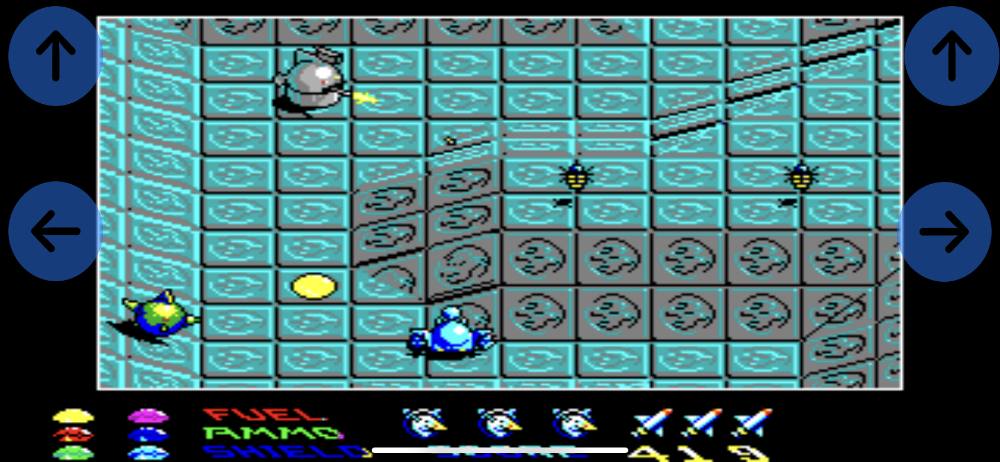
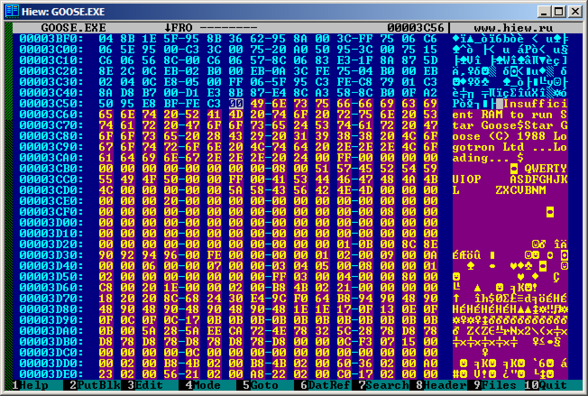
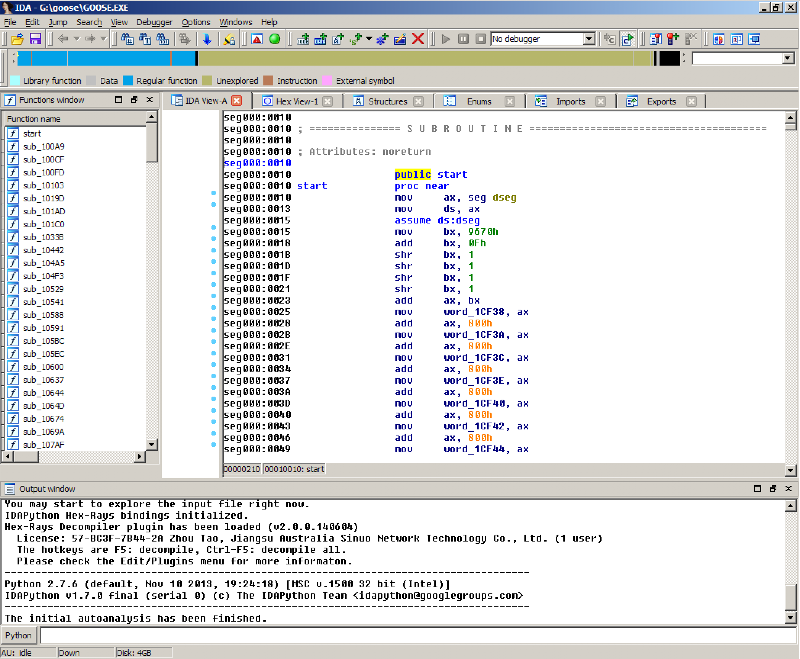
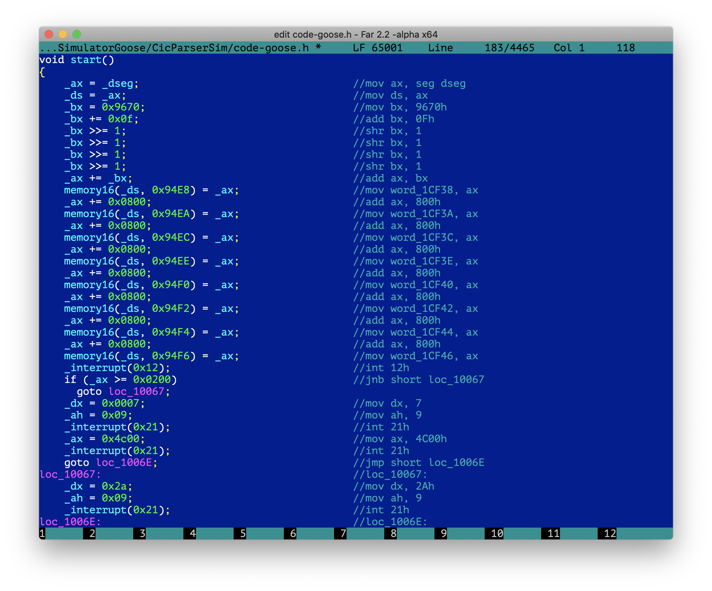

# Cicoparser 

Cicoparser is set of tools for conversion of old dos games into modern operating systems

## Swift goose



[Swift goose](https://github.com/gabonator/Projects/tree/master/XenonResurrection/SwiftGoose) is an old DOS game "Star goose" released in 1988 ported to swift. This was done in these stages:
  - disassembly of the original binary (x86 assembler)
    - extraction of datasegment (or all referenced segments by code) from original binary 
    - 
    - extraction of code (using IDA disassembler or any other which can split the code into functions)
    - 
  - conversion of the assembly code into C language 
    - using the CicoParser tool
    - 
  - building host application which runs this code
    - simple BIOS, DOS and EGA emulation
    - keyboard emulation (so we can control the game tapping the screen)
    - conversion of EGA video ram into RGB buffer
  - breaking up infinte loops
    - so the code can be run iteratively in non-blocking mode
    ! [!infinite loop breakup](breakup.png)

This is a demonstration that most of old x86 applications can be easily ported to other platforms by rewriting the assembly code into higher language. Proof of concept was done in the past where I converted two games (alley cat, star goose) to C++ and Javascript, so they can run in web browser. 
And this time I wanted to improve the conversion tool to reduce the effort of manually fixing produced code. And to extend it so it can be used on more complex applications which span over mutliple segments. 
To bring this even into higher level this iphone application in Swift/Objective C was made. It was not clear if the arm architecture and llvm compiler will allow me to do clever tricks with unaligned dereferencing (memory16 function), but everything runs well without any problems.

```C
BYTE& memory(WORD segment, WORD offset)
{
    if (segment == _dseg)
        return *(datasegment + offset);
    if (segment == _seg000)
        return *(segment0 + offset);
}

WORD& memory16(WORD segment, WORD offset)
{
    if (segment == _dseg)
        return *(WORD*)(datasegment + offset);
    if (segment == _seg000)
        return *(WORD*)(segment0 + offset);
}
```

## Cicoparser

Cicoparser is the tool which does all the hard work of rewriting the assembly code produced by disassembler into C language or Javascript. Heavily based on regular expresssions it converts the assembly code line by line into C while trying to analyse the code to perform the conditional jumps without using CPU flags to produce more human readable code. 

Since the generated assembly files can have several thousand of lines (Xenon2 disassembly has 46000 lines) this is done in two stages. At first the assembly file is parsed and turned into intermediate binary pseudocode optimized for fast reading and processing. This is done only once and takes about 20 seconds. Then the conversion itself is very fast since it does not need to parse text and works just with known set of instructions in fixed size binary form.

Cicoparser also supports simple optimizations to turn jumps into loops and simplification of arithmetical expressions. Tricky part was the javascript support - since this language does not have "goto" command, the code which uses labels and jumps was turn into big switch which handles the program counter flow:

```javascript
function sub_674()
{
  var _pc = 0;
  while (_pc != -1 && typeof(_pc) != "undefined" )
  switch (_pc)
  {
    case 0:
    STAT(0x674);
    _push(di);
    _push(r16[cx]);
    r16[cx] = 0;
    r16[ax] = 0x3C00;
    _int(0x21);
    r16[cx] = _pop();
    r16[dx] = _pop();
    if ( !cf ) // jnb 
      { _pc = 0x683; continue; }
    return;
  case 0x683:
    _data16set(0x8F1E, r16[ax]);
    r16[bx] = r16[ax];
    r16[ax] = 0x4000;
    _int(0x21);
    if ( !cf ) // jnb 
      { _pc = 0x690; continue; }
    return;
  case 0x690:
    r16[ax] = 0x3E00;
    r16[bx] = _data16get(0x8F1E);
    _int(0x21);
    _pc = -1;
  }
}
```

## Development

- 2014 
  - [Alley cat ported into C++](https://github.com/gabonator/Work-in-progress/tree/master/DosGames/JsGoose), just proof of concept including sound emulation.
  - Playable online here [alleycat.html](https://rawgit.valky.eu/gabonator/Work-in-progress/master/DosGames/AlleyCat/Javascript/alleycat.html)
  - [Star goose](https://github.com/gabonator/Work-in-progress/tree/master/DosGames/JsGoose)
  - Playable online here: [JSGoose/index.html](https://rawgit.valky.eu/gabonator/Work-in-progress/master/DosGames/JsGoose/index.html)
- 2017
  - Cicoparser was started based on the previous experiments [CicParser2017](https://github.com/gabonator/Work-in-progress/tree/master/DosGames/CicParser2017)
  - Alley cat was turned into playable game
  - Play online here: [CicParser2017/js/test.html](https://rawgit.valky.eu/gabonator/Work-in-progress/master/DosGames/CicParser2017/js/test.html)
- 2020
  - Porting cicoparser and host to OSX/SDL
  - Porting Xenon2 game (only intro working) [Xenon2 intro](https://github.com/gabonator/Projects/tree/master/XenonResurrection/Simulator)
  - Porting Star goose to C++ and swift: [SwiftGoose](https://github.com/gabonator/Projects/tree/master/XenonResurrection/SwiftGoose)

## Where to go next?

- 50% of the uncertainties which need to be fixed by hand can be fixed automatically. This would mean that less than 1% of code would need to be manually verified and fixed.
- Finish Xenon 2 game (currently the intro works 100%)
- Find some simple VGA games and try converting them (currently EGA and CGA emulation was done)
- Export into C, Javascript and Wasm, switch for avoiding unaligned dereferencing
- Advanced optimizations (all optimizations are currently turned off to prevent errors)
- Support for Borland C applications

