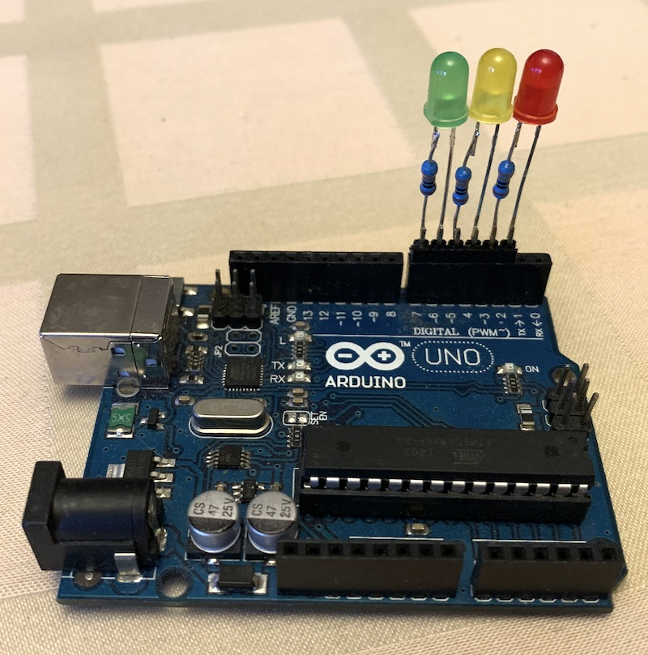

# Uvod do elektrotechniky a arduina

## Annotation
Nedavali ste na fyzike pozor, ked sa preberali elektricke obvody? Tento workshop je potom prave pre Vas! Aj bez predoslych znalosti si vsetko dolezite vysvetlime s pomocou analogie s prudom vody. Naucime sa citat elektricke schemy a pochopime zakony, ktore davaju do suvisu pojmy ako napatie, prud a odpor. Cerstvo ziskane vedomosti vyuzijeme pri navrhu zapojenia arduina a semaforu zostaveneho z troch led diod s predradnymi rezistormi. Navrhnute zapojenie si zletujeme, ozivime pomocou jednoducheho programu v jazyku C s vyuzitim iba troch prikazov.

## Program
- Teoria 90min
- Letovanie 45 min
- Programovanie 45 min

## Nakupit (pre 8 ludi s rezervou):
- 10x cervena LED (5mm, obycajna), LED 5MM RED 400/50, 0.90eur
- 10x zelena LED (5mm, obycajna), LED 5MM GREEN, 0.98eur
- 10x zlta LED (5mm, obycajna), LED 5MM YELLOW, 0.90eur
- 2x rovna lista 40 pinova, https://www.gme.sk/oboustranny-kolik-s1g40-2-54mm, 0.48eur
- 30x rezistor 330 ohm (obycajny vyvodovy staci 1/4W), RR330, 1.75eur
- 8x arduino uno, https://www.gme.sk/klon-arduino-uno-r3-atmega328p-ch340-mini-usb, 62.40eur

naklady dokopy: 0.90 + 0.98 + 0.90 + 0.48 + 1.75 + 62.40 = 67.41 eur

## Materialy pre studentov

[student](student.md)

## Prezentacia

[presentation](workshopelectro.pdf)

## Osnova

[draft](draft.txt)
