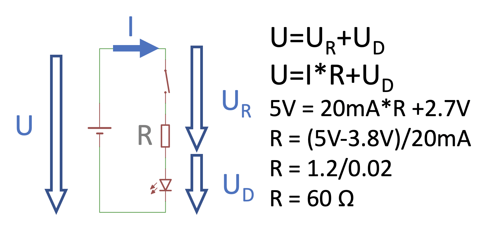

# Electro workshop 1


## Fyzikalne velicny

| Velicina | Oznacenie | Jednotka | Skratka | Analogia         |
-----------|-----------|----------|---------|------------------|
| Napatie  | U         | Volt     | V       | Tlak vody        |
| Prud     | I         | Amper    | A, mA   | Prietok vody     |
| Odpor    | R         | Ohm      | &Omega; | Odpor prekazky   |

- 1kOhm = 1000 Ohm
- 1A = 1000 mA


## Ohmov zakon

> U = R * I

## Napatovy kirchhoffov zakon

> U = U1 + U2 + U3

## Prudovy kirchhoffov zakon

> I = I1 + I2 + I3


## Instalacia arduina
[http://x.valky.eu/arduino](http://x.valky.eu/arduino)

## Fotka pripravku:


## Vyvody LED


## Zapojenie arduina a pripravku:


## Vypocet predradneho odporu:


## Volt amperova charakteristika LED diody:


## Oznacenie pinov a polarita


## Program na rozsvietenie LEDiek:

```C
void setup() {
  // put your setup code here, to run once:
  pinMode(7, OUTPUT);
  pinMode(6, OUTPUT);
  pinMode(5, OUTPUT);
  pinMode(4, OUTPUT);
  pinMode(3, OUTPUT);
  pinMode(2, OUTPUT);

  digitalWrite(7, LOW);
  digitalWrite(5, LOW);
  digitalWrite(3, LOW);
}

void loop() {
  // put your main code here, to run repeatedly:
  digitalWrite(6, HIGH);
  digitalWrite(4, HIGH);
  digitalWrite(2, HIGH);
}
```

Blikanie:

```C
void setup() {
  // put your setup code here, to run once:
  pinMode(7, OUTPUT);
  pinMode(6, OUTPUT);
  pinMode(5, OUTPUT);
  pinMode(4, OUTPUT);
  pinMode(3, OUTPUT);
  pinMode(2, OUTPUT);

  digitalWrite(7, LOW);
  digitalWrite(5, LOW);
  digitalWrite(3, LOW);
}

void loop() {
  // put your main code here, to run repeatedly:
  digitalWrite(6, HIGH);
  delay(1000);
  digitalWrite(6, LOW);
  digitalWrite(2, HIGH);
  delay(1000);
  digitalWrite(2, LOW);
}
```

## Riesenie
[riesenie](prog5.ino)


## Materialy ku workshopu
[readme](readme.md)
