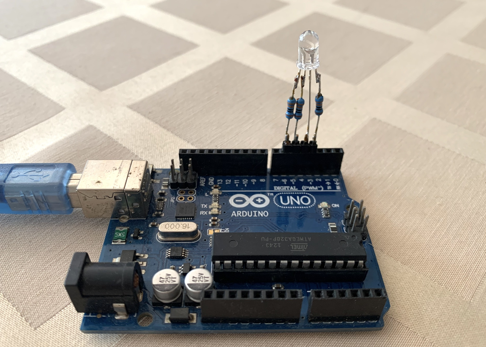

# Electro workshop 2

- programovanie RGB Led a animacie

## Nakupit (pre 8 ludi s rezervou):

| Pocet | Co      | Oznacenie GME                   | Jednotkova cena | Celkova cena    | Linka         |
|-------|---------|---------------------------------|-----------------|-----------------|---------------|
| 10x   | RGB LED | LED 5MM RGB-CC 500/1120/330/60  | 0.449           | 4.50            | https://www.gme.sk/led-5mm-rgb-cc-500-1120-330-60-osthjc5b61a      |
| 30x   | Rezistor 330 ohm | RR 330R                | 0.058           | 1.75            | https://www.gme.sk/rm-330r-0207-0-6w-1 | 
| 2x    | Lamacia lista rovna 40 pinova | S1G40 2,54mm | 0.24         | 0.48            | https://www.gme.sk/oboustranny-kolik-s1g40-2-54mm |
| 8x    | Arduino Uno | Klon Arduino UNO R3 ATmega328P CH340 USB mini | 7.80  | 62.4    | https://www.gme.sk/klon-arduino-uno-r3-atmega328p-ch340-mini-usb |

## Prezentacia

[presentation](workshopelectro2.pdf)

## Osnova

[draft](draft.txt)
