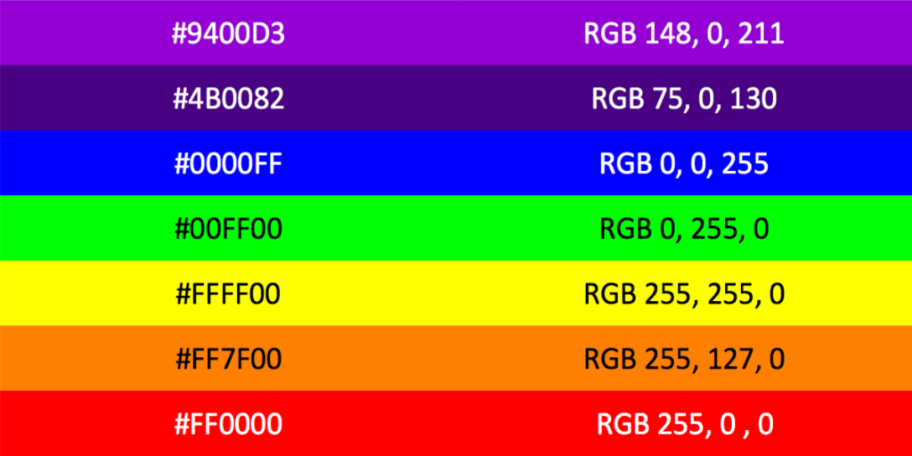

- preview
- pripravok 

## Uloha 1:

- Vypisat cisla od 0..10

```C
void setup() 
{
  Serial.begin(9600);
}

void loop() 
{
  int x = 0;
  Serial.print("Vypisujem cisla od 0 po 10:\n");
  while (x<=10)
  {
    Serial.print("x=");
    Serial.print(x);
    Serial.print("\n");
    x = x + 1;
  }
  delay(5000);
}
```

- [riesenie/uloha1](riesenie/prog1_u1.ino)
- 

## Uloha 2

Najdite predpis pre y1, y2, y3 a vypiste funkcne hodnoty pre 0..10

| x  | y1  | y2  | y3  |
-----|-----|-----|-----|
| 0  | 0   | 3   | 100 |
| 1  | 5   | 8   | 92  |
| 2  | 10  | 13  | 84  |
| 3  | 15  | 18  | 76  |
| 4  | 20  | 23  | 68  |
| 5  | 25  | 28  | 60  |
| 6  | 30  | 33  | 52  |
| 7  | 35  | 38  | 44  |
| 8  | 40  | 43  | 36  |
| 9  | 45  | 48  | 28  |
| 10 | 50  | 53  | 20  |

- [riesenie/uloha2a](riesenie/prog2_u2a.ino)
- 
- [riesenie/uloha2b](riesenie/prog2_u2b.ino)
- 

## Uloha 3

- Otestovat funkciu interpoluj
- Interpolovat hodnotu od 50 do 100 (v sto alebo 20 krokoch)
- [riesenie/uloha3](riesenie/prog4_u3.ino)
- 

## Uloha 4
- otvorit ukazku "blink.ino"
- pripojit pripravok
+ obrazok pripojenia 
- Rozsvietit jednotlive kanaly
- Vyskusat rozne kombinacie farieb
- Kolko roznych kombinacii vieme vytvorit z troch kanalov? 
- Ak su rozsvietene vsetky kanaly naraz, svietia vsetky rovnakou intenzitou?
- [riesenie/uloha4](riesenie/prog5_u4.ino)

## Uloha 5
- otvorit ukazku "blink.ino"
- skusat menit frekvenciu tak, aby blikajuci jav prestal byt pozorovatelny
- pri akej frekvencii tento jav prestava byt pozorovatelny?
- [riesenie/uloha5](riesenie/prog6_u5.ino)

## Uloha 6
- Príkaz Analog.write
- Zistite v akom rozsahu je vstupný argument
- Vytvorte bielu farbu
- Vytvorte vašu obľúbenú farbu
- [riesenie/uloha5](riesenie/prog7_u6.ino)

## Uloha 7
- Farebný prechod z červenej do modrej a naspäť 
- Príkaz while alebo for
- [riesenie/uloha5](riesenie/prog8_u7.ino)

## Uloha 8
- Vytvorte farby dúhy a prepínajte medzi nimi
- 

```C
void loop() 
{
  farba(148, 0, 211);
  farba(74, 0, 130);
  farba(0, 0, 255);
  farba(0, 255, 0);
  farba(255, 255, 0);
  farba(255, 127, 0);
  farba(255, 0, 0);
}

``` 

- [riesenie/uloha8](riesenie/prog9_u8.ino)

## Uloha 9
- Plynulý prechod farieb dúhy s interpoláciou
- [riesenie/uloha9](riesenie/prog9_u10.ino)

## Uloha 10
- bonus

