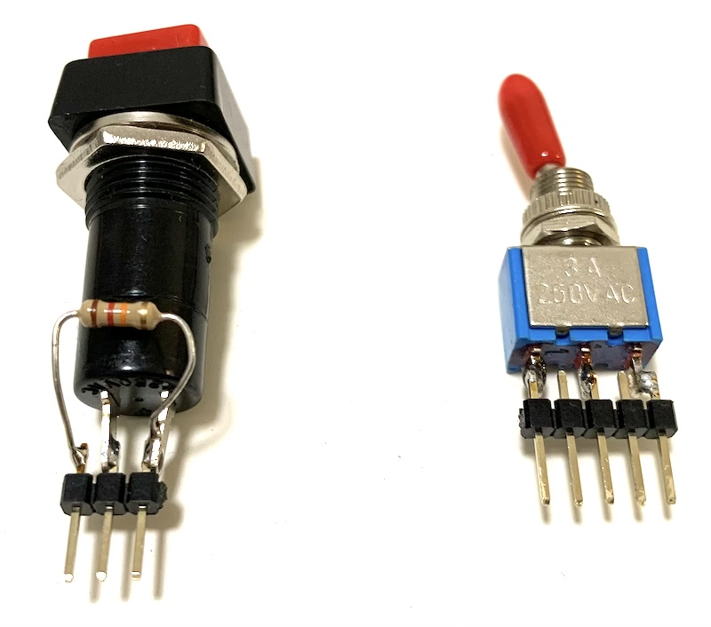
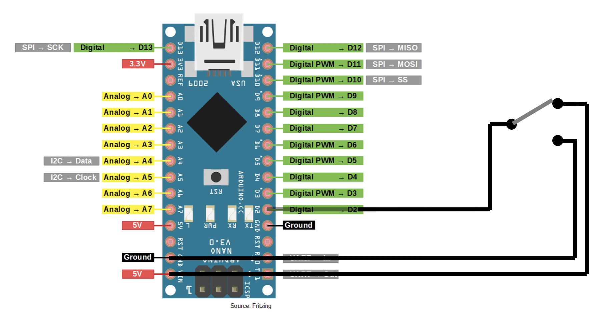
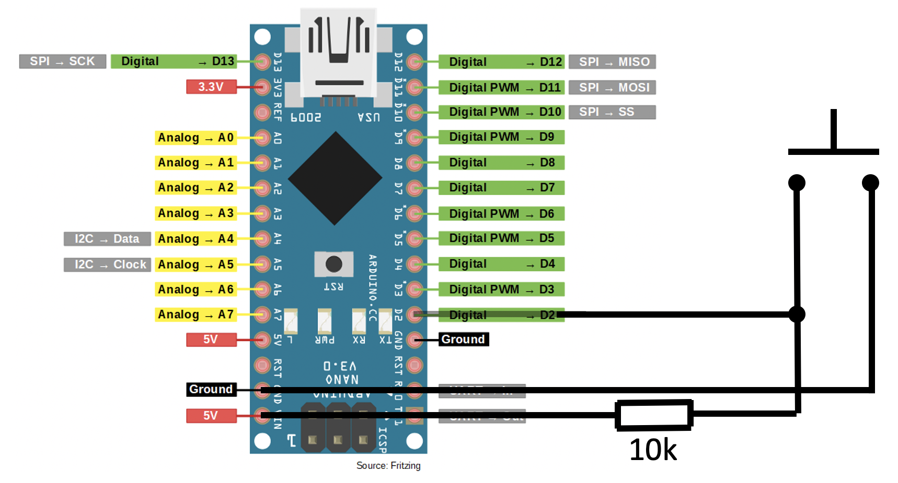
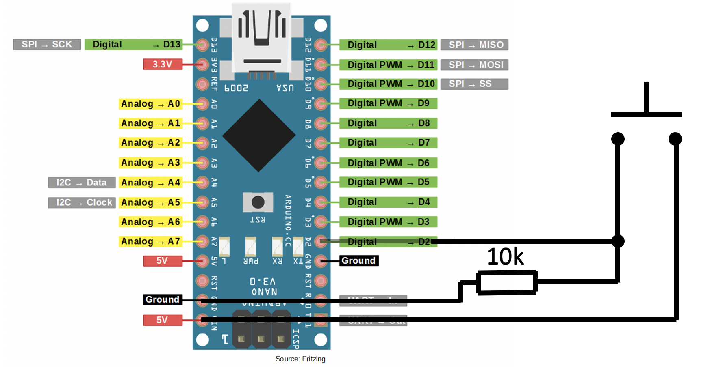
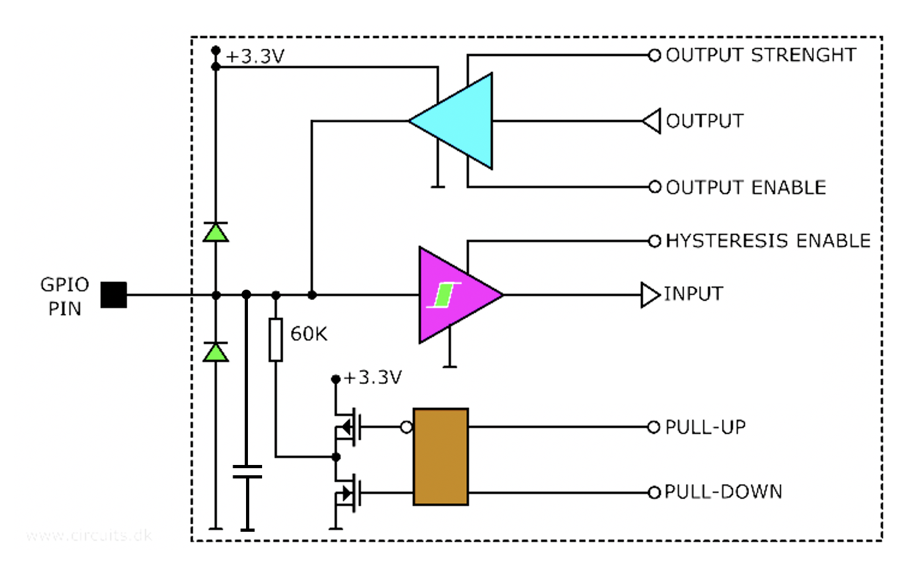
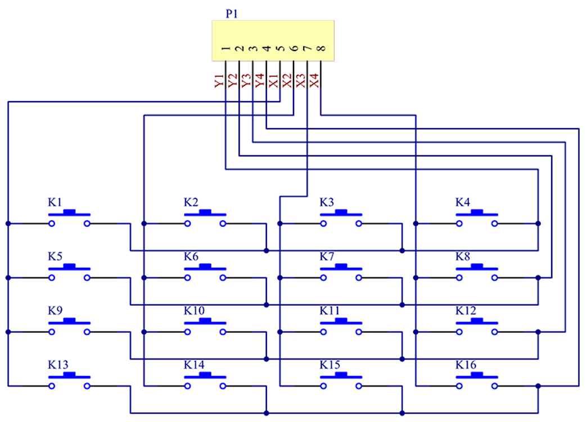
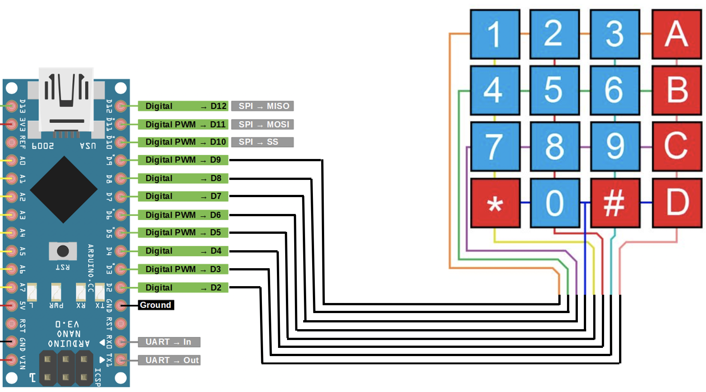

# Electro workshop 3

Čaká nás ďalší zo série Arduino workshopov. Tentokrát sa pozrieme na to, v akých režimoch vie pracovať GPIO pin mikrokontroléra. Zameráme sa na možnosť sledovania vonkajšej logickej úrovne, aby sme mohli k našemu zariadeniu pripojiť spínače a prepínače. S pomocou osciloskopu preskúmame prechodové javy pri spínani a rozpínaní mechanických kontaktov a porozmýšľame, ako správne v programe vyhodnotiť, kedy bolo tlačidlo zopnuté a kedy rozpnuté. Po pochopení pojmov ako “debouncing” a “pull-up resistor” pripojíme ku Arduinu jednoduchú maticovú 4x4 klávesnicu a naprogramujeme si kódovy zámok.

## BOM

- Nakup pre 8 ucastnikov kurzu dokopy 84.54 eur

| Pocet | Co                            | Oznacenie GME                                 | Jednotkova cena | Celkova cena | Linka         |
|-------|-------------------------------|-----------------------------------------------|-----------------|--------------|---------------|
| 8x    | Arduino Nano                  | Klon Arduino Nano V3.0 R3, CH340G             | 6.26            | 50.08        | https://www.gme.sk/klon-arduino-nano-v3-0-r3-ch340g |
| 8x    | Tlacidlo                      | Tlacidlove spinace PBS-12B-R/G/Y/BL           | 0.39            | 3.12         | https://www.gme.sk/p-pb303b-red |
| 8x    | Prepinac                      | Packovy spinac P-KNX1                         | 0.71            | 5.68         | https://www.gme.sk/p-knx1 |
| 2x    | Dupont kabel M-F              | Dupont prepojovacie vodice vidlica-zasuvka 40 kusov | 3.90      | 7.80         | https://www.gme.sk/propojovaci-vodice-vidlice-zasuvka-40-kusu |
| 1x    | Dupont kabel F-F              | Dupont prepojovacie vodice zasuvka-zasuvka 40 kusov | 3.90      | 3.90         | https://www.gme.sk/propojovaci-vodice-zasuvka-zasuvka-40-kusu |
| 8x    | Klavesnica 4x4                | Membranova klavesnica 4x4                     | 1.54            | 12.32        | https://www.gme.sk/membranova-klavesnice-4x4 |
| 2x    | Lista rovna                   | Kolikova lista S1G40 2.54mm                   | 0.27            | 0.54         | https://www.gme.sk/oboustranny-kolik-s1g40-2-54mm |
| 10x   | Rezistor 10Kohm               | RM 10k 0207 0.6W 1%                           | 0.11            | 1.1          | https://www.gme.sk/rm-10k-0207-0-6w-1 | 

## Draft

Improvizacia podla prezentacie

## Prezentacia

[presentation](prezentacia.pdf)

## Ulohy

Pripravok na zletovanie:

### Uloha 1

- Uloha 1: Rozsviet internu LED podla podla logickeho stavu na vstupnom pine D2
- Pouzit prikazy: pinMode, digitalRead, digitalWrite

[sablona ulohy 1](progs/u1.ino)
[riesenie ulohy 1](progs/u1riesenie.ino)

### Uloha 2

- Uloha 2: Vypisuj hodnotu logickeho stavu pinu D2 v 100ms intervaloch
- Pouzit prikazy: Serial.begin, Serial.print

[sablona ulohy 2](progs/u2.ino)
[riesenie ulohy 2](progs/u2riesenie.ino)

### Pull up / down

### Zjednodusene zapojenie GPIO

### Uloha 3

- pripojit spinac a vyhodnotit stav zopnutia internym pull-upom

[sablona ulohy 3](progs/u3.ino)
[riesenie ulohy 3](progs/u3riesenie.ino)

### Uloha 4

- detekovat stlacene a rozopnutie (v okamih stlacenia vypisat cez seriovu konzolu...)

[sablona ulohy 4](progs/u4.ino)
[riesenie ulohy 4](progs/u4riesenie.ino)

### Uloha 5

- detekovat stlacenie a rozopnutie - debouncing

[sablona ulohy 5](progs/u5.ino)
[riesenie ulohy 5](progs/u5riesenie.ino)

### Uloha 6

- prepinat internu led v okamihu stlacenia tlacidla

[sablona ulohy 6](progs/u6.ino)
[riesenie ulohy 6](progs/u6riesenie.ino)

### Maticova klavesnica

### Uloha 7

– rozsvietit internu led ked je stlacena cislica “1” (piny 5 a 9)

[sablona ulohy 7](progs/u7.ino)
[riesenie ulohy 7](progs/u7riesenie.ino)

### Uloha 8

- detekovat stlacenie v prvom riadku (vyhodnotit klavesy 1, 2, 3, A)

[sablona ulohy 8](progs/u8.ino)
[riesenie ulohy 8](progs/u8riesenie.ino)

### Uloha 9

- detekovat vsetky klavesy

[sablona ulohy 9](progs/u9.ino)
[riesenie ulohy 9](progs/u9riesenie.ino)

### Ukazka 10

- fantomove klavesy pri stlaceni 3ch klaves v mriezke

### Uloha 11

- Dvojznakovy kodovy zamok

[sablona ulohy 11](progs/u11.ino)
[riesenie ulohy 11](progs/u11riesenie.ino)

### Uloha 12

- Klavesnica – stvorznakovy kodovy zamok

[sablona ulohy 12](progs/u12.ino)
[riesenie ulohy 12](progs/u12riesenie.ino)
