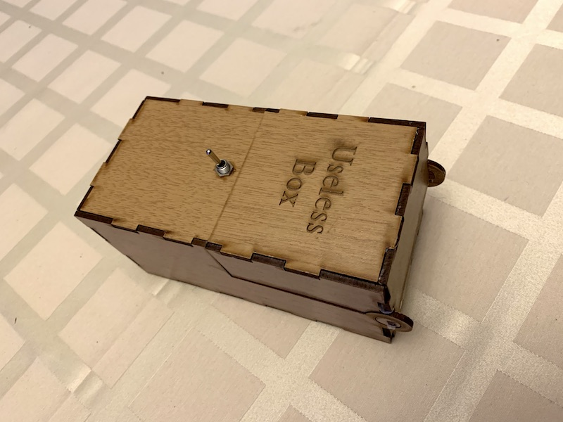
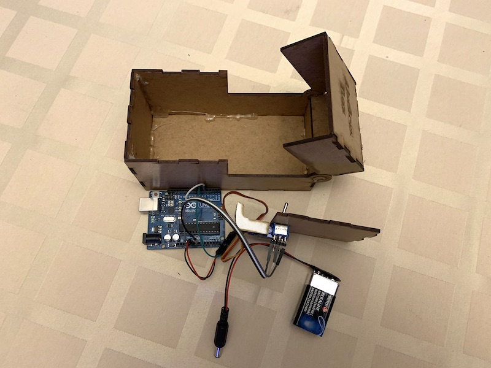
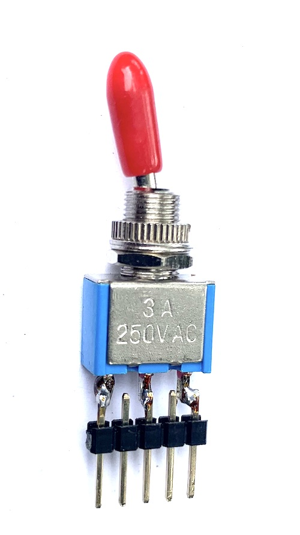
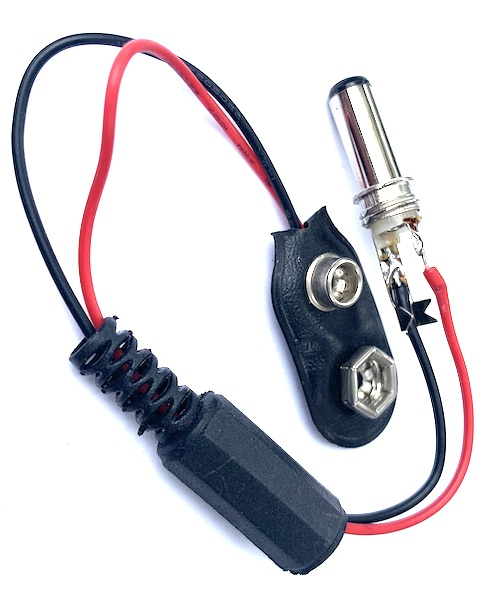
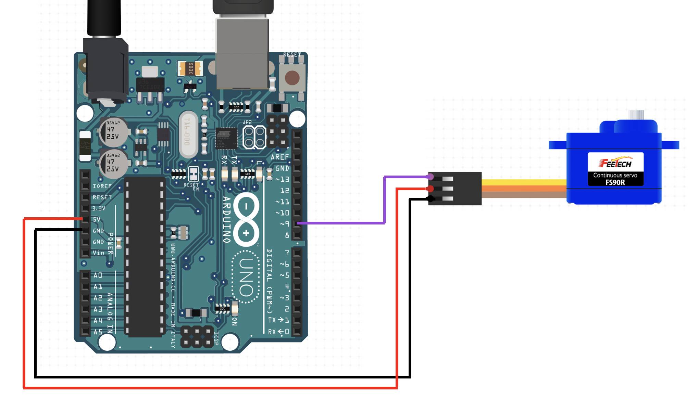
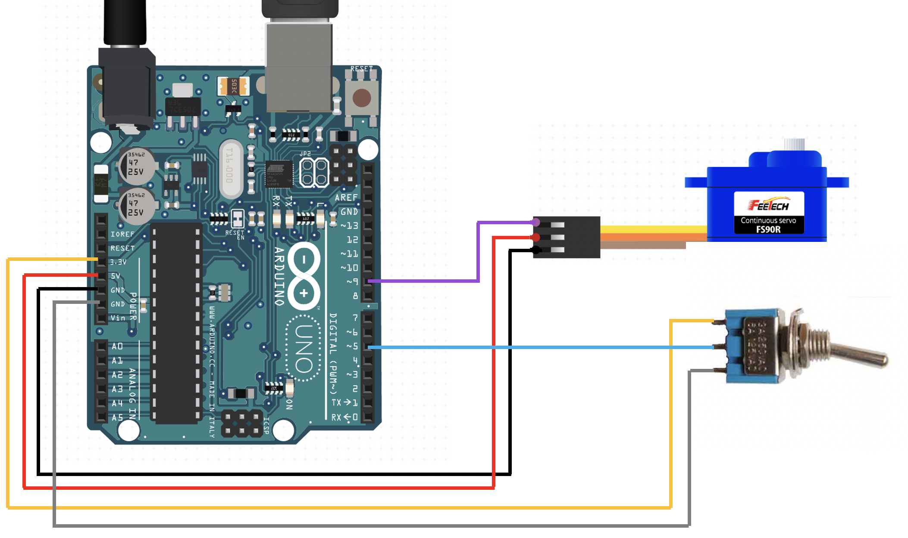

# Useless box
- Jednoduche zapojenie arduina so servo motorom a prepinacom napajane 9V bateriou



## Anotacia
Na tomto workshope skonštruujeme tzv. “Useless box”. Zariadenie pozostáva z drevenej krabičky, na ktorej je vo vrchnej časti namontovaný prepínač. Po prepnutí prepínača sa krabička otvorí a servo motor mechanickým ramenom prepne prepínač do pôvodnej polohy. 
Najprv si povieme niečo o konštrukcii, návrhu a výrobe podobných krabičiek pomocou laserovej rezačky. Vysvetlíme si ako ovládať servo motor 9g s Arduinom a ako správne pripojiť prepínač ku vstupnému pinu mikrokontroléra.
Po zmontovaní krabičky a umiestnení prepínača a servo motora prejdeme ku programovaniu Arduina. Vo vytvorenom programe budeme spracovávat signál z prepínača a podľa neho ovládať pohyb motora. Po overení funkčnosti uložíme elektronické zapojenie dovnútra krabičky, čím získame funkčný batériou napájaný prototyp useless boxu.

## Bill of material

- Nakup pre 8 ucastnikov kurzu s rezervou dokopy 139.24 eur

| Pocet | Co                            | Oznacenie GME                                 | Jednotkova cena | Celkova cena | Linka         |
|-------|-------------------------------|-----------------------------------------------|-----------------|--------------|---------------|
| 8x    | Arduino Uno                   | Klon Arduino UNO R3 ATmega328P CH340 USB mini | 7.80            | 62.4         | https://www.gme.sk/klon-arduino-uno-r3-atmega328p-ch340-mini-usb |
| 10x   | Servo motor 9g                | Servomotor 9g                                 | 4.59            | 45.9         | https://www.gme.sk/servomotor-9g |
| 10x   | Prepinac                      | Packovy spinac P-KNX1                         | 0.71            | 7.1          | https://www.gme.sk/p-knx1 |
| 1x    | Dupont kabel M-F              | Dupont prepojovacie vodice vidlica-zasuvka 40 kusov | 3.90      | 3.90         | https://www.gme.sk/propojovaci-vodice-vidlice-zasuvka-40-kusu |
| 1x    | Dupont kabel M-M              | Dupont prepojovacie vodice vidlica-vidlica 40 kusov | 3.90      | 3.90         | https://www.gme.sk/propojovaci-vodice-vidlice-vidlice-40-kusu |
| 2x    | lista rovna                   | Kolikova lista S1G40 2.54mm                   | 0.27            | 0.54         | https://www.gme.sk/oboustranny-kolik-s1g40-2-54mm |
| 10x   | Napajaci jack 5.5/2.1         | Napajaci suosi konektor SCP-2009B             | 0.51            | 5.1          | https://www.gme.sk/napajeci-souosy-konektor-dci-scp-2009b |
| 10x   | Napajaci konektor na 9V bateriu | Napajaci konektor pre 9V bateriu BS-IC      | 0.29            | 2.9          | https://www.gme.sk/bs-ic |
| 10x   | 9V bateria                    | Bateria Westinghouse 6F22 9V                  | 0.75            | 7.5          | https://www.gme.sk/bateria-westinghouse-6f22-9v-super-heavy-duty-znc |

## Uvod

- Zopar slov o konstrukcii krabicky, ako je rieseny pant
- Ako vytvorit podklad pre laserovu rezacku
- Pouzity material a ako ho budeme spajat (tavna pistol)
- Ako kontroler je pouzite arduino a budeme ho programovat cez Arduino IDE (skontrolovat ci vsetci maju nainstalovane)
- Budeme pracovat s prepinacom a servom. 
- Prepajacie kable: 
  - Servo je zakoncene 2.54 mm dutinkovou hlavickou. Arduino ma na pripajanie tiez 2.54 mm listy.
  - Servo potrebuje napajacie napatie (5V, GND) a riadiaci signal
  - Potrebujeme na prepojenie trojzilovy dupont kabel samec-samec
  - Prepinac je trojvyvodovy dvojpolohovy, spolocny vyvod je prostredny. Ak je prepinac vhornej polohe, spojene su spodne dva vyvody. Ak je v spodnej, spojene su dva horne vyvody
  - Aby sme ho vedeli pripojit na arduino, naletujeme na neho 5 pinovu lamaciu listu (na kazdy druhy pin)
  - Napajaci kabel, zariadenie bude napajane 9V bateriou, takze si na tento ucel pripravime prepajaci kablik
- Potrebujeme naplnit cas v pripade ze by niekto meskal, aby sme mohli naraz zacat letovat

## Letovanie

- Prepinac



- Napajaci kabel



- Ti ktori budu sikovnejsi zatial mozu rozmyslat ako zmontovat krabicku dokopy, treba ich upozornit aby neprilepili aj vrchnak s prepinacom. Ten budeme mat pocas programovania od skatule odpojeny, aby sme vedeli odladit krajne polohy serva

## Postup

- Zlozenie a zlepenie krabicky okrem vrhnaka (tam kde sa bude montovat prepinac a servo)
- Namontovanie prepinaca a prilepenie serva
- Umiestnenie packy tak, aby sa vedela schovat pod rovinu druheho vrchnaka a zaroven aby v jednej krajnej polohe dokazala prepnut prepinac
- Overenie pohyblivosti packy (bez pripojenia elektriky) a ci dokaze krajna poloha serva prepnut prepinac

## Programovanie

### Uloha 0: Priprava
- Spustime arduino
- Otvorime ukazku Blink: File -> Examples -> 01. Basics -> Blink
- Pripojime arduino USB kablom
- Vyberieme spravny komunikacny port: Tools -> Port
- Tlacidlom "sipka" v Arduino IDE skompilujeme ukazkovy program a napalime do arudina.
- Skontrolovat ci blika

### Instalacia kniznice servo (pravdepodobne nepotrebne)
- Mala by byt uz predinstalovana, ale pre kazdy pripad:
- Tools -> Manage Libraries... -> Search: "Servo"
- Built-In by Michael Margolis, Version 1.1.6

### Uloha 1: Ovladanie serva s kniznicou
- Otvorime ukazku: File -> Examples -> Servo -> Sweep

```C
#include <Servo.h>

Servo myservo;  // create servo object to control a servo
// twelve servo objects can be created on most boards

int pos = 0;    // variable to store the servo position

void setup() {
  myservo.attach(9);  // attaches the servo on pin 9 to the servo object
}

void loop() {
  for (pos = 0; pos <= 180; pos += 1) { // goes from 0 degrees to 180 degrees
    // in steps of 1 degree
    myservo.write(pos);              // tell servo to go to position in variable 'pos'
    delay(15);                       // waits 15ms for the servo to reach the position
  }
  for (pos = 180; pos >= 0; pos -= 1) { // goes from 180 degrees to 0 degrees
    myservo.write(pos);              // tell servo to go to position in variable 'pos'
    delay(15);                       // waits 15ms for the servo to reach the position
  }
}
```

- Pripojime servo podla obrazku s dupont kablom male-male: GND (hnedy) 5V (oranzovy), pin 9 (zlty)
- spustit ukazku a sledovat pohyb serva



### Uloha 2: Pridanie pauzy

- Upravime program tak, aby servo stale nebehalo, ale vzdy pred samotnym pohybom cakalo 5 sekund, pouzijeme prikaz sleep

```C
Servo myservo;  // create servo object to control a servo
// twelve servo objects can be created on most boards

int pos = 0;    // variable to store the servo position

void setup() {
  myservo.attach(9);  // attaches the servo on pin 9 to the servo object
}

void loop() {
  delay(5000); // <--- toto sme doplnili

  for (pos = 0; pos <= 180; pos += 1) { // goes from 0 degrees to 180 degrees
    // in steps of 1 degree
    myservo.write(pos);              // tell servo to go to position in variable 'pos'
    delay(15);                       // waits 15ms for the servo to reach the position
  }
  for (pos = 180; pos >= 0; pos -= 1) { // goes from 180 degrees to 0 degrees
    myservo.write(pos);              // tell servo to go to position in variable 'pos'
    delay(15);                       // waits 15ms for the servo to reach the position
  }
}
```

- Analyza programu:
  - prvy **for** postupuje od hodnoty 0 po hodnotu 180 s krokom 1. Nastavi servu poolohu a pocka 15 milisekund.
  - Hadanka: Kolko bude trvat takyto pohyb? (15ms * 180 = 2.7s)
  - druhy **for** sa zase vrati z hodnoty 180 na hodnotu 0.

### Uloha 3: Montaz a rozsah

- Namontujeme servo na vrchnak a rozmyslame ako umiestnit packu tak, aby bola schopna prepinac v jednej krajnej polohe prepnut do druhej, a zaroven aby druha krajna poloha serva bola packa pod urovnou vrchnaka.
- Servo sa bude pohybovat presne naopak ako by sme chceli. V hornej polohe skonci. Nech skusia upravit program tak, aby bol pohyb vykonany naopak a zaroven nech najdu vhodny rozsah (staci len prehodit tie dva fory)
- V mojom experimente vysiel idealny rozah 150..20
- Zaroven strojnasobime rychlost pohybu (delay 15 nahradime za delay 5)
- Pozor: Ak nastavime krajnu polohu, ktoru servo nevie dosiahnut, tak bude "bzucat" a zrat elektriku

- Takto by to malo vyzerat:

```C
#include <Servo.h>

Servo myservo;  // create servo object to control a servo
// twelve servo objects can be created on most boards

int pos = 0;    // variable to store the servo position

void setup() {
  myservo.attach(9);  // attaches the servo on pin 9 to the servo object
}

void loop() {
  delay(5000);

  for (pos = 150; pos >= 20; pos -= 1) { // goes from 180 degrees to 0 degrees
    myservo.write(pos);              // tell servo to go to position in variable 'pos'
    delay(5);                       // waits 15ms for the servo to reach the position
  }
  for (pos = 20; pos <= 150; pos += 1) { // goes from 0 degrees to 180 degrees
    // in steps of 1 degree
    myservo.write(pos);              // tell servo to go to position in variable 'pos'
    delay(5);                       // waits 15ms for the servo to reach the position
  }
}
```

### Uloha 4: Nastavenie pociatocnej hodnoty

- Aby sme sa vyhli nedefinovanemu stavu, kedy servo po zapnuti arduina nevie, do akej polohy sa ma nastavit, tak iba pridame ```myservo.write(150);``` za attach.servo v setupe.

```C
void setup() {
  myservo.attach(9);  // attaches the servo on pin 9 to the servo object
  myservo.write(150); // <--- toto sme pridali
}
```

### Uloha 5: Pripojenie prepinaca
- Prepinac pripojime na arduino s dupont prepajacim kablom samec-samica
- Jednu krajnu polohu pripojime na 3.3V (idealne by bolo pouzit 5V, ale chceme sa vyhnut pouzitiu rozdvojky, kedze na arduino doske mame iba jeden pin s 5V na vystupe)
- Druhu krajnu polohu na GND (nastastie mame dva GND vedla seba)
- Stredny pin prepinaca teda bude nadobudat bud 3.3V alebo GND. Takyto signal mozeme kludne pripojit na vstupy pin arduina, kedze rozhodovacia uroven toho, ci bude arduino registrovat na vstupnom pine logicku jednotku alebo nulu je polovica napajacieho napatia. Napajacie napatie je 5V, takze cokolvek vacsie ako 2.5V na vstupnom pine bude povazovat arduino za logicku jednotku
- Stredny pin pripojime na pin 5



- Namiesto cakania sleep(5000) budeme cakat na okamih, kedy bude prepinac zapnuty
- Na to potrebujeme nakonfigurovat vstupny pin s prikazom ```pinMode(5, INPUT);``` vo funkcii setup
- A zaroven necheme aby funkcia loop nerobila nic dokym funkcia ```digitalRead(5)``` nevrati hodnotu HIGH (vracia bud LOW, co zodpoveda hodnote 0 alebo HIGH, co zodpoveda hodnote 1)
- Pouzijeme prikaz if: ```if (digitalRead(5) == HIGH)``` a do scopovych zatvoriek ulozime obidva fory

```C
#include <Servo.h>

Servo myservo;  // create servo object to control a servo
// twelve servo objects can be created on most boards

int pos = 0;    // variable to store the servo position

void setup() {
  myservo.attach(7);  // attaches the servo on pin 9 to the servo object
  pinMode(5, INPUT);
  myservo.write(150);
}

void loop() {
  if (digitalRead(5) == HIGH)
  {
    for (pos = 150; pos >= 20; pos -= 1) { // goes from 180 degrees to 0 degrees
      myservo.write(pos);              // tell servo to go to position in variable 'pos'
      delay(5);                       // waits 15ms for the servo to reach the position
    }
    for (pos = 20; pos <= 150; pos += 1) { // goes from 0 degrees to 180 degrees
      // in steps of 1 degree
      myservo.write(pos);              // tell servo to go to position in variable 'pos'
      delay(5);                       // waits 15ms for the servo to reach the position
    }
  }
}
```

### Uloha 6: Kontrola logickej urovne
- Kedze su dve moznosti ako prepinac namontovat na vrchnak, tak je mozne ze im to bude vracat presne opacnu hodnotu, ako by ocakavali. V takom pripade by stacilo prehodit krajne kabliky na prepinaci, ale pri istotu si prichystame program, ktory bude aj zobrazovat logicku uroven z prepinaca
- Pouzijeme prikazy **Serial.begin** a **Serial.print**
- Seriovu konzolu otvorime: Tools -> Serial Monitor
- V seriovej konzole nastavime komunikacnu rychlost 9600

```C
#include <Servo.h>

Servo myservo;  // create servo object to control a servo
// twelve servo objects can be created on most boards

int pos = 0;    // variable to store the servo position

void setup() {
  myservo.attach(7);  // attaches the servo on pin 9 to the servo object
  pinMode(5, INPUT);
  myservo.write(150);

  Serial.begin(9600);
}

void loop() {
  bool prepinac = digitalRead(5);

  if (prepinac == HIGH)
  {
    Serial.print("Prepinac je zapnuty\n");
  }

  if (prepinac == LOW)
  {
    Serial.print("Prepinac je vypnuty\n");
  }

  delay(100); // obmedzime pocet vypisov na max. 10 za sekundu

  if (prepinac == HIGH)
  {
    for (pos = 150; pos >= 20; pos -= 1) { // goes from 180 degrees to 0 degrees
      myservo.write(pos);              // tell servo to go to position in variable 'pos'
      delay(5);                       // waits 15ms for the servo to reach the position
    }
    for (pos = 20; pos <= 150; pos += 1) { // goes from 0 degrees to 180 degrees
      // in steps of 1 degree
      myservo.write(pos);              // tell servo to go to position in variable 'pos'
      delay(5);                       // waits 15ms for the servo to reach the position
    }
  }
}
```

### Uloha 7: Finalizacia
- Zatial sme pracovali s vrchnakom mimo krabicky. Cielom bolo aby jedna krajna poloha serva dokazala prepnut prepinac a zaroven druha krajna poloha bola pod urovnou druheho vrchnaka
- Ak vsetko funguje ako ma, overime spojenim vrchnaka so zvyskom krabice
- Vrchnak zatial nelepime, kym nie sme na 100% presvedceni ze je to v poriadku
- Po kontrole ci je rozsah pohybu serva primerany mozeme vrchnak prilepit a arduino odpojit od PC
- Overime zapojenie s napajanim s 9V bateriou a ulozime vsetko dovnutra krabicky

### Podklad pre rezanie

- navrhol a odladil Andrej Gerhat a Robert Kolek


### Zaver
- Nezabudnut odpojit bateriu od arduina, inak sa rychlo vybije
- 9V bateria nezvlada velke prudove narazy pri rychlom pohybe serva
- aj pri pomalych pohyboch sa rychlo vybije. Treba skusit samostatnu regulacnu linku, pretoze pri poklese napatia sa restartuje cele arduino a nastavaju problemy. Dalsia moznost je napajanie z power banky. Napajanie z USB bolo bezproblemove. Servo na limit na napajanie max 6V, nie je mozne ho napajat priamo z 9V baterie. Zvazit pouzitie napajania zo 4.5V alebo 6V s pomocou AA/AAA baterii

