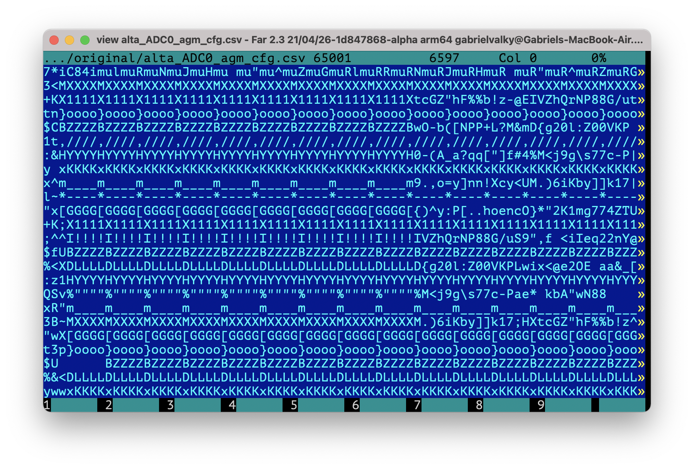
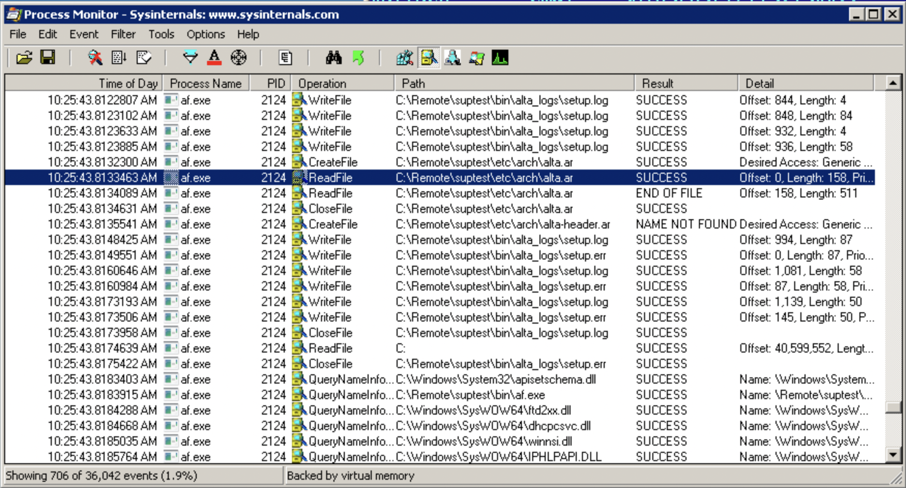
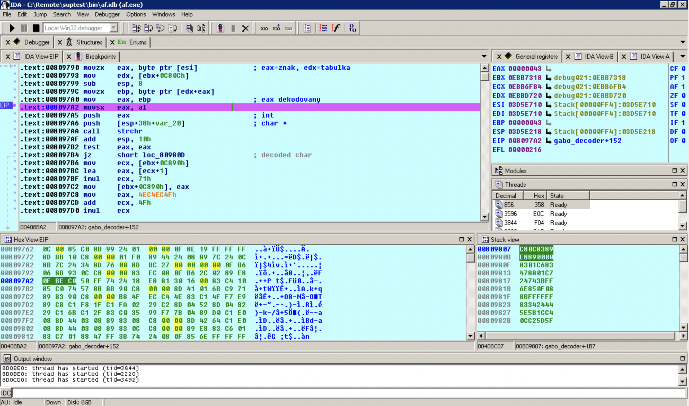
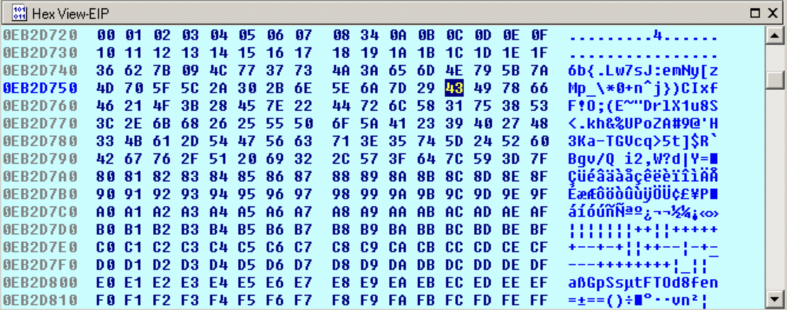

# Alta-gate Supra reverse engineering

Alta-gate is FPGA manufacturer focused on low end devices. Their chips are programmed using combination of their own software called Supra and Altera Quartus. Supra contains a lot of encrypted files (verilog files, their own hardware description files, CSVs...) and I was hoping that by decoding these files it will help me designing my own verilog code for AG1KLPQ48 used in LA104 since there is no documentation available for these chips. 

At the first sight the encoding looks fairly simple, this file shows CSV table in encoded form. You can see there regular sequences which may be the comma delimiter and 4 white spaces repating many times in every line. But the delimiter character and whitespace changes every line... So there is some conversion table which assigns real character to each encoded character (some sort of Caesar cipher?). The problem is that this table is different for each line and I was not able to see there some clear pattern or period.



Supra contains two binaries: AF.exe which provides some commandline shell for building project files for Quartus and Supra.exe which is just GUI interface for the previous one.

By calling following command, it will prepare project files for specific device:
`af.exe -B --setup --mode QUARTUS --design app --device AG1KLPQ48 -X "set DEVICE_FAMILY 1"`

The first step to minimize the application by removing everything unnecessary to be able to load itself and execute previous command. I ended up with following directory structure:

```
C:\Remote\suptest\bin
C:\Remote\suptest\etc
C:\Remote\suptest\lib
C:\Remote\suptest\license
C:\Remote\suptest\bin\af.exe
C:\Remote\suptest\etc\af_setup_.tcl
C:\Remote\suptest\lib\tcl8.5
C:\Remote\suptest\lib\tcl8.5\init.tcl
C:\Remote\suptest\license\license.txt
```


It resulted in following error message:
```
Error: Can not read open architectual file C:/Remote/suptest/etc/arch/alta.ar.
Error: [load_architect] Failed to load device AG1KLPQ48.

Total 0 fatals, 2 errors, 0 warnings, 0 infos.
```

So it needs the alta.ar to work. Alta.ar is the first encrypted file Supra is loading, so I tried to alter the contents of this file to see how it handles corrupted file:

```
Error: Syntax error at C:/Remote/suptest/etc/arch/alta.ar:1.
Error: [load_architect] Failed to load device AG1KLPQ48.

Total 0 fatals, 2 errors, 0 warnings, 0 infos.
```

Trying to find this message in the executable in all possible encodings (using FAR) did not reveal anything. Nor searching for the reference to **alta.ar** file. And this was very suspicous... It seems like the application is written in TCL and embedded in encrypted form right in the main application executable.

Using ProcMon I checked who opens and reads the encrypted file:



So definitely it is the AF.exe which reads this file. Using IDA as debugger I put breakpoints on all CreateFile cals, but later I found out that the application is quite messy and consists of multiple modules which use different approach for accessing filesystem. Some parts were using Win32 api whereas others were using posix fopen. In this case they have used  ` FILE *__cdecl fopen(const char *, const char *)`  for opening and `int __cdecl read(int, void *, unsigned int)` for reading. Debugging the code was pretty nasty and the only way how to find the decryption algorithm was to place hardware breakpoint on memory read at the address where the file was read. This buffer is copied with `memcpy` and then processed character by character.



This part shows the decoding algorithm with lookup `movzx ebp, byte ptr [edx+eax]` where **eax** is the character read from the encrypted file and **edx** points to the conversion table. This table is just identity (with exception of character 9 - tab, and readable ascii range 0x20-0x7f):



This is how it looks with the first decoded character 'C' 0x43 (at offset 0x3C). `strchr` checks whether the decoded character was 'e', 'z', 'E', 'Z' or new line. If yes, it switches the decoding table by pseudorandom generator. Looking at the memory I found 200 tables in a row. This explains why I couldn't find the period when looking at the CSV file - the table changes even when there is 'e' or 'z' present in the line. Here is the code for pseudo random generator:
```
.text:008097B6 mov     ecx, [ebx+0C890h]         ; ecx = 1
.text:008097BC lea     eax, [ecx+1]              ; eax = 2
.text:008097BF imul    ecx, 71h
.text:008097C2 mov     [ebx+0C890h], eax         ; 1 <= 2
.text:008097C8 mov     eax, 4EC4EC4Fh
.text:008097CD add     ecx, 4Fh                  ; ecx = 7*0x71 + 0x4f
.text:008097D0 imul    ecx                       ; eax:edx
.text:008097D2 mov     eax, ecx                  ; eax = 0xc0
.text:008097D4 sar     eax, 1Fh                  
.text:008097D7 sar     edx, 2                    ; edx = 0x3b  
.text:008097DA sub     edx, eax                  ; edx = 0x0e, eax = 0
.text:008097DC lea     eax, [edx+edx*2]          ; eax = 0x2a
.text:008097DF lea     eax, [edx+eax*4]          ; eax = 0xb6
.text:008097E2 sub     ecx, eax
.text:008097E4 imul    eax, ecx, 2Fh             ; eax = 0x1d6
.text:008097E7 add     eax, 35h
.text:008097EA cdq                               ; edx:eax = 00000000 0000020b
.text:008097EB idiv    dword ptr [ebx+4]         ; [ebx+4] = 0x64, (char trans table)
                                                 ; eax = 5, edx= 0x17
.text:008097EE mov     eax, edx
.text:008097F0 shl     eax, 8                    ; eax = 0x1700
.text:008097F3 lea     eax, [ebx+eax+8]          ; eax = 0x0ea78b10
.text:008097F7 mov     [ebx+0C808h], eax         ; (0ea77410) <-  0x0ea78b10
.text:008097FD lea     eax, [edx+64h]            ; 0x17 + 0x64 = 0x7b 
.text:00809800 shl     eax, 8                    ; 0x7b00
.text:00809803 lea     eax, [ebx+eax+8]          ; 0xea7ef10
.text:00809807 mov     [ebx+0C80Ch], eax         ; new table adr
```

By wathing the table addresses generated by this code I found out that it generates just repeating sequence of 13 different offsets. So out of 200 tables the algorithm uses just 13 of them (probably a bug):
```
6400 7b00 8700 9300 aa00 b600 c200 7500 8100 8d00 9900 b000 bc00 
6400 7b00 8700 9300 aa00 ...
```

I did not go deeper to examine how those tables are generated. They could be embedded in the binary, but more likely are they generated run time. By dumping the [tables](tables.txt) and knowing this sequence I was able to write the [decoder in javascript](decod.js):

```
var ofs = 0x0ebbd720 - 0x0ebb7320 - 0x6400;
var seq = [0x6400, 0x7b00, 0x8700, 0x9300, 0xaa00, 0xb600, 0xc200, 0x7500, 0x8100, 
  0x8d00, 0x9900, 0xb000, 0xbc00];

var buf = [];
var lines = data.split("\n");
var base = 0;
for (var i=0; i<lines.length; i++)
{
  line = lines[i];
  var aux = "";
  for (var j=0; j<line.length; j++)
  {
    var inp = line.charCodeAt(j);
    var out = t[inp + ofs + seq[base % seq.length]];
    if ("ezEZ".indexOf(out) != -1)
     base++;
    aux += out;
  }
  base++;
  buf.push(aux);
}
```

In the IP folder you can find original encoded files and the same files after decoding
