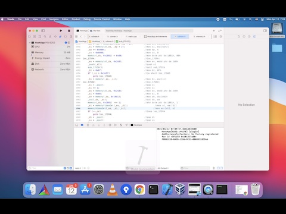
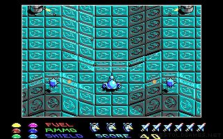
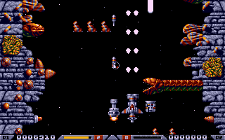

# Cicoparser 

CicoParser is a set of tools for conversion of IBM PC DOS applications into modern operating systems. Instead of emulation of the computer CPU, memory and peripherals, CicoParser translates assembly code of the program into C language and therefore achieves much higher performance than emulation. This also offers unlimited possibilities to extend or improve the original application:
  - run games and applications on any device and platform
  - adding high definition graphics while keeping original gameplay mechanics
  - drawing into multiple planes and more efficient scaling
  - improving input interface - adding touch control
  - online high score boards
  - full control over the application – debugging in programming IDE with C++ support
  - easy deployment on web through HTML5 & javascript export or web assembly

## Using cicoparser

This video demonstrates how to fully reverse engineer a PC DOS game using cicoparser and compile it as desktop OSX application in 25 minutes!

Tools used in this demonstration:
  - [Cicoparser source code](https://github.com/gabonator/Projects/tree/master/XenonResurrection/Parser)
  - [cico.py](https://github.com/gabonator/Projects/tree/master/XenonResurrection/Scripts) - IDA python script
  - [Cdman input files](https://github.com/gabonator/Projects/tree/master/XenonResurrection/Demo/input)
  - [Host application](https://github.com/gabonator/Projects/tree/master/XenonResurrection/Demo/HostApp)
  - [Magic script 1](https://github.com/gabonator/Projects/tree/master/XenonResurrection/Demo/m1) - ES segment signatures
  - [Magic script 2](https://github.com/gabonator/Projects/tree/master/XenonResurrection/Demo/m2) - indirect calls
  - [Result application](https://github.com/gabonator/Projects/tree/master/XenonResurrection/Demo/FinalApp1)

## Demos

| Application | Technology | Conversion state | Input files  | C++      | Javascript | Other targets | Play online |
|-------------|------------|------------------|--------------|----------|------------|---------------| ------------|
| [Star goose](https://www.bestoldgames.net/star-goose) | EGA, pure assembly | 100% | [InputGoose](https://github.com/gabonator/Projects/tree/master/XenonResurrection/InputGoose) | [SimulatorGoose](https://github.com/gabonator/Projects/tree/master/XenonResurrection/SimulatorGoose) | [WebGoose](https://github.com/gabonator/Projects/tree/master/XenonResurrection/WebGoose) | [Swift](https://github.com/gabonator/Projects/tree/master/XenonResurrection/SwiftGoose) |  |
| [CD-Man](https://www.bestoldgames.net/cd-man) | EGA hi res, pure assembly | 95% (no high scores) | [InputCdman](https://github.com/gabonator/Projects/tree/master/XenonResurrection/InputCdman) | [SimulatorCdman](https://github.com/gabonator/Projects/tree/master/XenonResurrection/SimulatorCdman) | | [Webassembly](https://github.com/gabonator/Projects/tree/master/XenonResurrection/WasmCdman) [Swift](https://github.com/gabonator/Projects/tree/master/XenonResurrection/SwiftCdman) |  |
| [Rick dangerous 2](https://www.bestoldgames.net/rick-dangerous-2) | EGA, pure assembly | 90% (mid-game issues) | [InputRick2](https://github.com/gabonator/Projects/tree/master/XenonResurrection/InputRick2) | [SimulatorRick2](https://github.com/gabonator/Projects/tree/master/XenonResurrection/SimulatorRick2) | [WebRick2](https://github.com/gabonator/Projects/tree/master/XenonResurrection/WebRick2) |  |  |
| [Xenon2](https://www.bestoldgames.net/xenon-2) | EGA, pure assembly | 70% (only first level) | [InputXenon2](https://github.com/gabonator/Projects/tree/master/XenonResurrection/InputXenon2) | [SimulatorXenon2](https://github.com/gabonator/Projects/tree/master/XenonResurrection/SimulatorXenon2) | [WebXenon2](https://github.com/gabonator/Projects/tree/master/XenonResurrection/WebXenon2) | |  |
| [Alley cat](https://www.bestoldgames.net/alley-cat) | CGA, pure assembly | 60% | [InputCat](https://github.com/gabonator/Projects/tree/master/XenonResurrection/InputCat) | [SimulatorCat](https://github.com/gabonator/Projects/tree/master/XenonResurrection/SimulatorCat) | | | |

## How it works?

### Assembly listing

Application executable is fed through disassembler (IDA or Ghidra) to produce assembly listing. The disassembler does not need to provide any special features, we just need it to identify all parts of the code and to identify all function bodies. Some applications use indirect calls by register value and in this case we need to tell ida where are those missing parts of the code.
With the python script CicoExport.py executed in IDA python interface a set of extra files is generated:
  - segments.h – with definition of segments and their placement in memory
  - binary file for each segment

### Conversion into C

Each line of the assembly listing is turned into C language using source to source compiler. This is not as straightforward as it seems. Intel CPU uses flags register which is updated after every arithmetical or comparison operation and all of the conditional branching instructions depend on the correct combination of these flags. Cryptic compare/alu instructions in combination with branching is turned into human readable comparisons in C. When necessary, flag register is updated (e.g. when shifting to the right and jumping when carry flag is on), but in most situations the conditional jump can be converted into simple numeric comparison.
To correctly emulate video adapter, video memory access is differentiated from the data segment access. Unfortunately this needs to be done by hand in some places.

### Two stage conversion

Conversion is done in two stages. At first, the assembly code is parsed and transformed into intermediate file with list of fixed size pseudo instructions. Parsing is heavily based on regular expressions and it takes significant time to process whole asm listing (e.g. 20 seconds to process 40 000 lines of assembly). Assembly can take various forms referring to the same address in memory, disassemblers try to be clever and automatically name identified variables in data/code segment (e.g. word_1CF78). This can come handy when reverse engineering an application, but for this converter it is just a complication. To convert this name back to memory address, we need to know where the image was loaded, or where the data segment is placed. By subtracting data segment base address from this value, we get the relative address in data segment. For this purpose the Cicoparser assembly importer needs the “segments.h” file to know, where is which segment located.

### Export into C or Javascript

Second conversion stage is exporting into C language (or Javascript). All pseudo instructions from intermediate file are turned into C statements. Some of the instruction just call their C counterparts (instruction rol calls _rol(…) function, int calls _int(…)) which need to be implemented in the host application. There are two types of memory access in those applications – byte access and word access. The memory(segment, offset) function takes the linear byte buffer for specific segment and returns reference to the specific byte. Whereas memory16(segment, offset) takes specific byte in the segment, casts it to word and then return reference to it. This makes the code perfectly readable.
Contrary to this approach, javascript or big-endian platforms, or platform where it is not possible to dereference unaligned need separate functions for working with words – memory16get and memory16set. Another complication is lack of goto command in javascript. Jumping around the code inside a function can be replaced with switch statement as can be seen in image above. All labels generated by IDA disassembler contain the memory address in the name, so we just take this numeric value and use it as case value.
Javascript does not support conversion into signed/unsigned. Registers and their 16 bit forms are implemented in Javascript as typed arrays (UInt8Array, UInt16Array) which refer to the same ArrayBuffer, using signed type arrays (Int8Array, Int16Array) also allows to create signed comparisons very easily.
In situations where the parser is not able to determine how to turn the assembly into C/Javascript, it leaves marks which stop evaluation of the code and requires the programmer to manually fix this code. This happens for example for indirect calls/branches or for conditional branches which condition is based on flag values which are modified outside the analysed function.

### Code optimizations

Currently there are two types of optimizations. Arithmetical optimization which join operations done on the same register into one expression. And loop optimizations for reduction of label/goto pairs. 

### Application host

Generated code needs host application which implements the CPU methods (string move/store operations, some ALU operations), RAM access, video RAM access, port access and interrupt calls. For filesystem access (open file, read file, close file) interrupt 21h (DOS) needs to be implemented. Video adapter emulation is done by handling writes to the memory starting at A000:0000 and handling video port access. Sound (square wave tone generator) is implemented by listening to ports 61h, 42h and 43h. And human interface can be either keyboard, mouse or joystick. Applications handling keyboard input usually attach to interrupt 16h, but I found it much easier to directly alter the variables modified in this interrupt instead of emulating the keyboard subsystem.
Before jumping to application entry point, the host application loads the data segment buffer contents from file (or whole memory snapshot)
Depending on how these components are implemented, final code can run as desktop application with help of SDL library, or as web application by using Canvas element or as a native application on mobile phone. 

### Application finalization

For demonstration of this conversion process I have ported game Star Goose published in 1988 to iOS. File system functions refer to bundled files (bird1.x, bird2.x, blox.x, intro.x, newbird.x, podz1.x) and before jumping to application entry point, data segment contents is loaded from bundled file into memory. Entry point (start function) is usually infinite loop which needs to broken up into non blocking calls. Each call should ideally represent single frame of gameplay. This game uses EGA video adapter and video RAM is converted into raw RGB buffer which is subsequently converted into UIImageView after every frame. For firing missiles, overlay buttons are placed on sides of the screen and for controlling the ship touches on the screen are converted into the screen coordinate and set the ship position directly.

## Development
- [x] Pure assembly conversion support into C++ with new cicoparser
  - [x] Star Goose
  - [x] Cd Man
  - [x] Rick dangerous 2
  - [x] Xenon 2
  - [x] Alley cat
- [x] Pure assembly conversion into swift or html with full gameplay
  - [x] CDman (link swift, link html)
  - [x] Goose (link swift, link html)
- [x] Advanced assembly conversion into C++
  - [ ] Golden axe
- [ ] Universal host C++ application
- [ ] Cleanup of cicoparser codebase
- [x] Cicoparser CLI
- [ ] Standalone C++ optimizer
- [ ] Standalone C++ to Javascript converter
- [x] Tutorial video
- [ ] Conversion of Borland C/Borland pascal apps into C++
  - [ ] Arcade volleyball
- [ ] Conversion of DOS4GW apps into C++
- [ ] Convresion of Windows 3.11 gui app into C++ / HTML
- [ ] Use internal runtime disassembler instead of IDA
- [ ] Just in time conversion of a application

## History

- 2014 
  - [Alley cat ported into C++](https://github.com/gabonator/Work-in-progress/tree/master/DosGames/AlleyCat), just proof of concept including sound emulation.
  - Not playable demo here [alleycat.html](https://rawgit.valky.eu/gabonator/Work-in-progress/master/DosGames/AlleyCat/Javascript/alleycat.html)
  - [Star goose](https://github.com/gabonator/Work-in-progress/tree/master/DosGames/JsGoose)
  - Playable here: [JSGoose/index.html](https://rawgit.valky.eu/gabonator/Work-in-progress/master/DosGames/JsGoose/index.html)
- 2017
  - Cicoparser was started based on the previous experiments [CicParser2017](https://github.com/gabonator/Work-in-progress/tree/master/DosGames/CicParser2017)
  - Alley cat was turned into playable game
  - Play online here: [CicParser2017/js/test.html](https://rawgit.valky.eu/gabonator/Work-in-progress/master/DosGames/CicParser2017/js/test.html)
- 2021
  - Porting cicoparser and host to OSX/SDL
  - Porting Xenon2 game
  - Porting Star goose to C++ and swift
  - Porting initial scenes of PopCorn, Tetris
  - ...
  
## Screenshots & Videos

