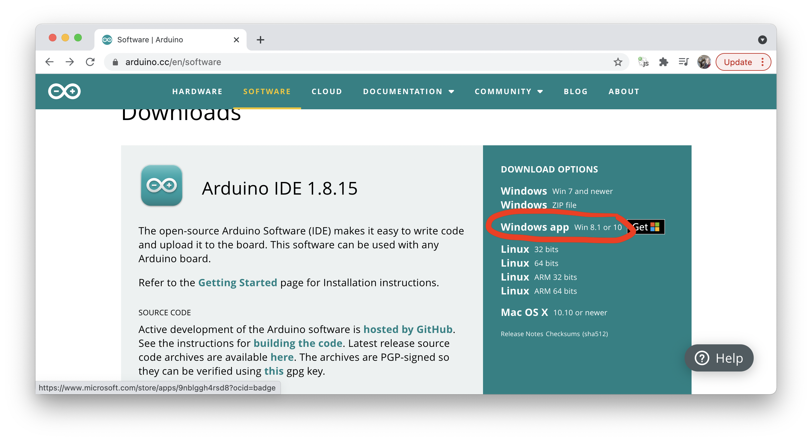
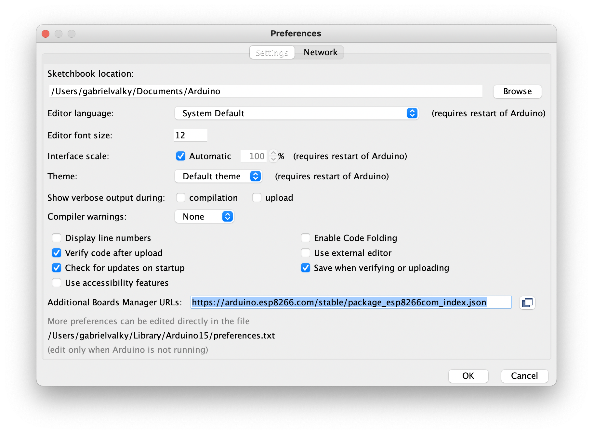
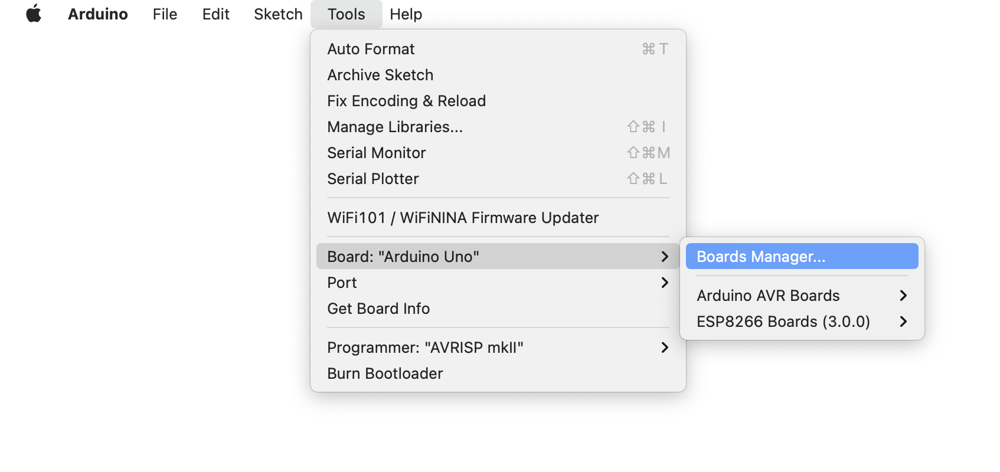
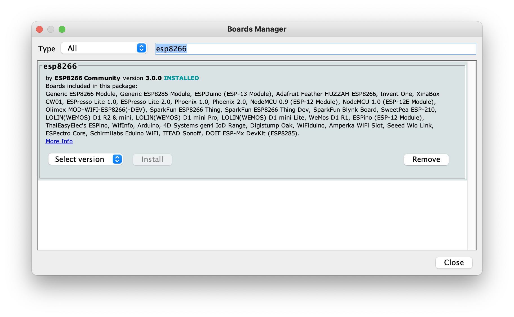
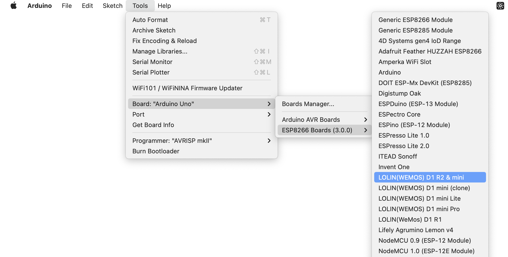
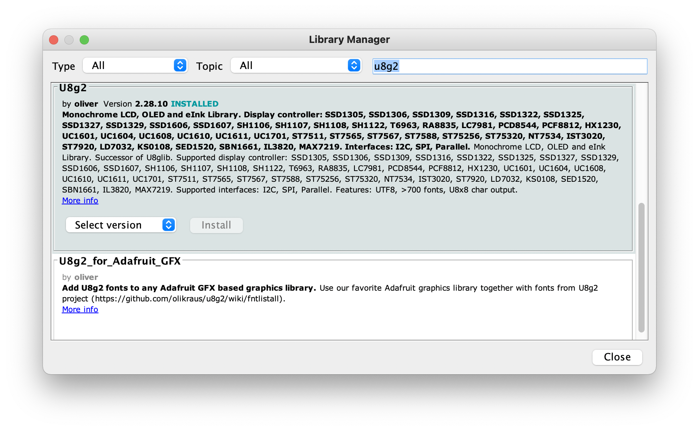

# Priprava na workshop

Na workshope budeme pracovat s modulom Wemos D1 mini, ktory je postaveny na platforme ESP8266 

Za ucelom programovania a napalovania firmwaru pouzijeme program Arduino IDE. Kedze zakladna verzia tohto programu neposkytuje podporu pre moduly postavene na platforme ESP8266, musime vykonat zopar krokov ktore su opisane v nasledujucom navode. Ku modulu budeme pripajat OLED displej a tak isto treba do Arduina doplnit kniznicu, ktora vie s tymto modulom pracovat.

## Instalacia Arduino IDE

- Zo stranky [arduino.cc](www.arduino.cc) vyberte **Software**

- A v zavislosti od platformy na ktorej pracujete stiahnite a nainstaluje Arduino IDE

## Instalacia podpory pre ESP8266

- File - Preferences

- Do pola **Additional boards Manager URLs** pridat: https://arduino.esp8266.com/stable/package_esp8266com_index.json
- Tools -> Board -> BoardsManager

- Vyhladajte vyraz "esp8266"

- Skontrolujte a vyberte Tools -> Boards -> ESP8266 Boards -> LOLIN(WEMOS) D1 R2 & mini

## Instalacia kniznice pre displej

- Sketch -> Include library -> Manager libraries...
- Do vyhladavacieho pola zadajte "u8g2" a nainstalujte kniznicu "U8g2"

