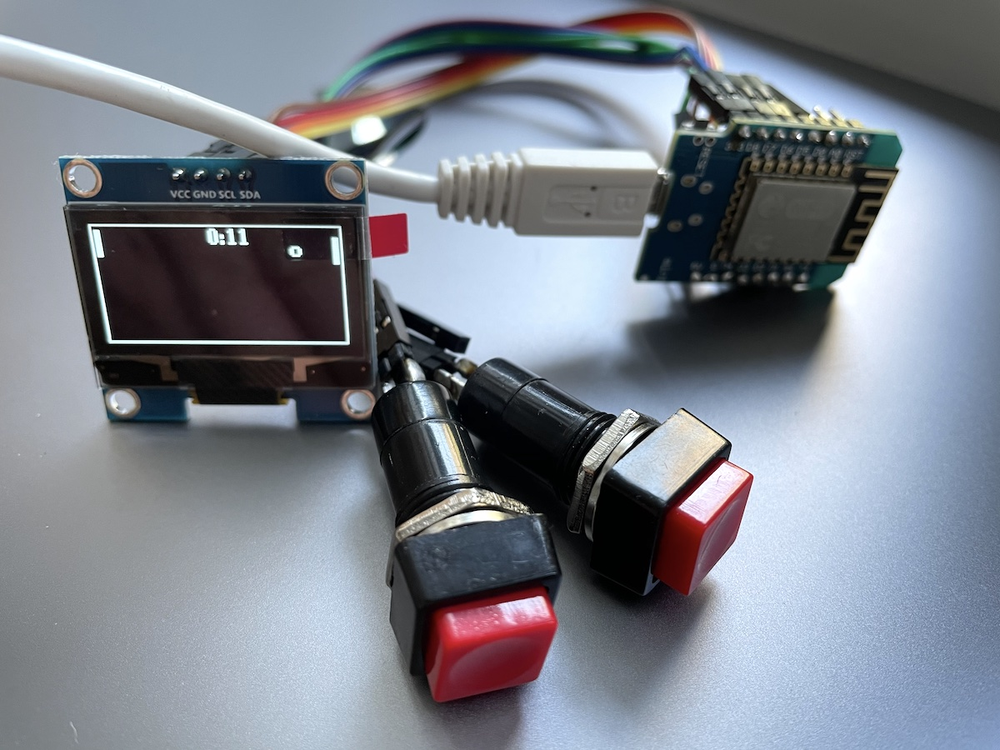

# Electro workshop 4

- i2c zbernice, pamate
- arduino a oled displej
- naprogramujeme si jednoduchy ping pong ovladany dvomi tlacidlami
- hrat budeme proti pocitacu
- workshop rozdelime na dve casti - staticke kreslenie geometrie, jednoduche scrollovanie textu
- interaktivna grafika

## Anotacia

Beseda:
  - pamate, bit, bajt
  - komunikacne zbernice, paralelne, seriove
  - displeje, suradnicove sustavy

Workshop:
  - arduino a displej
  - kreslenie zakladnych geometrickych utvarov
  - animacia
  - interaktivna animacia

## BOM

- Nakup pre 8 ucastnikov kurzu dokopy 140.90 eur

| Pocet | Co                            | Oznacenie GME                                 | Jednotkova cena | Celkova cena | Linka         |
|-------|-------------------------------|-----------------------------------------------|-----------------|--------------|---------------|
| 8x    | Wemos D1 mini                 | NodeMcu LUA D1 mini WIFI ESP-12F modul s ESP8266  | 7.48        | 59.84        | https://www.gme.sk/nodemcu-lua-d1-mini-wifi-esp-12f-modul-s-esp8266 |
| 8x    | OLED 128x64                   | OLED displej 1,3" 128x64, I2C, white          | 8.23            | 65.84        | https://www.gme.sk/oled-displej-1-3-128x64-i2c-white
| 16x   | Tlacidlo                      | Tlacidlove spinace PBS-12B-R/G/Y/BL           | 0.43            | 6.88         | https://www.gme.sk/p-pb303b-red |
| 2x    | Dupont kabel F-F              | Dupont prepojovacie vodice zasuvka-zasuvka 40 kusov | 3.90      | 7.80         | https://www.gme.sk/propojovaci-vodice-zasuvka-zasuvka-40-kusu |
| 2x    | Lista rovna                   | Kolikova lista S1G40 2.54mm                   | 0.27            | 0.54         | https://www.gme.sk/oboustranny-kolik-s1g40-2-54mm |

## Priprava
- [Priprava](priprava/priprava.md)

## Prezentacia
- [Logicke obvody](prezentacia/logickeobvody.pdf)
- [Zbernice](prezentacia/zbernice.pdf)
- OLED Displej (TBD)

## Animacie
- Zoom na integrovany obvod: 

- Konstruktor - simulator polovodicovych cipov

- Paralelna komunikacia

- Seriova komunikacia

- I2C bus - TBD
- I2C protocol - TBD

## Ulohy
- demo [demo.ino](programy/demo.ino) 

- finalny program [pingpong.ino](programy/pingpong.ino)
                    
## Draft

- bit
- 4 bity -> prve procesory, kalkulacky
- 8 bitov, velkosti harddiskov v GB, ascii tabulka, kolko kb je jedna A4, kolko jedna kniha, kolko 1 minuta zvuku,
kolko 1 minuta videa

- komunikacia, paralelna zbernica, lpt tlaciaren
- seriova komunikacia, RS232
- https://www.youtube.com/watch?v=PJ_bS7meE7s&ab_channel=HowTo
- I2C
- https://escapequotes.net/wp-content/uploads/2016/02/esp8266-wemos-d1-mini-pinout.png
- install esp8266 tutorial!!

## References
- https://www.zachtronics.com/kohctpyktop-engineer-of-the-people/
- https://www.electronics-tutorials.ws/boolean/bool_2.html
- https://electricalacademia.com/digital-circuits/basic-logic-gates-definition-truth-tables-examples/
- https://www.youtube.com/watch?v=PJ_bS7meE7s&ab_channel=HowTo
- https://github.com/olikraus/u8g2/wiki/fntlistall
- https://github.com/olikraus/u8g2/wiki/u8g2reference#drawcircle
