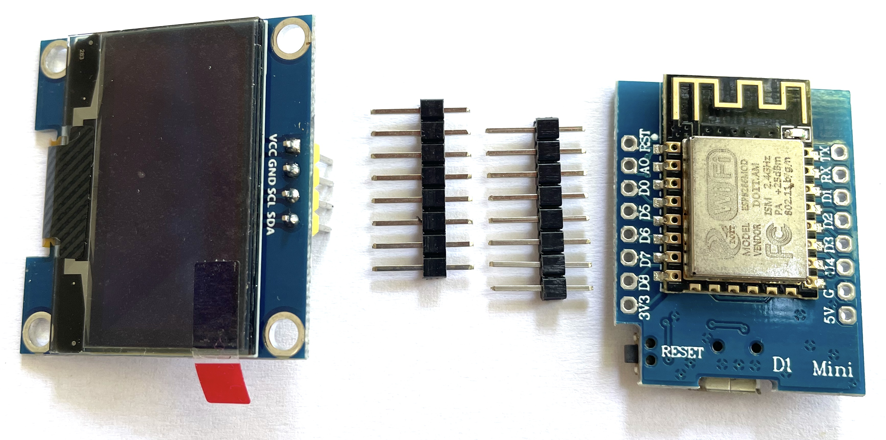
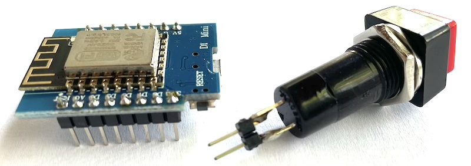
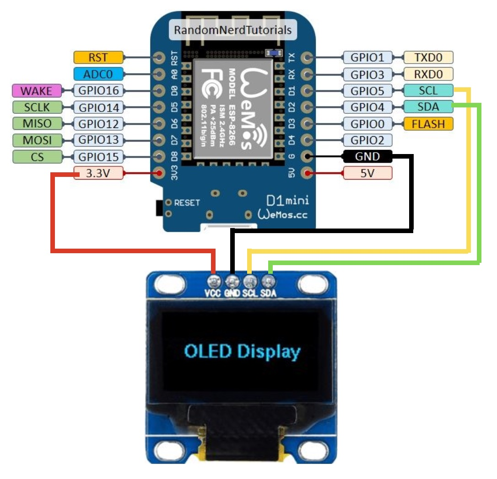
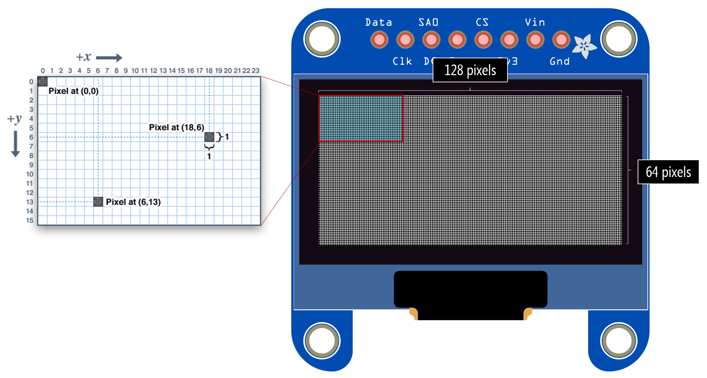
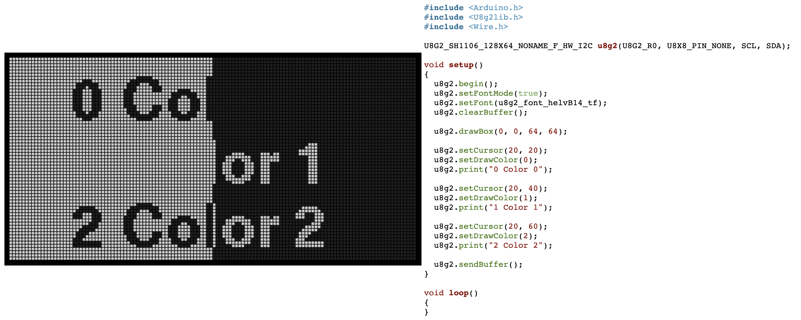
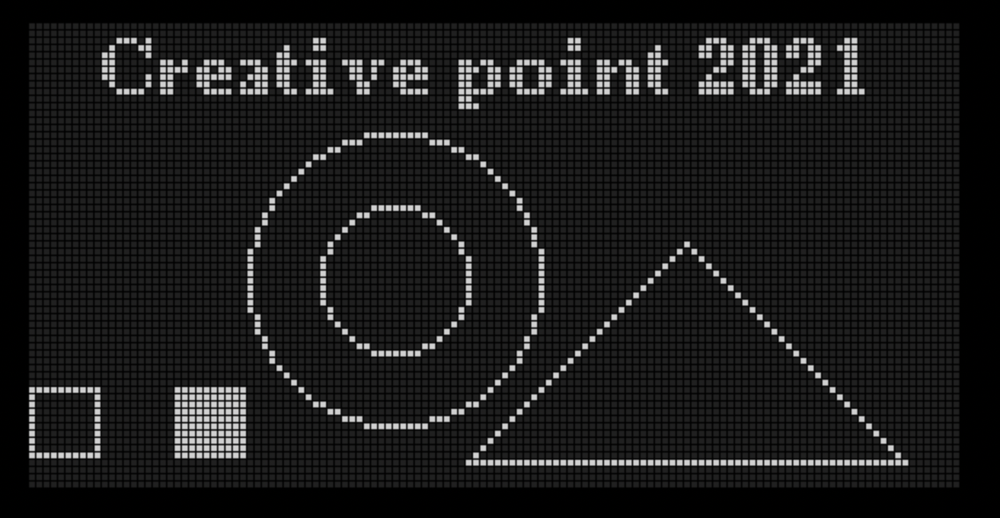
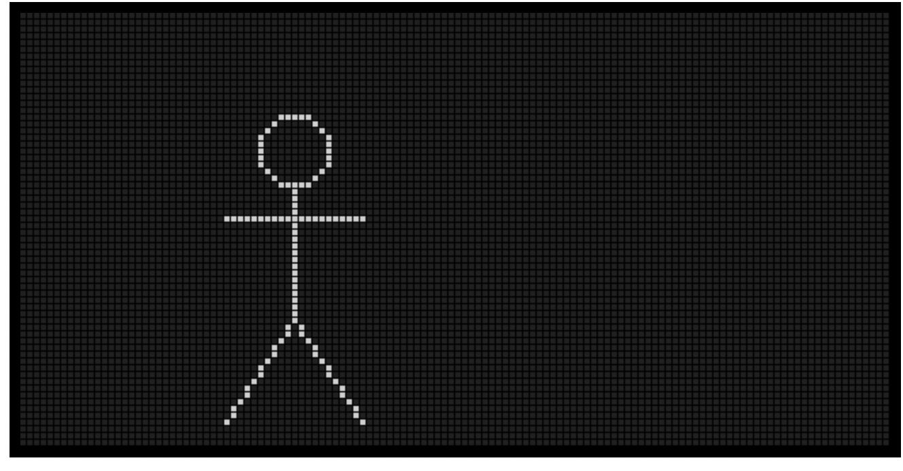
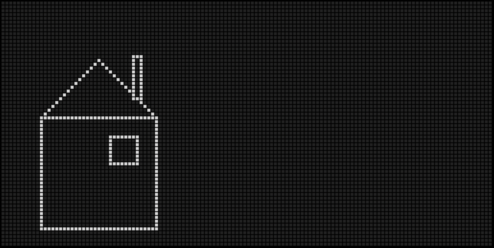
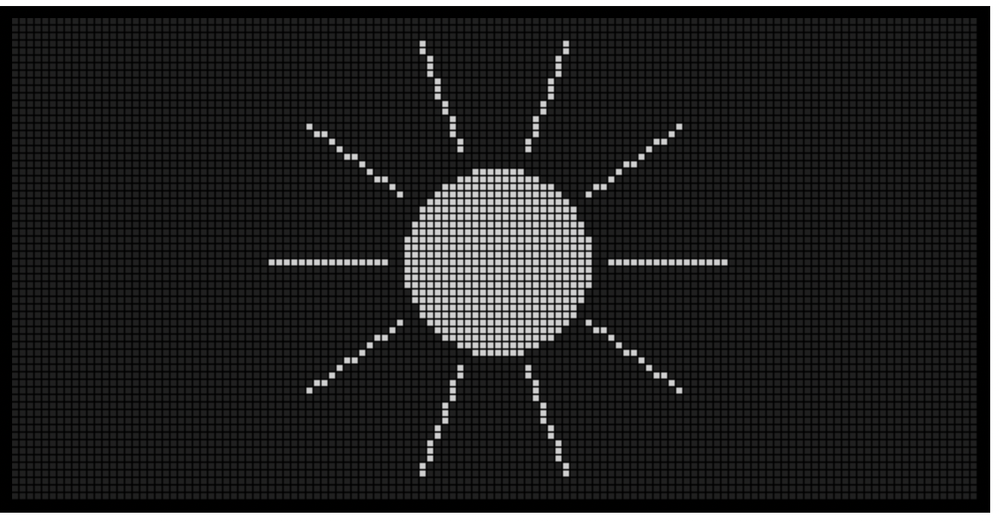

# Pripojenie OLED s Wemos D1 mini

Naletujeme dva 8 pinove headery na modul Wemos D1, na spince naletujeme dvojpinove headery





Prepajacimi kablami prepojime 3.3V napajanie, zem a zbernicu I2C medzi Wemos D1 a OLED displejom



# Kreslenie s OLED



## Farby

[](https://rawgit.valky.eu/gabonator/Education/master/2021/Electro4/resources/show.html#colors.js)

## Geometria

[](https://rawgit.valky.eu/gabonator/Education/master/2021/Electro4/resources/show.html#demo.js)

## Uloha 0: Demo

Otestujte tento program:

```C
#include <Arduino.h>
#include <U8g2lib.h>
#include <Wire.h>

U8G2_SH1106_128X64_NONAME_F_HW_I2C u8g2(U8G2_R0, U8X8_PIN_NONE, SCL, SDA);

void setup()
{
  u8g2.begin();
  u8g2.setFont(u8g2_font_ncenB08_tr);
  u8g2.clearBuffer();

  u8g2.setCursor(10, 10);
  u8g2.print("Creative point ");
  u8g2.print(2021);
  u8g2.drawCircle(50, 35, 10);
  u8g2.drawCircle(50, 35, 20);
  u8g2.drawPixel(50, 35);
  u8g2.drawLine(60, 60, 90, 30);
  u8g2.drawLine(90, 30, 120, 60);
  u8g2.drawLine(120, 60, 60, 60);
  u8g2.drawFrame(0, 50, 10, 10);
  u8g2.drawBox(20, 50, 10, 10);
  u8g2.sendBuffer();
}

void loop(void)
{
}
```
## Uloha 1: Meno

- Upravte predosly program tak, aby zobrazil vase meno v strede displeja a pod nim nakreslil vodorovnu ciaru (podciarknuty napis)
- Pouzite font ```u8g2_font_ncenB12_tr```
- [Riesenie](programy/name.ino)
TODO 

## Uloha 2: Panacik

Upravte predosly program tak, aby ste vykreslili panacika podla obrazka:



- [riesenie](programy/body.ino)

## Uloha 3: Domcek

- Nakreslite domcek podla obrazka



- [riesenie](programy/house.ino)


## Uloha 4: Hadanka

- Zistite, co robi nasledujuci program
- Sledujte vystup v konzole (Tools -> Serial monitor), nastavte baudrate na 9600
- Co robi operator ```%```?
- Upravte program na rozsah 0..4 (5 roznych hodnot)

```C
void setup()
{
  Serial.begin(9600);
}

void loop()
{
  Serial.println(rand()%100);
  delay(100);
}
```

## Uloha 5: Jablka, hrusky, maliny

Upravte tento program tak, aby vypisoval nahodne niektore zo styroch vasich oblubenych ovoci:

```C
void setup()
{
  Serial.begin(9600);
}

void loop()
{
  int i = ???;
  if (i==0)
  {
    Serial.println("jablka");
  }
  if (i==1)
  {
    Serial.println("hrusky");
  }
  if (i==2)
  {
    Serial.println("maliny");
  }
  delay(100);
}
```

- [riesenie](programy/fruits.ino)

## Uloha 6: Sierpinskeho trojuholnik

- Nastudujte kreslenie sierpinskeho trojuholnika metodou "chaos game" podla [videa](https://www.youtube.com/watch?v=droTYSmSGHg) 
- Upravte nasledujuci program aby ste nakreslili sierpinskeho trojuholnik:

```C
#include <Arduino.h>
#include <U8g2lib.h>
#include <Wire.h>

U8G2_SH1106_128X64_NONAME_F_HW_I2C u8g2(U8G2_R0, U8X8_PIN_NONE, SCL, SDA);

// polohy troch bodov vo vrcholoch trojuholnika
int px0 = 0; 
int py0 = 60;
int px1 = 64;
int py1 = 0;
int px2 = 127;
int py2 = 63;

// nasa pociatocna suradnica
int x = 128/2;
int y = 64/2;

void setup()
{
  u8g2.begin(); 
}

void loop()
{
  int i = ???;
  if (i==0)
  {
    x = (x + px0) / 2;
    y = (y + py0) / 2;
  }
  // ???
  u8g2.drawPixel(x, y);
  u8g2.sendBuffer();
}
```

- [Riesenie bez pola](programy/sierpinski1.ino)
- [Riesenie s polom](programy/sierpinski2.ino)

## Uloha 7: Slniecko

- Nakreslite slniecko podla obrazka



- [riesenie](programy/sun.ino)

## Uloha 8: Animovane slniecko

- Nechajte luce okolo slnka rotovat
- [riesenie](programy/sunanim.ino)

## Uloha 9: Scrollovany text
- Vypiste vase meno v strede displeja a posuvajte ho vzdy o jeden pixel doprava
- Ked zmizne z obrazovky, presunte ho na zapornu Xovu suradnicu tak, aby sa postupne vynoril zlava
- [Riesenie](programy/scroll.ino)

TBD

## Uloha 10: Stvorec s vertikalnym odrazom
- Vykreslite oramovanie displeja
- Vykreslite v strede stvorec s rozmermi 10x10 pixelov a nechajte ho posuvat o jeden pixel doprava az kym "nenarazi" o pravu hranu displeja
- V okamihu narazu ho nechate posuvat o jeden pixel dolava az kym nenarazi na lavu hranu displeja
- V okamihu narazu zmente smer posuvu doprava a opakujte

TBD

## Uloha 11: Stvorec pohyb v dvoch smeroch

- Rozsirte predosly program o pohyb aj v Y-ovej osi

TBD

## Uloha 12: Spinace

- Zapojte spinace podla obrazka


- s pomocou prikazov pinMode a digitalWrite nastavte piny nasledovne:
  - D8 - uzemnenie
  - D7 - vstup s pullup (INPUT_PULLUP)
  - D6 - uzemnenie
  - D5 - vstup s pullup (INPUT_PULLUP)
- V 100ms intervaloch vypisujte stav tlacidiel cez seriovu linku pre overenie funkcnosti vo formate: ```tlacidlo1=zapnute,tlacidlo2=vypnute```
- [Riesenie](programy/testbutton.ino)

## Uloha 13: Pohyb so spinacmi

- Vyuzite nasledujuci kod pre pohybovanie s obdlznikom. Pri stlaceni jedneho tlacidla znizte hodnotu ```py``` o jedna, pri stlaceni druheho ju zvyste. Obmedzte pohyb tak, aby obdlznik neopustil displej
```
#include <Arduino.h>
#include <U8g2lib.h>
#include <Wire.h>

U8G2_SH1106_128X64_NONAME_F_HW_I2C u8g2(U8G2_R0, U8X8_PIN_NONE, SCL, SDA);

int py = 32;
void setup()
{
  u8g2.begin();
}

void loop()
{
  u8g2.clearBuffer();
  u8g2.drawFrame(0, 0, 128, 64);
  u8g2.drawBox(2, py-7, 3, 14);
  u8g2.sendBuffer();
}
```

- [Riesenie](programy/pohyb.ino)

## Uloha 14: Detekcia kolizie
- Skombinujte predosly program s odrazajucim sa stvorcom z ulohy 11, pricom pouzijeme stvorec
- Skuste vypocitat ci sa lietajuca "lopticka" dotkla nasej "podlozky" s ktorou pohybujeme
- Ak lopticka vyletela mimo, premiestnimeju ju do stredu

## Uloha 15: Gulicka
- Namiesto stvorca vykreslime pismeno "o":

```C
  // pridat do setup
  u8g2.setFont(u8g2_font_ncenB08_tr);

  // vykreslenie gulicky
  u8g2.print("o");
```

## Uloha 16: Super
- Na pravu stranu vykreslime podlozku supera, ktora bude presne sledovat polohu lopticky a nikdy ju neminie

## Uloha 17: Score
- Do stredu obrazovky v hornej casti vypiseme skore v tvare "5 : 1"
- Vzdy pri prehre hraca sa inkrementuje cislo za dvojbodkou
- [riesenie](programy/pingpong.ino)
