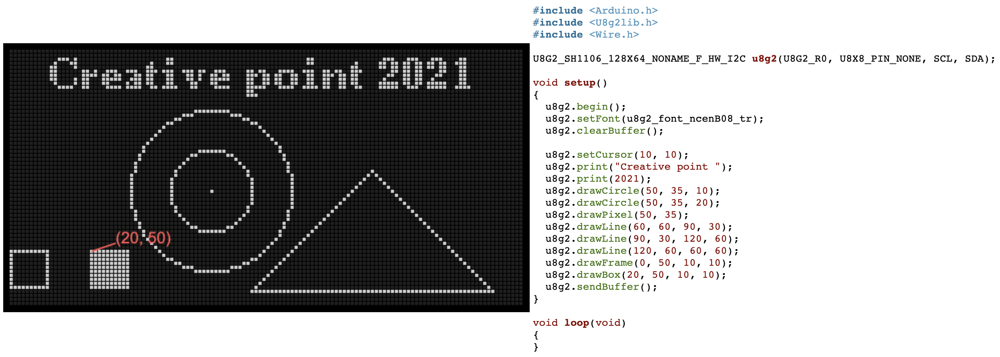

# Kreslenie s OLED

## Farby

## Geometria

## Panacik

## Sierpinskeho trojuholnik

## Slniecko

## Animovane slniecko

## Draft

- demo [demo.ino](programy/demo.ino) 

- finalny program [pingpong.ino](programy/pingpong.ino)
