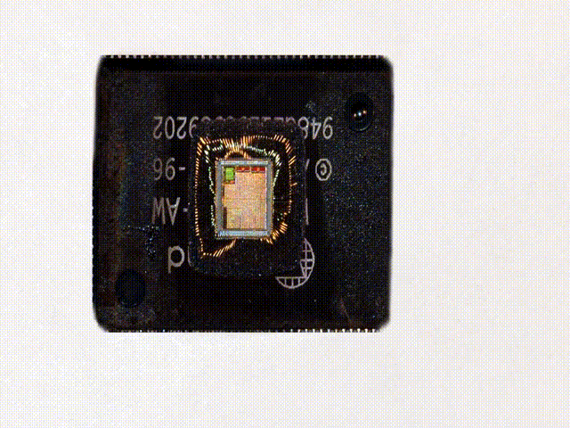
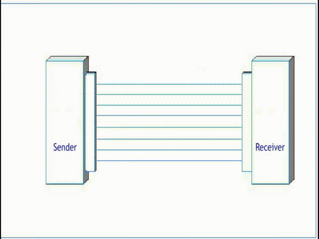
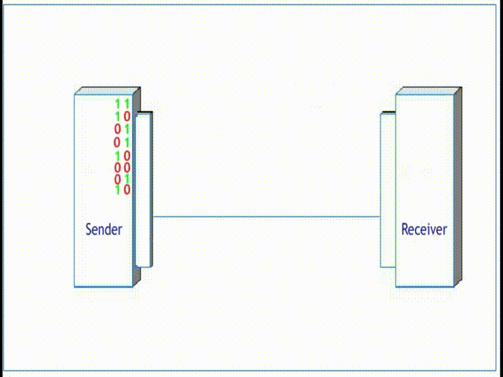
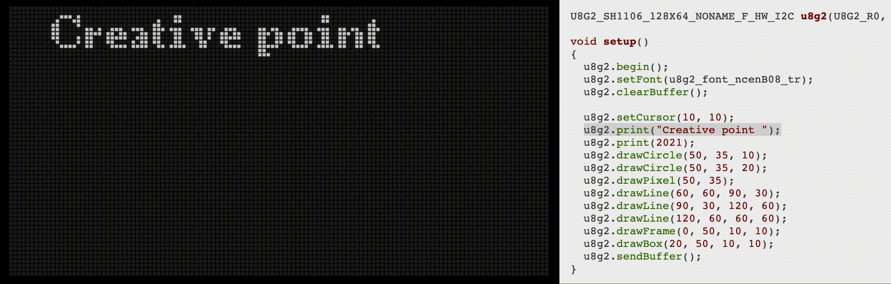

# Electro workshop 5

- i2c zbernice, pamate
- arduino a oled displej
- naprogramujeme si jednoduchy ping pong ovladany dvomi tlacidlami
- hrat budeme proti pocitacu
- workshop rozdelime na dve casti - staticke kreslenie geometrie, jednoduche scrollovanie textu
- interaktivna grafika

## Anotacia

Beseda: Na besede sa porozprávame o tom, čo je to vlastne počítač, prečo pracuje s jednotkami a nulami a čo sa vovnútri deje, keď si pozeráme na youtube obľúbené video. Pôjdeme do hĺbky až na úroveň tranzistorov a pozrieme sa, aké základné logické štruktúry vytvárajú. Počítač, to však nie je iba procesor a preto si vysvetlíme ako prebieha komunikácia s perifériami a ako počítač komunikuje s okolitým svetom. Či už to sú externé periférie ako tlačiareň a myš, alebo perifére interné ako displej alebo akcelerometer v mobilnom telefóne.
Zameriame sa na dvojvodičovú zbernicu I2C a komunikáciu Arduina s OLED displejom. Naučíme sa v akej súradnicovej sústave takéto displeje pracujú a ako sa na nich dajú vykresliť jednoduché statické obrázky alebo animácie s pomocou útvarov ako úsečka alebo kružnica.

Workshop1: Na workshope budeme pracovať s modulom ESP8266 na doske Wemos D1 mini ku ktorému pripojíme 128x64 pixelový OLED displej. S pomocou knižnice u8g2 budeme vykreslovať základné geometrické útvary a skúsime tiež vykresliť jednoduché animácie.

Workshop2: Ďalej budeme pokračovať v programovaní grafických aplikácií v prostredí arduino. Ku statickým obrázkom a animáciám pridáme interaktívnu grafiku. Ku arduinu pripojíme dva spínače, s ktorými budeme ovládať zobrazené objekty na OLED displeji. Naším cieľom bude naprogramovanie jednoduchej ping-pong hry.

Príprava: Priniesť si kábel na USB-micro, postupovať podľa návodu [Priprava](priprava/priprava.md)

## BOM

- Nakup pre 8 ucastnikov kurzu dokopy 140.90 eur

| Pocet | Co                            | Oznacenie GME                                 | Jednotkova cena | Celkova cena | Linka         |
|-------|-------------------------------|-----------------------------------------------|-----------------|--------------|---------------|
| 8x    | Wemos D1 mini                 | NodeMcu LUA D1 mini WIFI ESP-12F modul s ESP8266  | 7.48        | 59.84        | https://www.gme.sk/nodemcu-lua-d1-mini-wifi-esp-12f-modul-s-esp8266 |
| 8x    | OLED 128x64                   | OLED displej 1,3" 128x64, I2C, white          | 8.23            | 65.84        | https://www.gme.sk/oled-displej-1-3-128x64-i2c-white
| 16x   | Tlacidlo                      | Tlacidlove spinace PBS-12B-R/G/Y/BL           | 0.43            | 6.88         | https://www.gme.sk/p-pb303b-red |
| 2x    | Dupont kabel F-F              | Dupont prepojovacie vodice zasuvka-zasuvka 40 kusov | 3.90      | 7.80         | https://www.gme.sk/propojovaci-vodice-zasuvka-zasuvka-40-kusu |
| 2x    | Lista rovna                   | Kolikova lista S1G40 2.54mm                   | 0.27            | 0.54         | https://www.gme.sk/oboustranny-kolik-s1g40-2-54mm |

## Priprava
- [Priprava](priprava/priprava.md)

## Prezentacia
- [Logicke obvody](prezentacia/logickeobvody.pdf)
- [Zbernice](prezentacia/zbernice.pdf)
- [Checkpoint](prezentacia/checkpoint.pdf)

## Ulohy
- [Ulohy](tasks.md)

## Animacie
- Zoom na integrovany obvod: 

- Konstruktor - simulator polovodicovych cipov

- Paralelna komunikacia

- Seriova komunikacia

- Kreslenie s u8g2 kniznicou

                    
## References
- https://www.zachtronics.com/kohctpyktop-engineer-of-the-people/
- https://www.electronics-tutorials.ws/boolean/bool_2.html
- https://electricalacademia.com/digital-circuits/basic-logic-gates-definition-truth-tables-examples/
- https://www.youtube.com/watch?v=PJ_bS7meE7s&ab_channel=HowTo
- https://github.com/olikraus/u8g2/wiki/fntlistall
- https://github.com/olikraus/u8g2/wiki/u8g2reference#drawcircle
- https://github.com/olikraus/u8g2/wiki/u8g2reference#getdisplaywidth
- https://makeabilitylab.github.io/physcomp/advancedio/oled.html
- https://www.youtube.com/watch?v=2z9qme_ygRI&ab_channel=ASML
- https://www.youtube.com/watch?v=6IAkYpmA1DQ&ab_channel=HowToMechatronics
- https://www.youtube.com/watch?v=2ciyXehUK-U&ab_channel=JohnHarrington
- https://www.sccs.swarthmore.edu/users/06/adem/engin/e77vlsi/lab3/
- https://pngable.com/png/XyPyPMafwW/cmos-nand-gate-logic-nor-bipolar-junction-transistor-png
- https://www.4004.com/
- https://github.com/olikraus/u8g2/wiki/fntlistall
- https://makeabilitylab.github.io/physcomp/advancedio/oled.html

## Notes
- Prezentacie: 75 min
- Letovanie: 25 min
- Nakonfigurovanie arduina: 25 min
- Splnene ulohy vramci 3h30min: 7