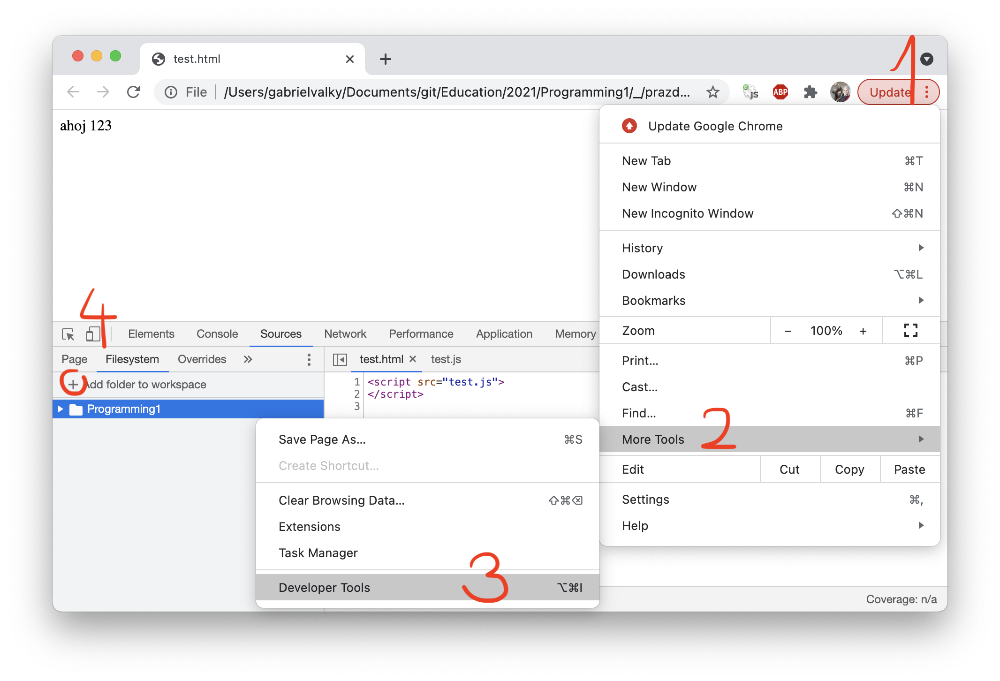
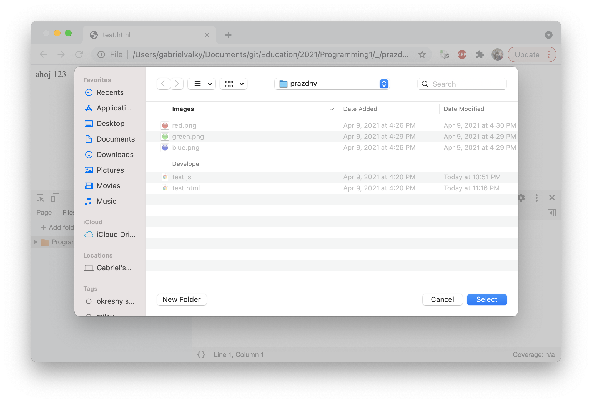
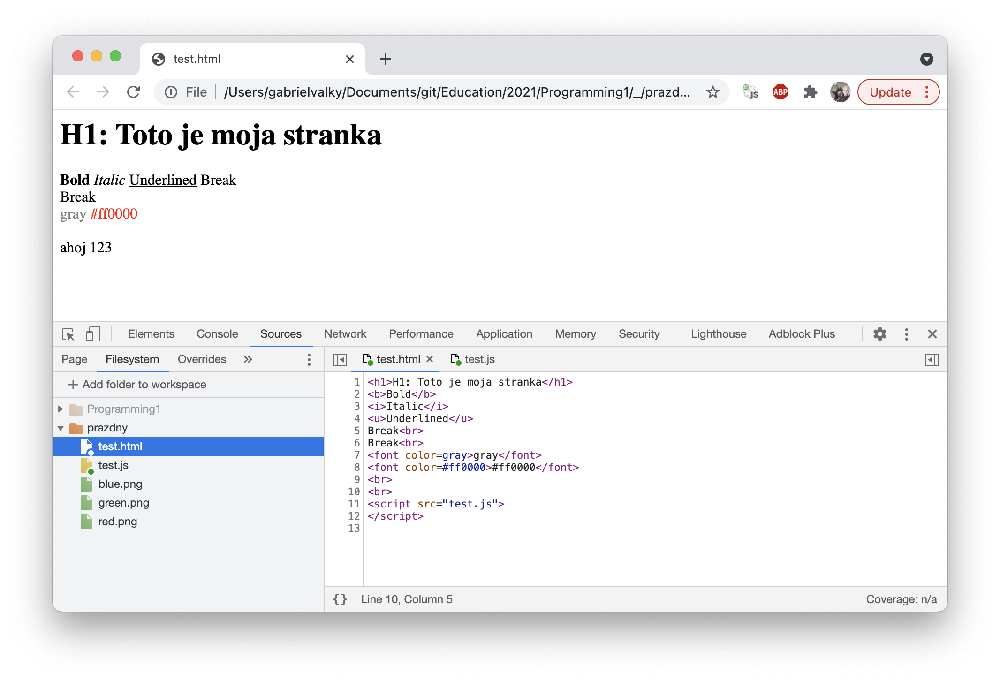

# Uvod do programovania 1

## Priprava

- stiahnite si [balicek](prazdny.zip)
- rozbalte a otvorte test.html v Chrome
- otvorte developer konzolu (Ctrl + Shift + J, alebo tri bodky vpravo hore, More Tools -> Developer Tools)
  
- pridajte adresar s rozbalenym balickom Source -> Filesystem -> Add folder to workspace
  
- vyskusajte modifikovat test.html. Pri kazdom zmenenom subore sa zobrazi hviezdicka. Treba subor ulozit (Ctrl + S) a refreshnut stranku (Ctrl + R)
  
- Pocas workshopu budeme fotografovat nase vytvory s pomocou "Snipping tool"-u a zdielat v chate v Teamsoch. Ak tento nastroj nepoznate, natrenujte podla [tejto stranky](https://exaktime.zendesk.com/hc/en-us/articles/360037477253-FAQ-Capturing-Effective-Screenshots)
  
  
- Nastavte si anglicku klavesnicu, a zistitke ako sa pisu nasledujuce symboly

plus +
minus -
krat *
deleno /
rovna sa =
zatvorka lava (
zatvorka prava )
zlozena zatvorka lava {
zlozena zatvorka prava }
hranata zatvorka lava [
hranata zatvorka prava ]
symbol mensie <
symbol vacsie >
vykricnik !
bodka .
or |
and &

uvodzovka dvojita "
uvodzovka jednoducha '     ---- vyhodit!!!

opacne lomitko \
bodkociarka ;

