# Uvod do programovania 1

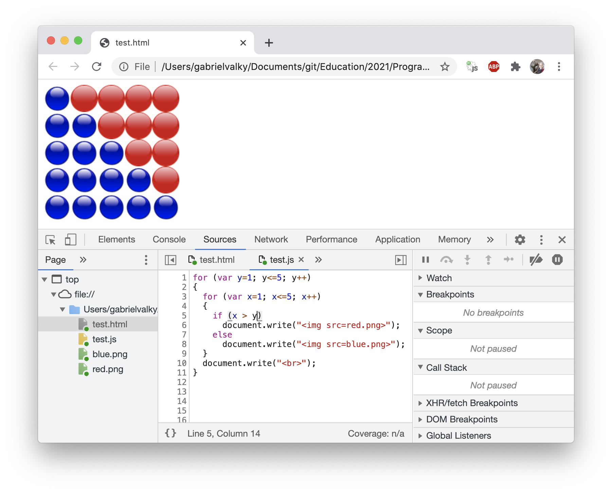

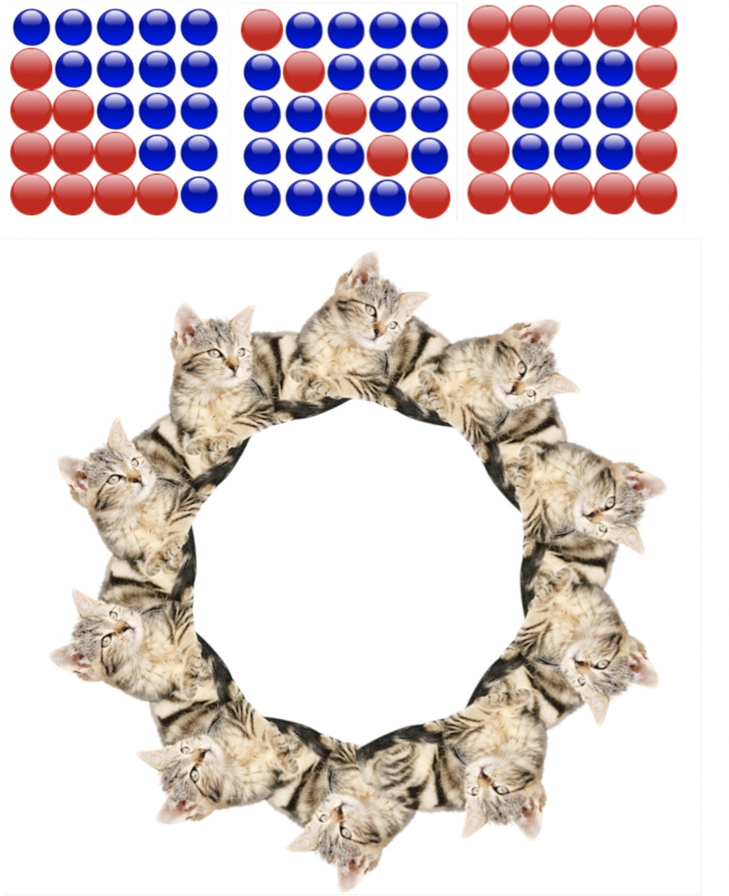

## Anotacia
Beseda: Vedeli ste o tom, že programovať sa dá naučiť za pol roka? Možno niektorí z vás už stáli pred rozhodnutím naučiť sa programovať, no po pr votnom prieskume množstva všetkých jazykov a technológií ste to radšej odložili na neskôr. Počas besedy si ukážeme ako napísať krátky program pre viac ako 10 rôznych jazykov. Vysvetlíme si, aké su medzi nimi rozdiely, a ako postupovať pri zoznamovaní sa s novým programovacím jazykom. Pozrieme sa na zakladné pojmy ako premenná, funkcia a podmienka. Taktiež predstavíme možnosti programovania aj bez použitia špeciálnych, často platených, integrovaných editorov IDE (Integrated development environment).

Workshop: Aj účastník bez predošlých algoritmických základov sa naučí zostaviť jednoduchý program a zapísať matematický alebo logický výraz tak, aby mu počítač rozumel. Pridáme premenné, slučky, funkcie a s pomocou týchto zakladných stavebných prkvov začneme generovať jednoduchú grafiku.
Na to, aby sme pretavili naše nápady do formy programu, nebude potrebný žiadny špeciálny software. Ukážeme si, že na programovanie stačí aj Microsoft Word alebo obyčajný browser.
A práve nástroj Developer Tools v browseri Chrome použijeme ako editor a debugger. S pomocou jazyka Javascript budeme generovať HTML kód, v ktorom budeme kombinovať obrázky, z ktorých zostavíme mozaiky a geometrické tvary.

## Priprava
- [Priprava](priprava.md)

## Prezentacia
- [Prezentacia](prezentacia.pdf)

## Ulohy

### Uloha 1: Vyskusat si HTML tagy

- Nastavit Debug console dock side na spodok
- Otvorit test.html

```html
<h1>H1: Toto je moja stranka</h1>
<b>Bold</b> 
<i>Italic</i> 
<u>Underlined</u> 
Break<br>
Break<br>
<font color=gray>gray</font>
<font color=#ff0000>#ff0000</font>
<!-- poznamka -->
<br>
<br>

```

### Uloha 2: Kalkulacka
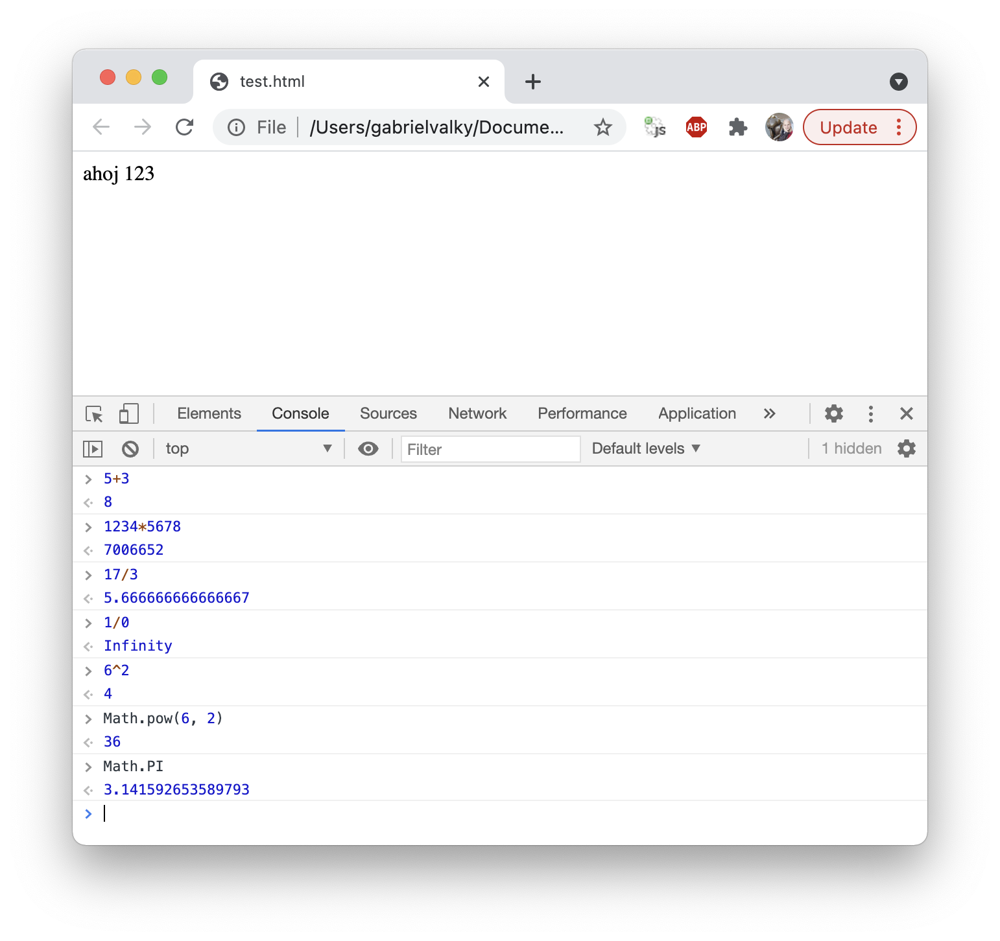

| Operacia                    | Zapis |
|-----------------------------|-----|
| Scitanie                    | 2 + 3 = 5 |
| Odcitanie                   | 2 - 3 = -1 |
| Nasobenie                   | 2 * 3 = 6 |
| Scitanie                    | 2 / 3 = 0.66666 |
| Xor                         | 2 ^ 3 = 1, 0b10 ^ 0b11 = 0b01 |
| Umocnenie                   | Math.pow(2, 3) = 8 |
| Druha odmocnina             | Math.sqrt(9) = 3 |
| Zaokruhlenie nadol          | Math.floor(3.9) = 3 |
| Zvysok po deleni (modulo)   | 7 % 4 = 3 |
| Absolutna hodnota           | Math.abs(-3) = 3 |
| PI                          | Math.PI = 3.141592653 |
| Sinus v radianoch           | Math.sin(Math.PI/4) = 0.70716 |
| Kosinus v radianoch         | Math.cos(Math.PI/4) = 0.70716 |
| Sinus v stupnoch            | Math.sin(45 / 180 * Math.PI) = 0.70716 |

### Uloha 3: Obvod a obsah stvorca

- doplnte riadok pre vypocet obsahu stvorca
```javascript
strana = 5
obvod = 4*strana
```

- [riesenie](riesenia.md#uloha-3)

### Uloha 4: Porovnavanie
```javascript
5 < 10
5 >= 10
5 = 5
5 == 5
true == 15
```

- aj true a false mozeme porovnat s cislami, zistite akej numerickej hodnote sa rovna true a false
- doplnte tabulku:

| Vyraz | Vysledok    |
|-------|-------------|
| false + false | ?   |
| false + true |  ?   |
| true + true |   ?   |
| false * false | ?   |
| false * true |  ?   |
| true * true |   ?  |

Tabulka porovnavacich operatorov:
| Operator                    | Vyznam                    |
|-----------------------------|---------------------------|
| a >= b                      | a je vacsie alebo rovne b |
| a > b                       | a je vacsie ako b |
| a < b                       | a je mensie ako b |
| a <= b                      | a je mensie alebo rovne b |
| a == b                      | a je rovne b |
| a = b                       | nastav hodnotu b do premennej a |
| a != b                      | a je ine ako b |
| a                           | ak a je pravda (nie je nulove) |
| !a                          | ak a nie je pravda (ak a je nula) |
| !(a == b)                   | a je ine ako b |
| !(a > b)                    | a je mensie |

- [riesenie](riesenia.md#uloha-4)

### Uloha 5: Alert a prompt
```javascript
meno = prompt("Ako sa volas")
alert("Ahoj " + meno)
```
- co robia funkcie prompt a alert?
- [riesenie](riesenia.md#uloha-5)

### Uloha 6: Slucka
- editujeme test.js
- program vypise 10 cisel za sebou
- upravte tento program tak, aby cisla vypisal pod seba 

```javascript
var i = 1
while (i <= 10)
{
    document.write(i)
    i = i + 1
}
```

- [riesenie](riesenia.md#uloha-6)

### Uloha 7: Spajanie cisel a retazcov
- Upravte program tak, aby pre kazde cislo napisal "Stvorec so stranou X ma obvod X"
- [riesenie](riesenia.md#uloha-7-a)
- Upravte program tak, aby pre kazde cislo napisal "Stvorec so stranou X ma obvod X a obsah X"
- [riesenie](riesenia.md#uloha-7-b)

### Uloha 8: Zvysok po deleni
- Upravte nasledujuci program tak, aby spravne vypocital podiel a zvysok a zaroven urcil ci je cislo parne

```javascript
var i = 1
while (i <= 10)
{
    var podiel = "neviem"
    var zvysok = "neviem"
    var parne = "neviem"

    document.write(i + " po deleni dvomi je " + podiel + " a zvysok " + 
      zvysok + ", cislo je parne: " + parne + "<br>")
    i = i + 1
}
```
- [riesenie](riesenia.md#uloha-8-a)

- Upravte tento program aby vypocital podiel po deleni tromi a urcil ci je cislo delitelne tromi

- [riesenie](riesenia.md#uloha-8-b)

### Uloha 9: html image
- Modifikaciou test.html nakreslit tri cervene gulicky vedla seba


- [riesenie](riesenia.md#uloha-9-a)

- nakreslite maticu guliciek 3x3 podla obrazku


- [riesenie](riesenia.md#uloha-9-b)

### Uloha 10: generovanie html
- vygenerovat v javascripte HTML, ktore nakresli 10 cervenych guliciek vedla seba


- [riesenie](riesenia.md#uloha-10-a)

- vygenerovat v javascripte HTML, ktore nakresli 2x10 cervenych guliciek v dvoch riadkoch

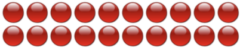

- [riesenie](riesenia.md#uloha-10-b)

### Uloha 11: vnorene slucky
- vygenerovat v javascripte HTML, ktore nakresli maticu 10x10 cervenych guliciek

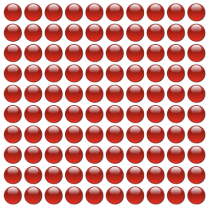

- [riesenie](riesenia.md#uloha-11)

### Uloha 12:
- vygenerovat v javascripte HTML, ktore nakresli maticu 5x5 cervenych guliciek, vypisat suradnice pred kazdou gulickou

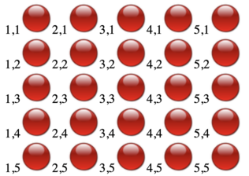

- [riesenie](riesenia.md#uloha-12)

### Uloha 13: podmienky
- v predoslej ulohe vykreslite modrou farbou tie gulicky, pre ktore plati ze suradnica stlpca je mensia ako suradnica riadku
- aky utvar vznikol?
- [riesenie](riesenia.md#uloha-13)

### Uloha 14: zlozene podmienky
- upravte predosly priklad tak, aby hlavna diagonala bola zelena (tie gulicky, pre ktore plati ze suradnice stlpca a riadku su rovnake)
- 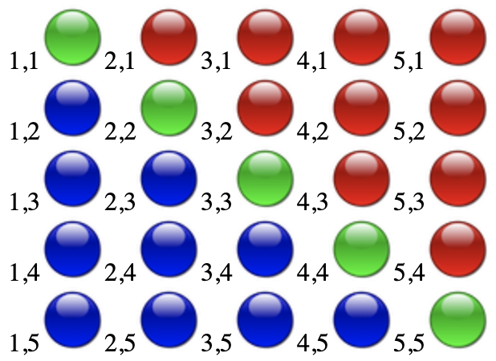
- [riesenie](riesenia.md#uloha-14)

### Uloha 15: zlozene podmienky
- v matici 5x5 cervenych guliciek nakreslite prvy a posledny riadok modrou
- 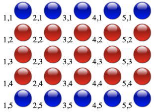
- [riesenie](riesenia.md#uloha-15)

### Uloha 16: zlozene podmienky
- Doplnte podmienku, aby bol prvy a posledy riadok modrou

```javascript
var y = 1
while (y <= 5)
{

    var x = 1
    while (x <= 5)
    {
        document.write(x + "," + y);

        if (...)
        {
            document.write("");
        }
        else 
        {
            document.write("");
        }
        x = x + 1
    }

    document.write("<br>");
    y = y + 1
}
```

### Uloha 17: binarne operatory

- prepiste predosly program s pouzitim vhodneho binarneho operatora

| a     | b     | And <br> konjunkcia <br> logicky sucin <br> a \&\& b <br> "a zaroven" | Or <br> disjunkcia <br> logicky sucet <br> a \|\| b <br> "alebo" | Not <br> negacia <br> !a | Xor <br> a ^ b |
|-------|-------|-----------------|----------------|---------|-------|
| false | false | false           | false          | true    | false |
| false | true  | false           | true           | true    | true  |
| true  | false | false           | true           | false   | true  |
| true  | true  | true            | true           | false   | false |
| 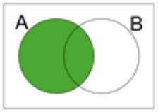 | 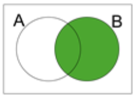 | 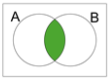 | 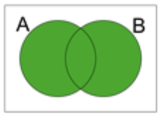 | 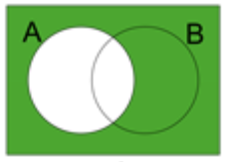 | 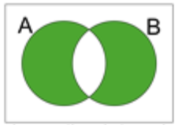 |

### Uloha 18: zlozene podmienky s binarnymi operatormi
- Najdite podmienku pre tento obrazok
- 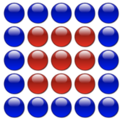
- [riesenie](riesenia.md#uloha-18-a)

- Najdite podmienku pre tento obrazok
- 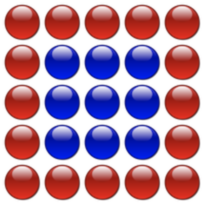
- [riesenie](riesenia.md#uloha-18-b)

### Uloha 19: zlozene podmienky
- Najdite podmienku pre tento obrazok
- 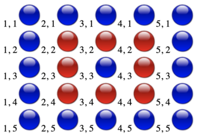
- [riesenie](riesenia.md#uloha-19)

### Uloha 20
- TODO: pridat obrazok
- Pre hlavnu diagonalu plati, ze x-ova a y-ova suradnica su zhodne

| x | y |
|---|---|
| 1 | 1 |
| 2 | 2 |
| 3 | 3 |
| 4 | 4 |
| 5 | 5 |

- Ktore suradnice tvoria vedlajsiu diagonalu?

| x | y |
|---|---|
| 1 |   |
| 2 |   |
| 3 |   |
| 4 |   |
| 5 |   |

- Aky matematicky predpis plati pre vedlajsiu diagonalu? (x == ???)
- Nakreslite modrou vedlajsiu diagonalu 
- [riesenie](riesenia.md#uloha-20)

### Uloha 21: Sachovnica
- Nakreslite nasledujuci obrazok s maticou 8x8
- 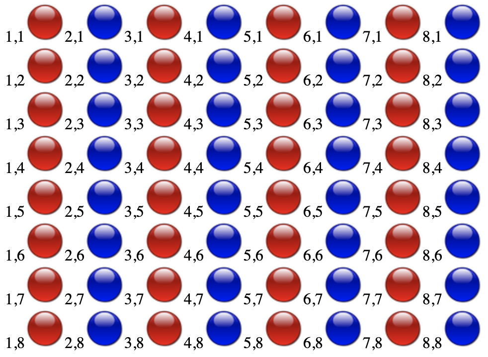
- [riesenie](riesenia.md#uloha-21-a)

- Nakreslite nasledujuci obrazok s maticou 8x8
- Pomocka: vypiste si sucet suradnic x+y pred kazdou gulickou
- 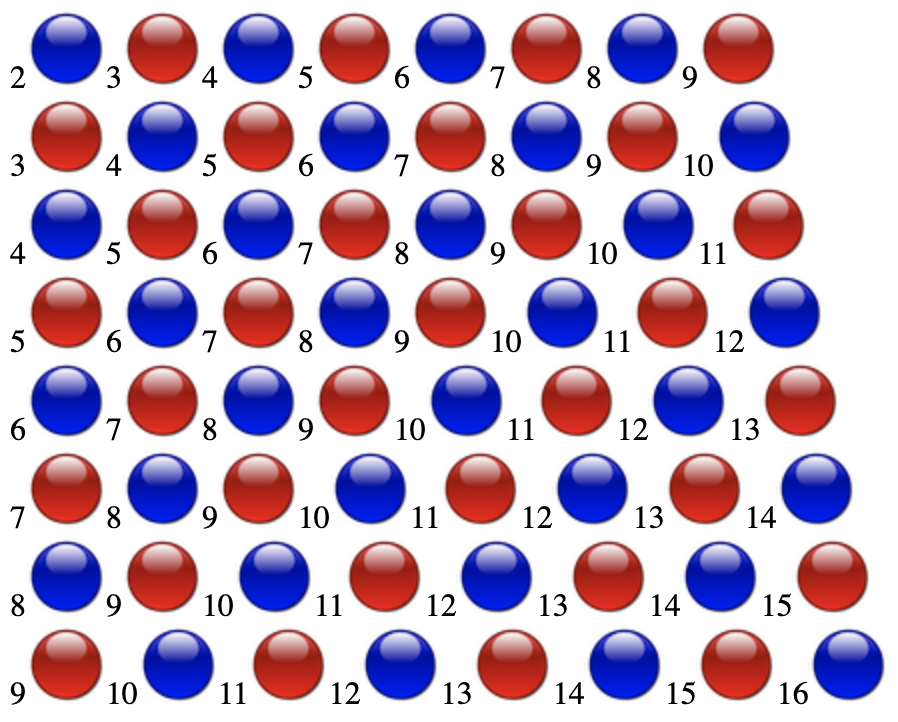
- [riesenie](riesenia.md#uloha-21-b)

- Nakreslite nasledujuci obrazok s maticou 8x8
- Pomocka: Math.floor
- 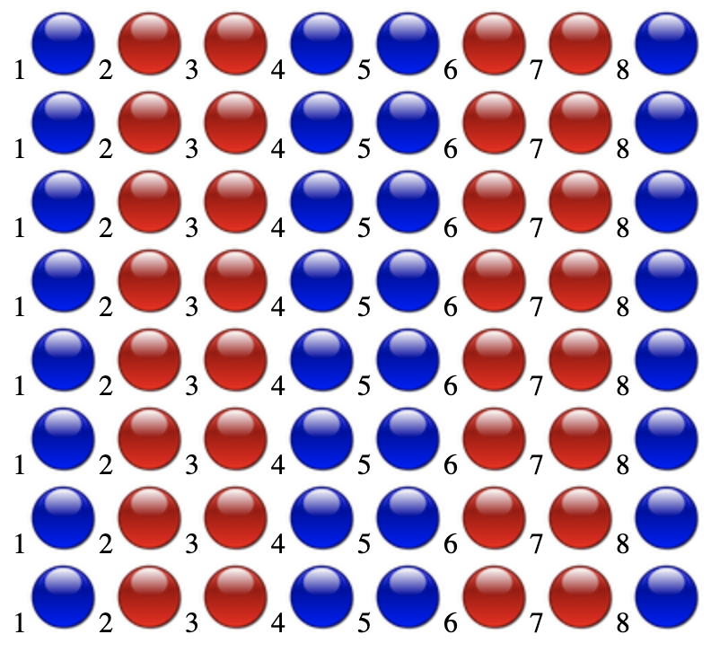
- [riesenie](riesenia.md#uloha-21-c)

- Nakreslite nasledujuci obrazok s maticou 8x8
- Pomocka: Zmente rozsah z 1..8 na 0..7
- 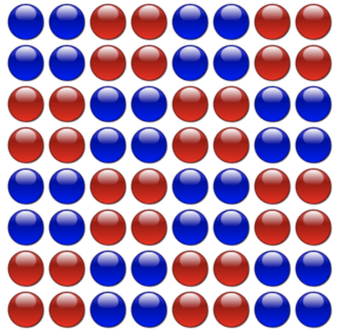
- [riesenie](riesenia.md#uloha-21-d)

### Uloha 22: Absolutna hodnota
- Zmente rozsah na -6..6
- Vykreslite modrou tie gulicky, ktorych x-ova suradnica je od stredu vzdialena menej ako 3
- 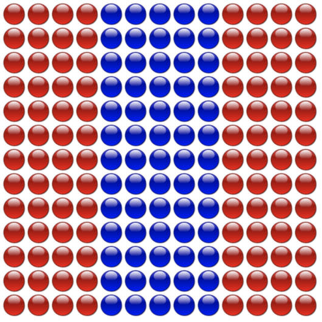
- [riesenie](riesenia.md#uloha-22-a)

- Vykreslite modrou tie gulicky, ktorych x-ova aj y-ova suradnica je od stredu vzdialena menej ako 3
- 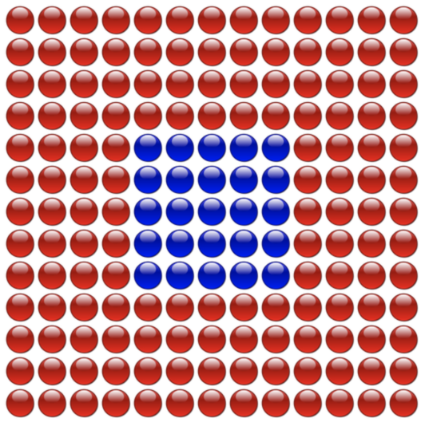
- [riesenie](riesenia.md#uloha-22-b)

- Aky vplyv maju konstanty 1 a 2 na vysledny obrazec? ```Math.abs(x+1) < 3 && Math.abs(y+2) < 3```


### Uloha 23: Kruh
- Vykreslite modrou tie gulicky, ktore su od stredu vzdialene presne 5
- Pomocka: pouzite pytagorovu vetu
- 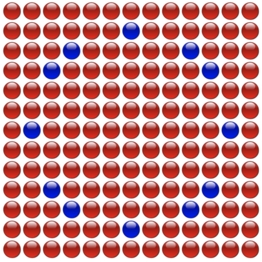
- [riesenie](riesenia.md#uloha-23-a)

- Zapiste pytagorovu vetu pre preponu mensiu ako 5
- 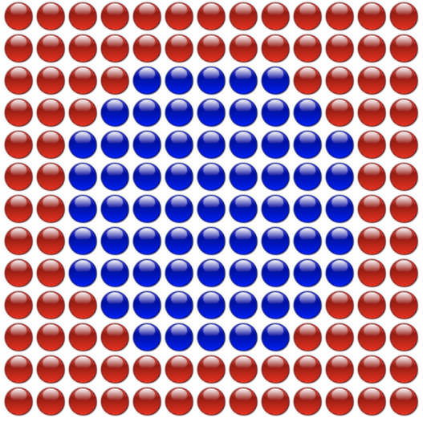
- [riesenie](riesenia.md#uloha-23-b)

- Vykreslite modrou modrou kruznicu s polomerom 5
- 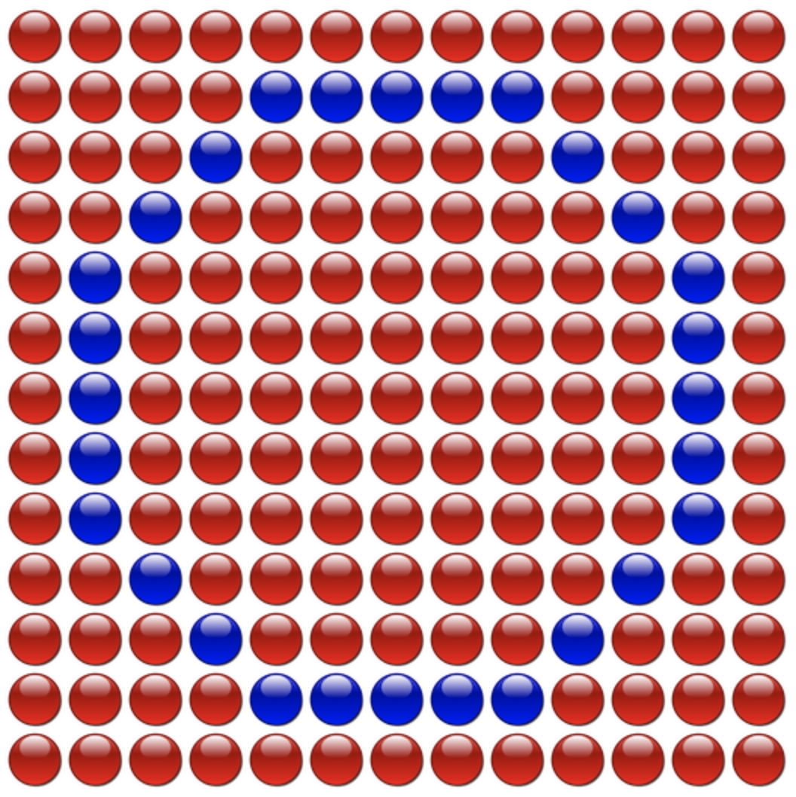
- [riesenie](riesenia.md#uloha-23-c)

### Uloha 24: funkcie
- zistite co robi nasledujuca funkcia

```javascript
function vykresli(stlpcov, riadkov, farba)
{
    var y = 1
    while (y <= riadkov)
    {
        var x = 1
        while (x <= stlpcov)
        {
            document.write("");
            x = x + 1
        }
        document.write("<br>")
        y = y + 1
    }
}
```
- s pomocou volani funkcie *vykresli* vytvorte nasledujuci obrazok:
- 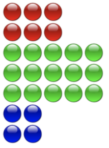
- [riesenie](riesenia.md#uloha-24)

### Uloha 25: Navratova hodnota

- upravte funkciu tak, aby spravne konvertovala stupne Celzia na Ferenheity
- Pomocka: pouzite google pre vyhladanie konverzneho vzorca

```javascript
function naFarenheity(stupne)
{
  return stupne + 10
}

for (var teplota = 0; teplota < 100; teplota = teplota + 10) 
{
  document.write("Teplota " + teplota + " &deg;C = " + naFarenheity(teplota) + "&deg;F<br>")
}
```

- [riesenie](riesenia.md#uloha-25-a)

- upravte program tak, aby zobrazil konverziu pre teploty -20 az 100 vratane s krokom 5 stupnov
- [riesenie](riesenia.md#uloha-25-b)

- ktore teploty v Celzioch zodpovedaju 0 stupnom Farenheita a 100 stupnom Farenheita?

### Uloha 26: Zellerov algoritmus

- Nastudujte [Zellerov algoritmus](https://en.wikipedia.org/wiki/Determination_of_the_day_of_the_week)
- Krokujte s debuggerom a zistite aky bol den v den vasho narodenia

```javascript
function Zeller(D, M, Y)
{    
    if (M < 3)
    {
        M = M + 12;
        Y = Y - 1;
    }
    
    var C = Math.floor(Y / 100);
    var K = Y - (100 * C);
    var S = Math.floor(13 * (M+1)/5) + Math.floor(K / 4) + Math.floor(C / 4) + D + K - (2 * C) + (7 * C);
    var ans = S % 7
    var dniVTyzdni = ["Sobota", "Nedela", "Pondelok", "Utorok", "Streda", "Stvrtok", "Piatok"]
    return dniVTyzdni[ans];
}

document.write(Zeller(15, 4, 1985))
```

### Uloha 27: Trojrozmerna slucka s forom
- Nasledujuci program vypise cisla od 000..999
- Upravte ho tak, aby vypisal iba tie kombinacie cifier, ktorych sucet je 5
- [riesenie](riesenia.md#uloha-27-a)

```javascript
for (var a=0; a<=9; a=a+1)
{
  for (var b=0; b<=9; b=b+1)
  {
    for (var c=0; c<=9; c=c+1)
    {
      document.write("a="+a+" b="+b+" c="+c+"<br>")
    }
  }
}
``` 

- Vypiste iba celkovy pocet takychto cisel
- [riesenie](riesenia.md#uloha-27-b)

### Uloha 28: Funkcia s navratovou hodnotou
- Upravte predoslu ulohu do formy funkcie, kde hladany sucet cifier bude argument funkcie a navratova hodnota bude pocet najdenych cisel
- V akom rozsahu moze byt argument funkcie (aky mozne hodnoty nadobuda sucet cifier kazdeho trojciferneho cisla) ?
- Vypiste tabulku, podla ktorej uvidime pocetnost pre kazdy mozny sucet
- Ktore sucty maju najvacsiu pocetnost?

### Uloha 29: Kniznica High charts
- S pomocou prikazov pre vytvorenie prazdneho pola ```pole = []``` a vlozenia cisla na koniec pola ```pole.push(13)``` vytvorte pole pocetnosti z poslednej ulohy

- Vlozte html kod do suboru *test.html*
```html
<script src="https://code.highcharts.com/highcharts.js"></script>
<div id="container"></div>
```

- Vlozte javascript pre vygenerovanie stlpcoveho grafu pocetnosti
```javascript
Highcharts.chart('container', { series: [{ data: pole }] })
```

- [riesenie](riesenia.md#uloha-29)

### Uloha 30: Macky
- HTML zapis `````` nakresli macku na suradniciach x=100 y=200
- Nasledujuci program vypocita body na kruznici
- Upravte ho tak, aby boli macky vykreslene prave na tychto suradniciach

```javascript
for (var a=0; a<360; a+=30)
{
  var adeg = (a+90)/180*Math.PI
  var x = Math.cos(adeg)*300+300;
  var y = Math.sin(adeg)*300+300;
  document.write("");
}
```
- [riesenie](riesenia.md#uloha-30)

### Uloha 31: Animacia

- polohu objektu mozeme modifikovat realtime zapisom do ```macka.style.left``` a ```macka.style.top```
- upravte tento program tak, aby boli macky umiestnene na kruhu podla uhla *adeg* (rovnako ako v predoslej ukazke)

```javascript
  for (var i=0; i<10; i++)
  {
    document.write("");    
  }

  var tick = 0;
  setInterval( ()=>
  {
    tick = tick + 0.1
    for (var i=0; i<10; i++)
    {
      var macka = document.getElementById("macka"+i);
      var a = i*360/10+tick*5;

      // dopln kod

      macka.style.transform = "rotate("+(a+180)+"deg)"
    }

  }, 10);
```
