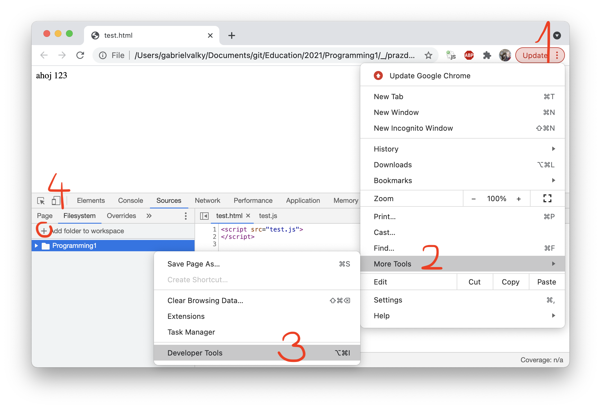

# Uvod do programovania 1


## Anotacia
Beseda: Vedeli ste o tom, že programovať sa dá naučiť za pol roka? Možno niektorí z vás už stáli pred rozhodnutím naučiť sa programovať, no po pr votnom prieskume množstva všetkých jazykov a technológií ste to radšej odložili na neskôr. Počas besedy si ukážeme ako napísať krátky program pre viac ako 10 rôznych jazykov. Vysvetlíme si, aké su medzi nimi rozdiely, a ako postupovať pri zoznamovaní sa s novým programovacím jazykom. Pozrieme sa na zakladné pojmy ako premenná, funkcia a podmienka. Taktiež predstavíme možnosti programovania aj bez použitia špeciálnych, často platených, integrovaných editorov IDE (Integrated development environment).

Workshop: Aj účastník bez predošlých algoritmických základov sa naučí zostaviť jednoduchý program a zapísať matematický alebo logický výraz tak, aby mu počítač rozumel. Pridáme premenné, slučky, funkcie a s pomocou týchto zakladných stavebných prkvov začneme generovať jednoduchú grafiku.
Na to, aby sme pretavili naše nápady do formy programu, nebude potrebný žiadny špeciálny software. Ukážeme si, že na programovanie stačí aj Microsoft Word alebo obyčajný browser.
A práve nástroj Developer Tools v browseri Chrome použijeme ako editor a debugger. S pomocou jazyka Javascript budeme generovať HTML kód, v ktorom budeme kombinovať obrázky, z ktorých zostavíme mozaiky a geometrické tvary.

## Priprava
- [stiahnut si balicek](prazdny.zip)
- rozbalit a otvorit test.html v Chrome
- otvorit developer konzolu (Ctrl + Shift + J, alebo tri bodky vpravo hore, More Tools -> Developer Tools)
  
- pridat adresar s rozbalenym balickom Source -> Filesystem -> Add folder to workspace
  
- vyskusat modifikovat test.html. Pri kazdom zmenenom subore sa zobrazi hviezdicka. Treba subor ulozit (Ctrl + S) a refreshnut stranku (Ctrl + R)
  
- Pocas workshopu budeme fotografovat nase vytvory s pomocou "Snipping tool"-u a zdielat v chate v Teamsoch. Ak tento nastroj nepoznate, natrenujte podla [tejto stranky](https://exaktime.zendesk.com/hc/en-us/articles/360037477253-FAQ-Capturing-Effective-Screenshots)
  
  

## Prezentacia
- Prezentacia je sucastou besedy: [prezentacia.pdf](prezentacia.pdf)

## Ulohy

### Uloha 1: Vyskusat si HTML tagy

```html
<h1>H1: Toto je moja stranka</h1>
<b>Bold</b> 
<i>Italic</i> 
<u>Underlined</u> 
Break<br>
Break<br>
<font color=gray>gray</font>
<font color=#ff0000>#ff0000</font>
<!-- poznamka -->
<br>
<br>
```

### Uloha 2: Kalkulacka


### Uloha 3: Obvod a obsah stvorca

- doplnte riadok pre vypocet obsahu stvorca
```javascript
strana = 5
obvod = 4*strana
```

### Uloha 4: Porovnavanie
- zistite akej numerickej hodnote sa rovna true a false
```javascript
5 < 10
5 >= 10
5 = 5
5 == 5
true == 15
```

### Uloha 5: Alert a prompt
```javascript
meno = prompt("Ako sa volas")
alert("Ahoj " + meno)
```

### Uloha 6: Vypis cisel od 1 po 10


!!! tabulka operatorov