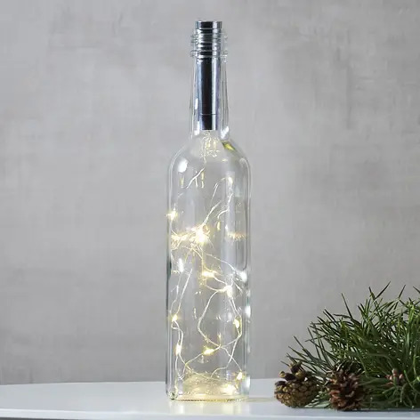
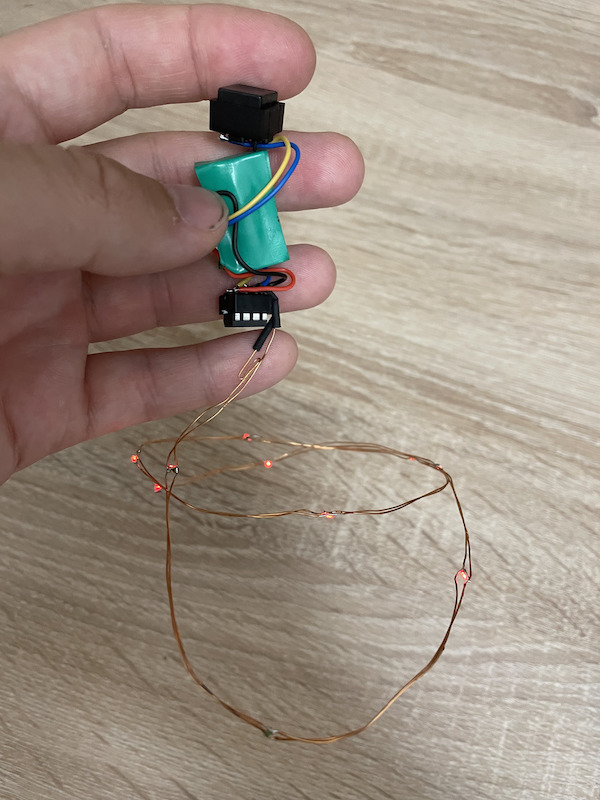
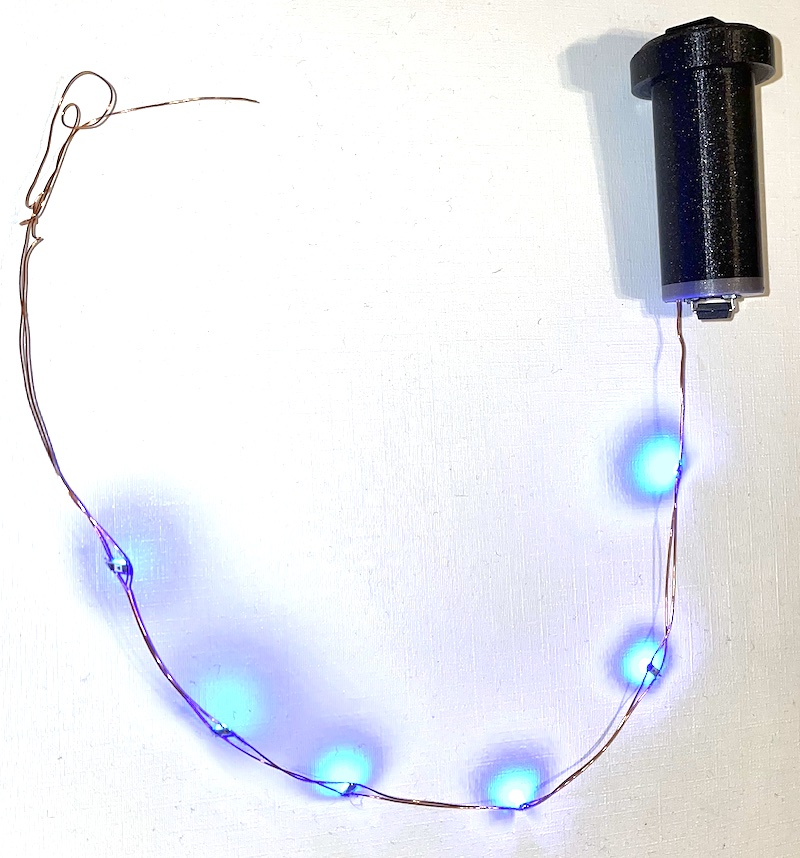
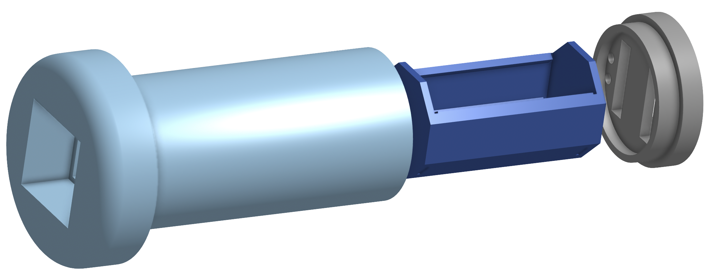
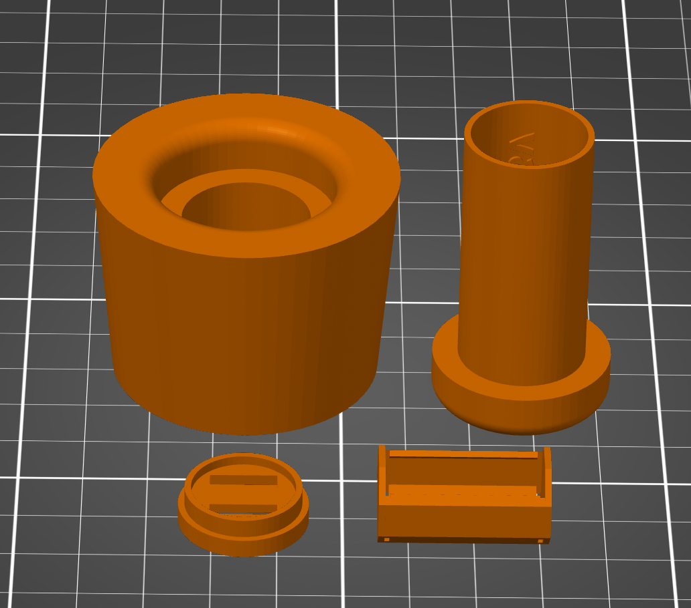

# Electro workshop 6

## Beseda

Pri konštrukcii jednoduchých elektrických zapojení vychádzame zo schémy, ktorá znázorňuje zapojenie elektrických súčiastok. Prestavíme si základné schématické značky, aby sme počas nasledujúceho workshopu vedeli stotožniť konkrétnu súčiastku s jej grafickou reprezentáciou. Špeciálny dôraz budeme klásť na LED diódy určené pre povrchovú montáž. Pre správne nastavenie pracovného bodu LED diódy potrebujeme limitovať prúd, ktorý ňou prechádza. S pomocou Ohmovho zákona si vysvetlíme, ako vypočítať hodnotu predradného odporu, aby nám reťazec paralelne zapojených diód svietil vhodnou intenzitou. Povieme si niečo aj o vnútornom odpore a o tom, ako vypočítať životnosť zariadenia napájaného batériou.

## Workshop

Chcete sa naučiť spájkovať cínom alebo zdokonaliť svoju techniku? Príďte na náš workshop, kde Vám skúsený lektor vysvetlí, ako správne pracovať so spájkovačkou, cínom a kolofóniou. Detailne si vysvetlíme celý postup a prípravu medených vodičov pre kvalitný spoj. Okrem užitočných skúseností si z podujatia domov prinesiete zaujímavú vianočnú dekoráciu, ktorú si sami zostrojíte. Spájkovať budeme okrem lankových vodičov aj smaltovaný drôt. Smalt budeme odstraňovať mechanicky s nožom, alebo s Acylpyrínom použitým ako tavidlo.
Na takýto drôt budeme pripájať LED diódy pre povrchovú montáž (SMT) a s pomocou predprogramovaného kontroléra Atmel Tiny a gombíkových batérií vyrobíme tlačítkom aktivované dekoračné svietidlo. 

## BOM

70.06 eur pre 8 ucastnikov (rezerva pre dalsich 2 ucastnikov)

| Pocet | Co                            | Oznacenie GME                                 | Jednotkova cena | Celkova cena | Linka         |
|-------|-------------------------------|-----------------------------------------------|-----------------|--------------|---------------|
| 10x   | AT tiny 45                    | Atmel AVR Tiny 45, 4kb flash                  | 2.56            | 25.60        | https://www.gme.sk/attiny45-20pu-dip8-atmel |
| 50x   | LED 1206 cervena              | LED 1206, červená, 115mcd, 120° S150VC-V1-1B | 0.06 | 3.00 | https://www.gme.sk/led-1206-red-150-120 |
| 50x   | LED 1206 modra                | LED 1206, modrá, 120mcd, 120° S150BC-B4-1A | 0.07 | 3.50 | https://www.gme.sk/led-1206-blue-120-120 |
| 50x   | LED 1206 biela                | LED 1206, biela, 350mcd, 120° S150W-W2-1B | 0.13 | 6.50 | https://www.gme.sk/led-1206-cool-white-350-120 |
| 10x   | DIL8 patica                   | DIP pätica 8pin rozteč 2,54mm SOKL 8          | 0.07            | 0.70         | https://www.gme.sk/sokl-8 |
| 10x   | Tlacidlo                      | Tlačidlo do DPS, OFF-(ON), čierne PBS-18B-B   | 0.30            | 3.00         | https://www.gme.sk/p-b1715-black |
| 15x   | 2ks Bateria, 30 kusov dokopy  | Bateria 1.5V AG13 158mAh                      | 0.75            | 11.25        | https://www.gme.sk/baterie-gombikova-westinghouse-lr44-1-5v-alkalicka-blister-2ks |
| 10x   | Rezistor vyvodovy 43 Ohm      | Metal oxidový rezistor THT RM 43R 0,6W 1% 0207 | 0.12           | 1.20         | https://www.gme.sk/rm-43r-0207-0-6w-1 |
| 5x    | Zmrstovacia buzirka           | Zmršťovacia bužírka 1.4mm, 2:1, čierna K32-1  | 0.39            | 1.95         | https://www.gme.sk/teplem-smrstovatelna-trubickova-buzirka-kss-f0927f-1 |
| 10x   | Drziak na bateriu plus        | Batériový kontakt pre AA do DPS 228 Anoda     | 0.09            | 0.90         | https://www.gme.sk/228-anoda |
| 10x   | Drziak na bateriu minus       | Batériový kontakt pre AA do DPS 228 Katoda    | 0.11            | 1.10         | https://www.gme.sk/228-katoda |
| 5x    | Kabel lanko 4 zilovy          | Ovládací kábel LIYY 4x0,19 BAL                | 0.51            | 5.10         | https://www.gme.sk/liyy-4x0-19-bal |
| 1x    | Lakovany drot 0.3mm 80m       | Lakovaný drôt WIK 0,3mm CU 80m                | 6.26            | 6.26         | https://www.gme.sk/lakovany-drot-0-3mm-cu-80m#product-detail |
| 8x    | Sklena flasa 7deci            |                                               |                 |              | |

- 8x Kuchynsky noz, alebo lamaci noz
- 1x Acylpyrin (balenie obsahuje 10 tabliet)
- obojstranna lepiaca paska

## Prezentacia
- [Prezentacia](prezentacia.pdf)
- [Postup](postup.md)

## Poznamky

- Workshop zamerany na techniku letovania
- Vianocna dekoracia s led diodami a 8 pinovym mikrokontrolerom
- Vzhladom na narocnost konstrukcie programovanie vynechame a prichystame uz funkcne mikrokontrolery
- Budeme pracovat s medenymi smaltovanymi vodicmi (daju sa ziskat rozobranim transformatora lubovolneho starsieho spotrebica) o hrubke 0.3mm
- Vyskusame si odstranovanie smaltu s pomocou acylpyrinu (aspirin) ktory bude sluzit ako tavidlo alebo s pomocou lamacieho nozika
- na dvojvodicovu linku naletujeme 10 smd LED diod rozmeru 1206 so striedavou polaritou (tym padom mame moznost ovladat kazdu parnu a kazdu neparnu diodu zvlast, ale hlavy dovod je redukcia spotreby. Limit MCU je 40mA na pin, budeme sa drzat do 20mA)

Beseda:
- vysvetlenie ako sa programuju MCU (mali sme v predoslom vianocnom workshope), 
- napatova kalkulacia, spotreba, vydrz
- ako lahko ziskat smaltovany drot a ake su moznosti jeho odizolovania.
- Predstavenie SMD suciastok a ich rozmerov
- Vysvetlenie polarity LED diody
- Vysvetenie predradneho rezistora
- Predstavenie celeho zapojenia
- Predstavenie pouzitych komponentov

Workshop:
- Odizolovanie smaltovanych drotov s pomocou aspirinu
- Postupne naletovanie prvych styroch led diod v 5 cm intervaloch
- Detailne vysvetlenie techniky letovania
- Skompletovanie zapojenia
- Pokracovanie v letovani diod do konca workshopu (idealne 10 kusov)

## Modely
- [Telo zatky](zatka_telo.stl)
- [Vrchnak zatky](zatka_vrchnak.stl)
- [Drziak baterie](zatka_bateria.stl)
- [Adapter na velku flasu](zatka_adapter.stl)

Print settings:
  - 0.15mm speed
  - PLA
  - fill density: 20%

## Program

- Zdrojovy kod: [dekoracia.ino](dekoracia.ino)
- Skompilovany firmware: [dekoracia.hex](dekoracia.hex)

## Notes
- Test: [LED 0805 15mcd cervena](https://www.gme.sk/led-0805-cervena-15mcd-120-kpt-2012ec) 20mA/5 kusov
- Test: [LED 1206 120mcd modra](https://www.gme.sk/led-1206-blue-120-120) 
  - oficialne 100mcd pri 20mA pri 3.2V
  - meranie 8.2mA / 3 kusy, drop 2.64V, 50 ohm
- Test: [LED 1206 115mcd cervena](https://www.gme.sk/led-1206-red-150-120)
  - oficialne: 115mcd 20mA pri 2.0V
- Test: [LED 1206 350mcd tepla biela](https://www.gme.sk/led-1206-cool-white-350-120)
  - oficialne 250mcd pri 20mV pri 2.8V
- Test: [LED 1206 115mcd cervena](https://www.gme.sk/led-1206-red-150-120)
  - oficialne 115mcd

