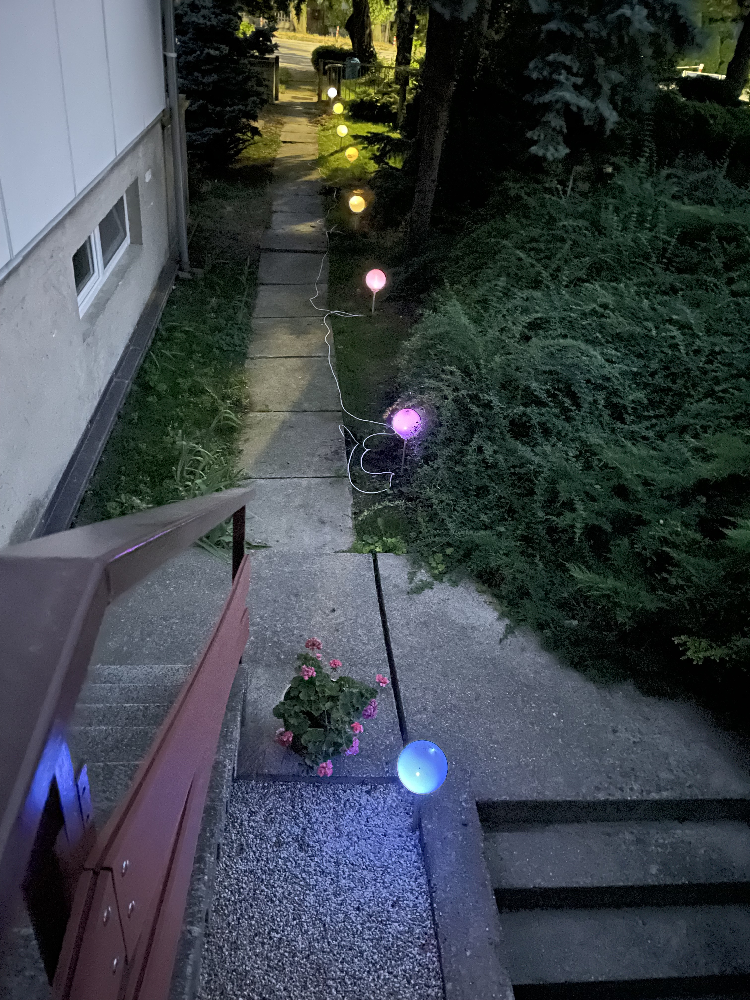

# Electro workshop s ESP8266


## Annotation
Zaujíma vás ako fungujú bezdrôtové meteorologické stanice alebo inteligentné žiarovky? Na tomto workshope pod vedením skúseného lektora skonštruujete svoje vlastné IoT (internet vecí) zariadenie, ktoré bude prostredníctvom WiFi siete komunikovať s vaším mobilným telefónom. 
V prostredí Arduino budeme programovať modul ESP8266, ktorý spôsobil revolúciu vo svete IoT vzhľadom na svoju nízku cenu, malé rozmery, integrovaný WiFi modul a vysoký výpočtový výkon. Dnes ho nájdeme v inteligentných žiarovkách alebo telefónom ovládaných zásuvkách a iných, často podomácky skonštruovaných zariadeniach, ktoré komunikujú cez internet.

### Prvý workshop:
Aby sme vnikli do tajov programovania, najprv skúsime naprogramovať program pre ovládanie LED pásika. Ten bude zložený z ôsmich adresovateľných LED diód s označením WS2812. To nám umožní každej dióde nezávisle nastaviť farbu. Po statických vzoroch skúsime LED pásik rozanimovať, aby sme pochopili ako fungujú cykly s príkazom for a ako vytvoriť dojem pohybu.
Ďalšou úlohou bude pripojenie digitálneho teplomera kombinovaného s vlhkomerom DHT22. 

### Druhý workshop:
Po zvládnutí komunikácie s týmito perifériami vyskúšame použiť modul ESP8266 ako webový server. Najprv začneme s jednoduchými statickými stránkami, potom tieto skúsime oživiť čerstvo nameranými dátami z teplomera. 
Ďalšie úlohy už budú na fantázii účastníkov. Buď môžeme nastavovať farbu LED pásika podľa nameranej teploty, alebo jeho farbu budeme riadiť cez mobilný telefón. Ďalšou možnosťou je ukladanie nameraných dát na webovej platforme dweet.com a zobrazenie teploty vo forme grafu.

Workshop je určený pre úplných začiatočníkov bez skúseností s programovaním alebo konštrukcie elektrických zariadení. Treba si priniesť laptop, nainštalovať anglickú klávesnicu (kvôli programovaniu), skontrolovať či viete na klávesnici nájst všetky zátvorky a interpunkciu (https://x.valky.eu/progk) nainštalovať program Arduino (https://x.valky.eu/arduino) a podporu pre ESP8266 (https://x.valky.eu/esp). Kábel na pripojenie zariadenia budete mať k dispozícii USBA-USB micro, ak nemáte na počítači štandardné USB porty, treba si priniesť vlastný usb micro kábel alebo redukciu.

## BOM

| Pocet | Oznacenie                     | GME kod produktu | GME oznacenie                                         | Jednotkova cena | Celkova cena | Linka         |
|-------|-------------------------------|---------|-----------------------------------------------|-----------------|--------------|---------------|
| 8x    | Wemos D1 mini                 | 775-052 | NodeMcu LUA D1 mini WIFI ESP-12F modul s ESP8266 | 7.76         | 62.08        | https://www.gme.sk/nodemcu-lua-d1-mini-wifi-esp-12f-modul-s-esp8266 |
| 8x    | DHT22                         | 775-004 | Digitálny teplomer a vlhkomer, THT DHT22      | 8.37            | 66.96        | https://www.gme.sk/digitalny-teplomer-a-vlhkomer-s-dht22 |
| 8x    | WS2812 LED pas                | 774-031 | Modul 8x RGB digitálny LED, pás               | 2.82            | 22.56        | https://www.gme.sk/modul-fc101-8x-rgb-digitalny-led-pas |
| 8x    | Micro USB kabel               | 052-135 | Prepojovací kábel USB A 2.0 (M) - Micro USB B 2.0 (M), 1m červený | 1.59 | 12.72 | https://www.gme.sk/prepojovaci-kabel-goobay-usb-2-0-a-m-usb-2-0-micro-m-1m-cerveny |
| 2x    | Dupont kabel F-F              | 661-205 | Prepojovacie vodiče zásuvka-zásuvka 40 kusov  | 4.04            | 8.08         | https://www.gme.sk/propojovaci-vodice-zasuvka-zasuvka-40-kusu |

Price per one attendant: (62.08+66.96+22.56+12.72+8.08)/8=21.55

## Tasks

### Workshop 1
[prezentacia 1](prezentacia1.pdf)

1. Nainstalovat Arduino
2. Nainstalovat podporu pre esp8266
3. Blink esp8266
4. Instalacia kniznice pre ws2812 (NeoPixelBus by Makuna)
5. Zapojte led pasik
  

6. Examples -> NeoPixel by Makuna -> NeoPixelCyclon, zmenit dva riadky:
    ```C
    // pocet bodov zvysit na 8 (povodne 4)
    const uint16_t PixelCount = 8;
    // driver nastavit na NeoEsp8266Uart1800KbpsMethod (povodne Neo800KbpsMethod)
    NeoPixelBus<NeoGrbFeature, NeoEsp8266Uart1800KbpsMethod> strip(PixelCount, PixelPin);
    ```

7. Co urobi nasledujuci program?

    ```C
    #include <NeoPixelBus.h>

    NeoPixelBus<NeoGrbFeature, NeoEsp8266Uart1800KbpsMethod> strip(8);

    void setup()
    {
      strip.Begin();
      strip.Show();
    }

    void loop()
    {
      // red, green, blue (0..255)
      strip.SetPixelColor(0, RgbColor(100, 0, 0));
      strip.SetPixelColor(1, RgbColor(0, 100, 0));
      strip.SetPixelColor(2, RgbColor(0, 0, 100));
      strip.SetPixelColor(3, RgbColor(32, 0, 0));
      strip.SetPixelColor(4, RgbColor(32, 32, 0));
      strip.SetPixelColor(5, RgbColor(32, 32, 32));
      strip.SetPixelColor(6, RgbColor(0, 32, 32));
      strip.SetPixelColor(7, RgbColor(16, 0, 32));

      // hue, saturation, lightness (0..1)
      strip.SetPixelColor(7, HslColor(0.5, 1.0, 0.1));
      
      strip.Show();
      delay(100);
    }

    ```

8. Upravit program na animaciu semaforu

    ```C
    #include <NeoPixelBus.h>

    NeoPixelBus<NeoGrbFeature, NeoEsp8266Uart1800KbpsMethod> strip(8);

    void setup()
    {
      strip.Begin();
      strip.Show();
    }

    void loop()
    {
      // red, green, blue (0..255)
      strip.SetPixelColor(0, RgbColor(10, 0, 0));
      strip.Show();
      delay(1000);

      strip.SetPixelColor(0, RgbColor(0, 10, 0));
      strip.Show();
      delay(1000);

      strip.SetPixelColor(0, RgbColor(0, 0, 10));
      strip.Show();
      delay(1000);
    }
    ```

9. Co urobi nasledujuci program?
  - Otvorte si monitor seriovej linky **Tools** -> **Serial monitor**
  - Nastavte prenosovu rychlost na **9600 baud**
    ```C
    void setup() {
      Serial.begin(9600);
    }

    void loop() {
      for (int i=0; i<100; i+=5)
      {
        Serial.println(i);
      }
      delay(1000);
    }
    ```

10. Upravte ho na vypis ciselnej postupnosti 10 az 20 (vratane) s krokom 2

11. Najdite hodnotu konstanty **maximum** aby bola animacia plynula
  - Zatvorte monitor seriovej linky
    ```C
    #include <NeoPixelBus.h>
    NeoPixelBus<NeoGrbFeature, NeoEsp8266Uart1800KbpsMethod> strip(8);

    void setup() {
      strip.Begin();
    }

    void loop() {
      const int maximum = 300;
      for (int i=0; i<maximum; i+=1)
      {
          strip.SetPixelColor(0, RgbColor(i, 0, 0));
          strip.Show();
          delay(10);
      }
      for (int i=maximum; i>0; i-=1)
      {
          strip.SetPixelColor(0, RgbColor(i, 0, 0));
          strip.Show();
          delay(10);
      }
    }
    ```
12. Naprogramujte:
  - Jednoduchy farebny prechod (0, 0, 0) -> (0, 50, 0) s trvanim 5 sekund

  

  - Jednoduchy farebny prechod (0, 0, 0) -> (25, 50, 25) s trvanim 5 sekund

  


  - Jednoduchy farebny prechod (0, 0, 25) -> (0, 0, 25) s trvanim 5 sekund

  


  - Jednoduchy farebny prechod (50, 0, 0) -> (0, 50, 0) s trvanim 5 sekund

  


13. Ako urobit prechod z tmavo modrej do svetlo zelenej? (7, 4, 15) -> (2, 17, 8)

14. Teoria: Linearna interpolacia

  

  

  

  

  

  
          
  

  

15. Nasledujuci program interpoluje iba zelenu zlozku farby, upravte ho aby interpoloval aj cervenu (farba.R) a modru zlozku (farba.G)

    ```C
    #include <NeoPixelBus.h>
    NeoPixelBus<NeoGrbFeature, NeoEsp8266Uart1800KbpsMethod> strip(8);

    void setup() {
      strip.Begin();
    }

    int interpoluj(int x1, int x2, int percent)
    {
      return x1 + (x2-x1)*percent/100;
    }

    void loop() {
      RgbColor zelena(3, 50, 14);
      RgbColor modra(11, 7, 50);
      
      for (int i=0; i<100; i+=1)
      {
        int g = interpoluj(zelena.G, modra.G, i);
        strip.SetPixelColor(0, RgbColor(0, g, 0));
        strip.Show();
        delay(10);
      }
      delay(1000);
      for (int i=100; i>0; i-=1)
      {
        int g = interpoluj(zelena.G, modra.G, i);
        strip.SetPixelColor(0, RgbColor(0, g, 0));
        strip.Show();
        delay(10);
      }
      delay(1000);
    }
    ```

16. Bonus: animacia farieb

    ```C
    #include <NeoPixelBus.h>
    NeoPixelBus<NeoGrbFeature, NeoEsp8266Uart1800KbpsMethod> strip(8);

    void setup() {
      strip.Begin();
    }

    int interpoluj(int x1, int x2, int percent)
    {
      return x1 + (x2-x1)*percent/100;
    }

    RgbColor farby[] = {
      RgbColor(255, 0, 0),
      RgbColor(0, 255, 0),
      RgbColor(0, 0, 255),
      RgbColor(255, 0, 255),
      RgbColor(0, 255, 255),
      RgbColor(255, 255, 0),
      RgbColor(255, 255, 255)
    };

    const int pocet = sizeof(farby)/sizeof(farby[0]);
    int f = 0;
     
    void loop() {  
      RgbColor farba1 = farby[f % pocet];
      RgbColor farba2 = farby[(f+1) % pocet];
      
      for (int i=0; i<100; i+=1)
      {
        int r = interpoluj(farba1.R, farba2.R, i) / 5;
        int g = interpoluj(farba1.G, farba2.G, i) / 5;
        int b = interpoluj(farba1.B, farba2.B, i) / 5;
        for (int j=0; j<8; j+=1)
        {
          strip.SetPixelColor(j, RgbColor(r, g, b));
        }
        strip.Show();
        delay(10);
      }
      delay(1000);
      f += 1;
    }
    ```

17. Harmonicke farby

    ```C
    #include <NeoPixelBus.h>
    NeoPixelBus<NeoGrbFeature, NeoEsp8266Uart1800KbpsMethod> strip(8);

    void setup() {
      strip.Begin();
    }

    void loop() {
      long l = millis();  
      float a = l/1000.0;
      float q = 0.4;
      for (int i=0; i<8; i++)
      {
         int r, g, b;
         r = 128 + sin(a+i*q)*128;
         g = 128 + sin(a*0.37+i*q)*128;
         b = 128 + sin(a*0.11+i*q)*128;
               
         strip.SetPixelColor(i, RgbColor(r/4, g/4, b/4));
      }
      
      strip.Show();
    }

    ```

  

18. DHT22 - nainstalovat kniznicu

19. Pripojenie senzora DHT
  

20. DHT sensor library for ESPx -> DHT_ESP8266

21. Nefunguje, potrebujeme napajanie, upravit cislo pinu 
  - baudrate nastavit na 115200
  - pre zobrazenie hlavicky tabulky treba resetnut zariadenie

    ```C
    pinMode(D1, OUTPUT);
    digitalWrite(D1, HIGH);
    pinMode(D3, OUTPUT);
    digitalWrite(D3, LOW);

    dht.setup(D2, DHTesp::DHT22); // Connect DHT sensor to GPIO 17
    ```

    

22. Porovnavanie hodnoty, zapnut led pri vyssej vlhkosti
  - pouzit nasledovny kod vo funkcii setup

    ```C
    pinMode(LED_BUILTIN, OUTPUT);
    digitalWrite(LED_BUILTIN, HIGH); // zhasne
    ```

  - dopln podmienku aby sa led rozsvietila pri vlhkosti nad 70%

    ```C
    if (dopln podmienku)
    {
      digitalWrite(LED_BUILTIN, LOW); // rozsvieti
    } else 
    {
      digitalWrite(LED_BUILTIN, HIGH); // zhasne
    }
    ```


23. Kreslit graf s internym toolom
    - vyskusat co vypisuje do konzoly tento program
    - zapnut Tools -> Serial Plotter

    ```C
    #include "DHTesp.h"

    DHTesp dht;

    void setup()
    {
      Serial.begin(115200);
      pinMode(D1, OUTPUT);
      digitalWrite(D1, HIGH);
      pinMode(D3, OUTPUT);
      digitalWrite(D3, LOW);
      dht.setup(D2, DHTesp::DHT22);
    }

    void loop()
    {
      float humidity = dht.getHumidity();
      Serial.println(humidity);
      delay(500);
    }
    ```

    

24. Bonus: Menit farbu LED pasika podla vlhkosti/teploty

### Workshop 2

1. Co je to server? Ako prebieha HTTP request?


    ```
    gabrielvalky@Gabriels-MacBook-Air ~ % telnet 37.9.175.26 80
    GET /ahoj.html HTTP/1.0
    Host: gabo.guru

    ```

2. Motivacia - informacny system

  

  

2. Vytvorte vlastny server: 
  - nastavte spravne prihlasovacie udaje pre nasu wifi, 
  - zistite na akej IP adrese bezi (pouzite seriovej linky) a 
  - nechajte ho vypisat vlastne meno

    ```C
    #include <ESP8266WiFi.h>
    #include <WiFiClient.h>
    #include <ESP8266WebServer.h>

    char* ssid = "******";
    char* password = "******";
     
    ESP8266WebServer server(80);

    void handleRoot() 
    {
     server.send(200, "text/html", "Ahoj, ja sa volam Gabo!");
    }

    void setup(void)
    {
      Serial.begin(9600);
      
      WiFi.begin(ssid, password);
     
      while (WiFi.status() != WL_CONNECTED) 
      {
        delay(500);
        Serial.print(".");
      }
     
      Serial.print("\n");
      Serial.print("Connected to ");
      Serial.print(ssid);
      Serial.print("\n");
      Serial.print("IP address: ");
      Serial.print(WiFi.localIP());
      Serial.print("\n");
     
      server.on("/", handleRoot);
      server.begin();
    }

    void loop(void)
    {
      server.handleClient();
    }
    ```

3. Skuste vyuzit niektore html tagy (b-bold, u-underline, hr-line, body bgcolor)

    ```
    #include <ESP8266WiFi.h>
    #include <WiFiClient.h>
    #include <ESP8266WebServer.h>

    char* ssid = "******";
    char* password = "******";
     
    ESP8266WebServer server(80);

    char* html = R""(
    <HTML>
      <HEAD>
          <TITLE>My first web page</TITLE>
      </HEAD>
    <BODY>
      <CENTER>
          <B>Hello World.... </B>
      </CENTER> 
    </BODY>
    </HTML>
    )"";
      
    void handleRoot() 
    {
     server.send(200, "text/html", html);
    }

    void setup(void)
    {
      Serial.begin(9600);
      
      WiFi.begin(ssid, password);
     
      while (WiFi.status() != WL_CONNECTED) 
      {
        delay(500);
        Serial.print(".");
      }
     
      Serial.print("\n");
      Serial.print("Connected to ");
      Serial.print(ssid);
      Serial.print("\n");
      Serial.print("IP address: ");
      Serial.print(WiFi.localIP());
      Serial.print("\n");
     
      server.on("/", handleRoot);
      server.begin();
    }

    void loop(void)
    {
      server.handleClient();
    }
    ```

4. Viacej prelinkovanych dokumentov

    ```C
    #include <ESP8266WiFi.h>
    #include <WiFiClient.h>
    #include <ESP8266WebServer.h>
    #include <DHTesp.h>

    char* ssid = "********";
    char* password = "********";
     
    ESP8266WebServer server(80);
      
    void handleRoot() 
    {
      String html = R""(
    <HTML>
      <HEAD>
          <TITLE>My first web page</TITLE>
      </HEAD>
    <BODY>
      <CENTER>
          <a href="/ahoj">Klikni sem</a>
      </CENTER> 
    </BODY>
    </HTML>
    )"";

      server.send(200, "text/html", html);
    }

    void handleAhoj() 
    {
      server.send(200, "text/html", "Ahoj!");
    }

    void setup(void)
    {
      Serial.begin(9600);
      
      WiFi.begin(ssid, password);
     
      while (WiFi.status() != WL_CONNECTED) 
      {
        delay(500);
        Serial.print(".");
      }
     
      Serial.print("\n");
      Serial.print("Connected to ");
      Serial.print(ssid);
      Serial.print("\n");
      Serial.print("IP address: ");
      Serial.print(WiFi.localIP());
      Serial.print("\n");
     
      server.on("/", handleRoot);
      server.on("/ahoj", handleAhoj);
      server.begin();
    }

    void loop(void)
    {
      server.handleClient();
    }
    ```

5. Vycitanie udajov z teplomera
   - nezabudnite inicializovat napajanie pre senzor DHT22 vo funkcii setup

    ```C
    void handleMeraj() 
    {
      DHTesp dht;
      dht.setup(Ds, DHTesp::DHT22);
      
      String html = "Teplota: " + String(dht.getTemperature()) + " &deg;C<br>";
      html = html + "Vlhkost: " + String(dht.getHumidity()) + "%<br>";
      server.send(200, "text/html", html);
    }
    ```

6. Automaticke obnovenie
  - pridajte do generovanej stranky nasledujuci text

    ```html
    <script>setTimeout(() => document.location.reload(), 1000)</script>
    ```

7. TODO: Tlacitka na nastavenie farby led pasika

8. TODO: color chooser

9. Klient 
  - nahradte `creativepoint_ba1` za `creativepoint_svojemeno`
  - otvorte stranku: https://dweet.io/follow/creativepoint_svojemeno
  - otvorte stranku: https://dweet.io/get/latest/dweet/for/creativepoint_svojemeno

    ```C
    #include "ESP8266WiFi.h"
    #include "DHTesp.h"

    const char* ssid = "********";
    const char* password = "********";
    const char* id = "creativepoint_ba1";

    int counter = 0;

    DHTesp dht;

    void setup() 
    {  
      Serial.begin(115200);
      dht.setup(D4, DHTesp::DHT22);
      
      Serial.print("\n");
      Serial.print("Connecting to ");
      Serial.print(ssid);
      Serial.print("\n");
      WiFi.begin(ssid, password);
      
      while (WiFi.status() != WL_CONNECTED) 
      {
        delay(500);
        Serial.print(".");
      }

      Serial.print("\n");
      Serial.print("WiFi connected\n");
    }

    void loop() 
    {
      counter++;

      float humidity = dht.getHumidity();
      float temperature = dht.getTemperature();

      Serial.print("Connecting...\n");
      
      WiFiClient client;
      if (!client.connect("dweet.io", 80)) 
      {
        Serial.println("connection failed");
        return;
      }
      
      client.print("GET /dweet/for/");
      client.print(id);
      client.print("?counter=");
      client.print(counter);
      client.print("&humidity=");
      client.print(humidity);
      client.print("&temperature=");
      client.print(temperature);
      client.print(" HTTP/1.1\r\n");
      client.print("Host: dweet.io\r\n");
      client.print("Connection: close\r\n");
      client.print("\r\n");
      
      delay(1000);

      Serial.print("\n<<<< Response >>>>\n");
      while(client.available())
      {
        char c = client.read();
        Serial.print(c);
      }
      Serial.print("\n===================\n");
     
      // Repeat every 5 seconds
      delay(5000); 
    }
    ```


10. AP mode s dns serverom a captive portalom (esp vytvori vlastny accesspoint na ktory sa pripojime)
  - pouzite kod, doplnte chybajuce funkcie `handleRoot` a `handleMeraj`

    ```C
    #include <ESP8266WiFi.h>
    #include <WiFiClient.h>
    #include <ESP8266WebServer.h>
    #include <DHTesp.h>
    #include <DNSServer.h>

    char* apSsid = "esp weather";
    char* apPassword = "11111111";

    IPAddress         apIP(10, 10, 10, 1);
    ESP8266WebServer  server(80);
    DNSServer         dnsServer;  
      
    void setup(void)
    {
      Serial.begin(9600);

      WiFi.mode(WIFI_AP);
      WiFi.softAPConfig(apIP, apIP, IPAddress(255, 255, 255, 0));
      dnsServer.start(53, "*", apIP);

      server.on("/", handleRoot);
      server.on("/meraj", handleMeraj);
      server.onNotFound(handleRoot);
      server.begin();
    }

    void loop(void)
    {
      server.handleClient();
      dnsServer.processNextRequest();
    }

    ```

11. Ako pridat obrazok

12. Fake login, eeprom collect

## Notes

1. Workshop
  - programovanie ESP8266 v prostredi Arduino
  - praca s adresovatelnymi LED
  - meranie teploty a vlhkosti s ESP8266
2. Workshop
  - webserver s ESP8266
  - generovanie HTML
  - generovanie HTML s nameranymi udajmi (teplota vlhkost)
  - nastavovanie farby led pasika cez web rozhranie
  - zobrazovanie udajov vo forme grafu na webe
  - captive portal
  - falosna login stranka

TBD
