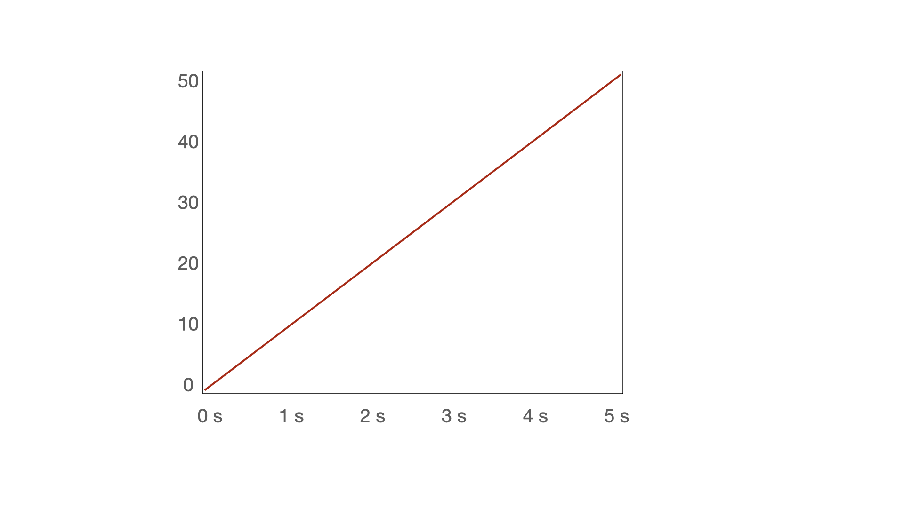
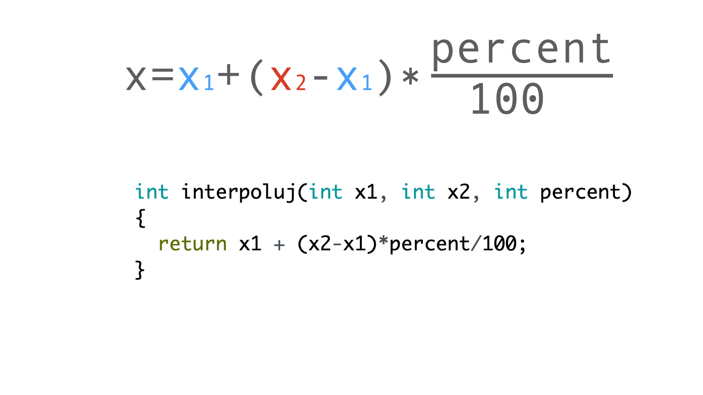

# Ulohy pre workshop 1

1. Nainstalovat Arduino
2. Nainstalovat podporu pre esp8266
3. Blink esp8266
4. Instalacia kniznice pre ws2812 (NeoPixelBus by Makuna)
5. Zapojte led pasik
  

6. Examples -> NeoPixel by Makuna -> NeoPixelCyclon, zmenit dva riadky:
    ```C
    // pocet bodov zvysit na 8 (povodne 4)
    const uint16_t PixelCount = 8;
    // driver nastavit na NeoEsp8266Uart1800KbpsMethod (povodne Neo800KbpsMethod)
    NeoPixelBus<NeoGrbFeature, NeoEsp8266Uart1800KbpsMethod> strip(PixelCount, PixelPin);
    ```

7. Co urobi nasledujuci program?

    ```C
    #include <NeoPixelBus.h>

    NeoPixelBus<NeoGrbFeature, NeoEsp8266Uart1800KbpsMethod> strip(8);

    void setup()
    {
      strip.Begin();
      strip.Show();
    }

    void loop()
    {
      // red, green, blue (0..255)
      strip.SetPixelColor(0, RgbColor(100, 0, 0));
      strip.SetPixelColor(1, RgbColor(0, 100, 0));
      strip.SetPixelColor(2, RgbColor(0, 0, 100));
      strip.SetPixelColor(3, RgbColor(32, 0, 0));
      strip.SetPixelColor(4, RgbColor(32, 32, 0));
      strip.SetPixelColor(5, RgbColor(32, 32, 32));
      strip.SetPixelColor(6, RgbColor(0, 32, 32));
      strip.SetPixelColor(7, RgbColor(16, 0, 32));

      // hue, saturation, lightness (0..1)
      strip.SetPixelColor(7, HslColor(0.5, 1.0, 0.1));
      
      strip.Show();
      delay(100);
    }

    ```

8. Upravit program na animaciu semaforu

    ```C
    #include <NeoPixelBus.h>

    NeoPixelBus<NeoGrbFeature, NeoEsp8266Uart1800KbpsMethod> strip(8);

    void setup()
    {
      strip.Begin();
      strip.Show();
    }

    void loop()
    {
      // red, green, blue (0..255)
      strip.SetPixelColor(0, RgbColor(10, 0, 0));
      strip.Show();
      delay(1000);

      strip.SetPixelColor(0, RgbColor(0, 10, 0));
      strip.Show();
      delay(1000);

      strip.SetPixelColor(0, RgbColor(0, 0, 10));
      strip.Show();
      delay(1000);
    }
    ```

9. Co urobi nasledujuci program?
  - Otvorte si monitor seriovej linky **Tools** -> **Serial monitor**
  - Nastavte prenosovu rychlost na **9600 baud**
    ```C
    void setup() {
      Serial.begin(9600);
    }

    void loop() {
      for (int i=0; i<100; i+=5)
      {
        Serial.println(i);
      }
      delay(1000);
    }
    ```

10. Upravte ho na vypis ciselnej postupnosti 10 az 20 (vratane) s krokom 2

11. Najdite hodnotu konstanty **maximum** aby bola animacia plynula
  - Zatvorte monitor seriovej linky
    ```C
    #include <NeoPixelBus.h>
    NeoPixelBus<NeoGrbFeature, NeoEsp8266Uart1800KbpsMethod> strip(8);

    void setup() {
      strip.Begin();
    }

    void loop() {
      const int maximum = 300;
      for (int i=0; i<maximum; i+=1)
      {
          strip.SetPixelColor(0, RgbColor(i, 0, 0));
          strip.Show();
          delay(10);
      }
      for (int i=maximum; i>0; i-=1)
      {
          strip.SetPixelColor(0, RgbColor(i, 0, 0));
          strip.Show();
          delay(10);
      }
    }
    ```
12. Naprogramujte:
  - Jednoduchy farebny prechod (0, 0, 0) -> (0, 50, 0) s trvanim 5 sekund

  

  - Jednoduchy farebny prechod (0, 0, 0) -> (25, 50, 25) s trvanim 5 sekund

  


  - Jednoduchy farebny prechod (0, 0, 25) -> (0, 0, 25) s trvanim 5 sekund

  


  - Jednoduchy farebny prechod (50, 0, 0) -> (0, 50, 0) s trvanim 5 sekund

  


13. Ako urobit prechod z tmavo modrej do svetlo zelenej? (7, 4, 15) -> (2, 17, 8)

14. Teoria: Linearna interpolacia

  

  

  

  

  

  
          
  

  

15. Nasledujuci program interpoluje iba zelenu zlozku farby, upravte ho aby interpoloval aj cervenu (farba.R) a modru zlozku (farba.G)

    ```C
    #include <NeoPixelBus.h>
    NeoPixelBus<NeoGrbFeature, NeoEsp8266Uart1800KbpsMethod> strip(8);

    void setup() {
      strip.Begin();
    }

    int interpoluj(int x1, int x2, int percent)
    {
      return x1 + (x2-x1)*percent/100;
    }

    void loop() {
      RgbColor zelena(3, 50, 14);
      RgbColor modra(11, 7, 50);
      
      for (int i=0; i<100; i+=1)
      {
        int g = interpoluj(zelena.G, modra.G, i);
        strip.SetPixelColor(0, RgbColor(0, g, 0));
        strip.Show();
        delay(10);
      }
      delay(1000);
      for (int i=100; i>0; i-=1)
      {
        int g = interpoluj(zelena.G, modra.G, i);
        strip.SetPixelColor(0, RgbColor(0, g, 0));
        strip.Show();
        delay(10);
      }
      delay(1000);
    }
    ```

16. Bonus: animacia farieb

    ```C
    #include <NeoPixelBus.h>
    NeoPixelBus<NeoGrbFeature, NeoEsp8266Uart1800KbpsMethod> strip(8);

    void setup() {
      strip.Begin();
    }

    int interpoluj(int x1, int x2, int percent)
    {
      return x1 + (x2-x1)*percent/100;
    }

    RgbColor farby[] = {
      RgbColor(255, 0, 0),
      RgbColor(0, 255, 0),
      RgbColor(0, 0, 255),
      RgbColor(255, 0, 255),
      RgbColor(0, 255, 255),
      RgbColor(255, 255, 0),
      RgbColor(255, 255, 255)
    };

    const int pocet = sizeof(farby)/sizeof(farby[0]);
    int f = 0;
     
    void loop() {  
      RgbColor farba1 = farby[f % pocet];
      RgbColor farba2 = farby[(f+1) % pocet];
      
      for (int i=0; i<100; i+=1)
      {
        int r = interpoluj(farba1.R, farba2.R, i) / 5;
        int g = interpoluj(farba1.G, farba2.G, i) / 5;
        int b = interpoluj(farba1.B, farba2.B, i) / 5;
        for (int j=0; j<8; j+=1)
        {
          strip.SetPixelColor(j, RgbColor(r, g, b));
        }
        strip.Show();
        delay(10);
      }
      delay(1000);
      f += 1;
    }
    ```

17. Harmonicke farby

    ```C
    #include <NeoPixelBus.h>
    NeoPixelBus<NeoGrbFeature, NeoEsp8266Uart1800KbpsMethod> strip(8);

    void setup() {
      strip.Begin();
    }

    void loop() {
      long l = millis();  
      float a = l/1000.0;
      float q = 0.4;
      for (int i=0; i<8; i++)
      {
         int r, g, b;
         r = 128 + sin(a+i*q)*128;
         g = 128 + sin(a*0.37+i*q)*128;
         b = 128 + sin(a*0.11+i*q)*128;
               
         strip.SetPixelColor(i, RgbColor(r/4, g/4, b/4));
      }
      
      strip.Show();
    }

    ```

18. DHT22 - nainstalovat kniznicu

19. Pripojenie senzora DHT
  

20. DHT sensor library for ESPx -> DHT_ESP8266

21. Nefunguje, potrebujeme napajanie, upravit cislo pinu 
  - baudrate nastavit na 115200
  - pre zobrazenie hlavicky tabulky treba resetnut zariadenie

    ```C
    pinMode(D1, OUTPUT);
    digitalWrite(D1, HIGH);
    pinMode(D3, OUTPUT);
    digitalWrite(D3, LOW);

    dht.setup(D2, DHTesp::DHT22); // Connect DHT sensor to GPIO 17
    ```

    

22. Porovnavanie hodnoty, zapnut led pri vyssej vlhkosti
  - pouzit nasledovny kod vo funkcii setup

    ```C
    pinMode(LED_BUILTIN, OUTPUT);
    digitalWrite(LED_BUILTIN, HIGH); // zhasne
    ```

  - dopln podmienku aby sa led rozsvietila pri vlhkosti nad 70%

    ```C
    if (dopln podmienku)
    {
      digitalWrite(LED_BUILTIN, LOW); // rozsvieti
    } else 
    {
      digitalWrite(LED_BUILTIN, HIGH); // zhasne
    }
    ```


23. Kreslit graf s internym toolom
    - vyskusat co vypisuje do konzoly tento program
    - zapnut Tools -> Serial Plotter

    ```C
    #include "DHTesp.h"

    DHTesp dht;

    void setup()
    {
      Serial.begin(115200);
      pinMode(D1, OUTPUT);
      digitalWrite(D1, HIGH);
      pinMode(D3, OUTPUT);
      digitalWrite(D3, LOW);
      dht.setup(D2, DHTesp::DHT22);
    }

    void loop()
    {
      float humidity = dht.getHumidity();
      Serial.println(humidity);
      delay(500);
    }
    ```

    

24. Bonus: Menit farbu LED pasika podla vlhkosti/teploty

