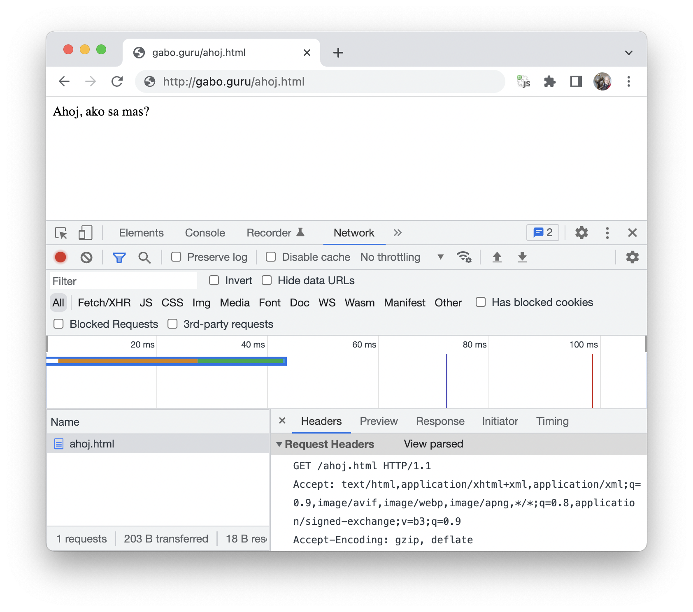
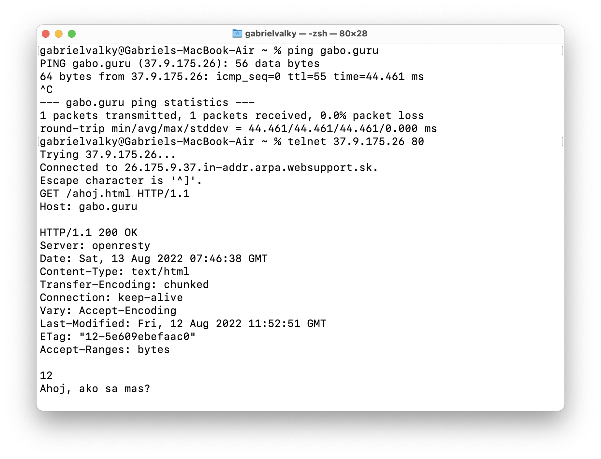
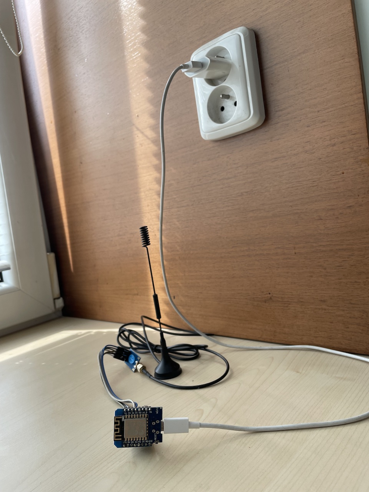
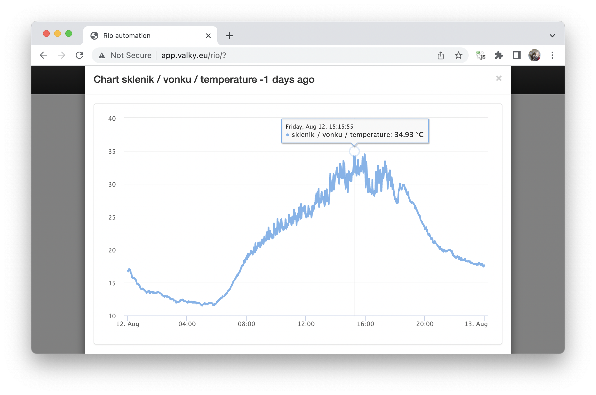

# Ulohy pre workshop 2

1. Co je to server? Ako prebieha HTTP request?





    gabrielvalky@Gabriels-MacBook-Air ~ % telnet 37.9.175.26 80
    GET /ahoj.html HTTP/1.0
    Host: gabo.guru


    gabrielvalky@Gabriels-MacBook-Air ~ % telnet http.badssl.com 80
    GET / HTTP/1.0
    Host: http.badssl.com


2. Motivacia - informacny system

  

  

2. Vytvorte vlastny server: 
  - nastavte spravne prihlasovacie udaje pre nasu wifi, 
  - zistite na akej IP adrese bezi (pouzite monitor seriovej linky) a 
  - po otvoreni vypiste vlastne meno

    ```C
    #include <ESP8266WiFi.h>
    #include <WiFiClient.h>
    #include <ESP8266WebServer.h>

    char* ssid = "******";
    char* password = "******";
     
    ESP8266WebServer server(80);

    void handleRoot() 
    {
     server.send(200, "text/html", "Ahoj, ja sa volam Gabo!");
    }

    void setup(void)
    {
      Serial.begin(9600);
      
      WiFi.begin(ssid, password);
     
      while (WiFi.status() != WL_CONNECTED) 
      {
        delay(500);
        Serial.print(".");
      }
     
      Serial.print("\n");
      Serial.print("Connected to ");
      Serial.print(ssid);
      Serial.print("\n");
      Serial.print("IP address: ");
      Serial.print(WiFi.localIP());
      Serial.print("\n");
     
      server.on("/", handleRoot);
      server.begin();
    }

    void loop(void)
    {
      server.handleClient();
    }
    ```

3. Server - Skuste vyuzit niektore html tagy (b-bold, u-underline, hr-line, body bgcolor)

    ```C
    #include <ESP8266WiFi.h>
    #include <WiFiClient.h>
    #include <ESP8266WebServer.h>

    char* ssid = "******";
    char* password = "******";
     
    ESP8266WebServer server(80);

    char* html = R""(
    <HTML>
      <HEAD>
          <TITLE>My first web page</TITLE>
      </HEAD>
    <BODY>
      <CENTER>
          <B>Hello World.... </B>
      </CENTER> 
    </BODY>
    </HTML>
    )"";
      
    void handleRoot() 
    {
     server.send(200, "text/html", html);
    }

    void setup(void)
    {
      Serial.begin(9600);
      
      WiFi.begin(ssid, password);
     
      while (WiFi.status() != WL_CONNECTED) 
      {
        delay(500);
        Serial.print(".");
      }
     
      Serial.print("\n");
      Serial.print("Connected to ");
      Serial.print(ssid);
      Serial.print("\n");
      Serial.print("IP address: ");
      Serial.print(WiFi.localIP());
      Serial.print("\n");
     
      server.on("/", handleRoot);
      server.begin();
    }

    void loop(void)
    {
      server.handleClient();
    }
    ```

4. Server - Viacej prelinkovanych dokumentov

    ```C
    #include <ESP8266WiFi.h>
    #include <WiFiClient.h>
    #include <ESP8266WebServer.h>
    #include <DHTesp.h>

    char* ssid = "********";
    char* password = "********";
     
    ESP8266WebServer server(80);
      
    void handleRoot() 
    {
      String html = R""(
    <HTML>
      <HEAD>
          <TITLE>My first web page</TITLE>
      </HEAD>
    <BODY>
      <CENTER>
          <a href="/ahoj">Klikni sem</a>
      </CENTER> 
    </BODY>
    </HTML>
    )"";

      server.send(200, "text/html", html);
    }

    void handleAhoj() 
    {
      server.send(200, "text/html", "Ahoj!");
    }

    void setup(void)
    {
      Serial.begin(9600);
      
      WiFi.begin(ssid, password);
     
      while (WiFi.status() != WL_CONNECTED) 
      {
        delay(500);
        Serial.print(".");
      }
     
      Serial.print("\n");
      Serial.print("Connected to ");
      Serial.print(ssid);
      Serial.print("\n");
      Serial.print("IP address: ");
      Serial.print(WiFi.localIP());
      Serial.print("\n");
     
      server.on("/", handleRoot);
      server.on("/ahoj", handleAhoj);
      server.begin();
    }

    void loop(void)
    {
      server.handleClient();
    }
    ```

5. Server - Vycitanie udajov z teplomera
   - nezabudnite inicializovat napajanie pre senzor DHT22 vo funkcii setup s funkciami `pinMode` a `digitalWrite` (D1: napajanie 3.3V, D2: data, D3: napajanie zem)

    ```C
    void handleMeraj() 
    {
      DHTesp dht;
      dht.setup(D2, DHTesp::DHT22);
      
      String html = "Teplota: " + String(dht.getTemperature()) + " &deg;C<br>";
      html = html + "Vlhkost: " + String(dht.getHumidity()) + "%<br>";
      server.send(200, "text/html", html);
    }
    ```
  - riesenie: [demo_dhtserver.ino](demo_dhtserver.ino)

6. Server - Automaticke obnovenie
  - pridajte do generovanej stranky nasledujuci text

    ```html
    <script>setTimeout(() => document.location.reload(), 1000)</script>
    ```

  - alebo

    ```html
    <meta http-equiv="Content-type" content="text/html; charset=utf-8" />
    ```

  - riesenie: [demo_dhtrefresh.ino](demo_dhtrefresh.ino)

7. Server - Prepinanie farieb
  - pridame include a deklaraciu pre led pasik: 
    - `#include <NeoPixelBus.h>`
    - `NeoPixelBus<NeoGrbFeature, NeoEsp8266Uart1800KbpsMethod> strip(8);`
  - ako prve prikazy v `setup()` zavolame: `strip.Begin();` a `strip.Show();`
  - a pridame handler na `/red`:

    ```C
    server.on("/red", []() {
      server.send(200, "text/plain", "Nastavil som cervenu farbu");
      strip.SetPixelColor(5, RgbColor(16, 0, 0));
      strip.Show();
    });
    ```
  - riesenie: [demo_red.ino](demo_red.ino)
  - pridajte farby red, green, blue, black, white. S maximalnou intenzitou 50
  - pridajte odkazy na zakladnu stranku
  - riesenie: [demo_rgb.ino](demo_rgb.ino)

8. Server - URL parametre
  - Pridame handler na `/color`, ktory vycita intenzity pre vsetky farebne kanaly z URL linky

    ```C
    int r = server.arg("r").toInt();
    int g = server.arg("g").toInt();
    int b = server.arg("b").toInt();
    strip.SetPixelColor(5, RgbColor(r, g, b));
    strip.Show();

    // presmeruj naspat na zakladnu stranku
    server.sendHeader("Location", String("/"), true);
    server.send(302, "text/plain", "");
    ```

  - Otestovat otvorenim url linky: `http://123.123.123.123/color?r=20&g=10&b=5`
  - Nahradime nim endpointy pre individualne farby z predoslej ulohy, a upravime zakladnu stranku aby odkazovala na novy endpoint
  - riesenie: [demo_color.ino](demo_color.ino)

8. Server - Farebny gradient
  - pouzite nasledujuci HTML kod

    ```html
    <input type="color" id="set1" value="#000000">
    <input type="color" id="set2" value="#000000">
    <script>
      document.querySelectorAll("input[type='color']")
        .forEach(e => e.addEventListener("input", updateColor, false));
                
      function updateColor()
      {
        var html = event.target.value;
        var id = event.target.id;
        var color = parseInt("0x"+html.substr(1));
        var r = color >> 16, g = (color >> 8) & 0xff, b = color & 0xff;
        r /= 4; g /= 4; b /= 4;
        const xhr = new XMLHttpRequest()
        xhr.open("GET", `${id}?r=${r}&g=${g}&b=${b}`);
        xhr.send()
      }
    </script>
    ```

  - vytvorte dva endpointy `/set1` a `/set2` v ktorych si hodnotu farby ulozite do globalnych parametrov
  - zavolajte funkciu na vykreslenie gradientu, pouzite funkciu `interpoluj` s ktorou nastavite vsetkych 8 lediek

    ```C
    int interpoluj(int x1, int x2, int percent)
    {
      return x1 + (x2-x1)*percent/100;
    }
    ```

  - riesenie: [demo_picker.ino](demo_picker.ino)

9. Server - Obrazky
  - aky je rozdiel vo formatoch `png`, `jpg`, `jpeg`, `svg` ?
  - skript na konverziu obrazku na kod:

    ```bash
    wget "https://external-content.duckduckgo.com/iu/?u=https%3A%2F%2Fisorepublic.com%2Fwp-content%2Fuploads%2F2018%2F11%2Fyellow-flower-details.jpg&f=1&nofb=1" -O flowerbig.jpg
    convert flowerbig.jpg -resize 400x400 -quality 30 flower.jpg
    xxd -i flower.jpg > flower.h
    ```

  - riesenie: [demo_images.ino](demo_images.ino)

10. Server - Formular, ukladanie do eeprom

  - funkcie na pracu s eeprom:

    ```C
    #include <EEPROM.h>

    String nacitajEeprom(int adresa)
    {
      char temp[64];
      for (int i=0; i<63; i++)
      {
        temp[i] = EEPROM.read(adresa+i);
        if (temp[i] == 0)
          break;
      }
      return String(temp);
    }

    void zapisEeprom(int adresa, String text)
    {
      for (int i=0; i<text.length()+1; i++)
        EEPROM.write(adresa+i, text[i]);
    }

    void dokonciEeprom()
    {
      EEPROM.commit();
    }
    ```

  - riesenie: [demo_login.ino](demo_login.ino)

11. Klient - Informacny system
  - nastavte `const char* id = "creativepoint_svojemeno";`
  - riesenie: [demo_dweet.ino](demo_dweet.ino)
  - otvorte: https://dweet.io/follow/creativepoint_svojemeno

12. Access point 
  - zoberte riesenie z programu 6: [demo_dhtrefresh.ino](demo_dhtrefresh.ino)
  - v predoslom programe nahradte kod na pripajanie na wifi za vytvorenie access pointu
  - v premennej `apSsid` pouzite svoje meno, `apPassword` musi mat aspon 8 znakov
  - po spusteni esp8266 vytvori vlastnu wifi na ktoru sa pripojime
  - v seriovej konzole zistime na akej IP adrese vramci virtualnej siete vystupuje nas http server

    ```C
    // ...

    char* apSsid = "esp gabo";
    char* apPassword = "11111111";

    // ...

    void setup(void)
    {
      Serial.begin(9600);
      
      WiFi.softAP(apSsid, apPassword);
     
      Serial.print("\nSoft ap running: ");
      Serial.print("ssid: ");
      Serial.print(apSsid);
      Serial.print(" password: ");
      Serial.print(apPassword);
      Serial.print("\n");
      
      Serial.print("IP address: ");
      Serial.print(WiFi.softAPIP());
      Serial.print("\n");
      // ...
    }
    ```

  - riesenie: [demo_ap.ino](demo_ap.ino)

13. Captive portal
  - AP mode s dns serverom a captive portalom (esp vytvori vlastny accesspoint na ktory sa pripojime)
  - nastavte `char* apSsid = "esp_vase meno";`
  - pouzite kod, doplnte chybajuce funkcie `handleRoot` a `handleMeraj`

    ```C
    #include <ESP8266WiFi.h>
    #include <WiFiClient.h>
    #include <ESP8266WebServer.h>
    #include <DHTesp.h>
    #include <DNSServer.h>

    char* apSsid = "esp weather";

    IPAddress         apIP(10, 10, 10, 1);
    ESP8266WebServer  server(80);
    DNSServer         dnsServer;  

    // dopln tuto

    void setup(void)
    {
      Serial.begin(9600);

      WiFi.mode(WIFI_AP);
      WiFi.softAPConfig(apIP, apIP, IPAddress(255, 255, 255, 0));
      WiFi.softAP(apSsid);
      
      dnsServer.start(53, "*", apIP);

      server.on("/", handleRoot);
      server.on("/meraj", handleMeraj);
      server.onNotFound(handleRoot);
      server.begin();

      pinMode(D1, OUTPUT);
      digitalWrite(D1, HIGH);
      pinMode(D3, OUTPUT);
      digitalWrite(D3, LOW);  
    }

    void loop(void)
    {
      server.handleClient();
      dnsServer.processNextRequest();
    }
    ```

  - riesenie: [demo_captive.ino](demo_captive.ino)

14. Bonus: AP + Captive portal + Falosny login
