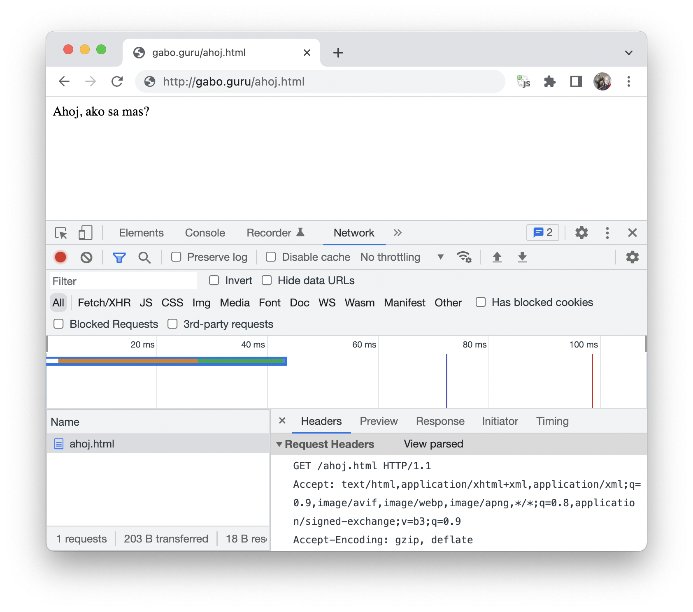
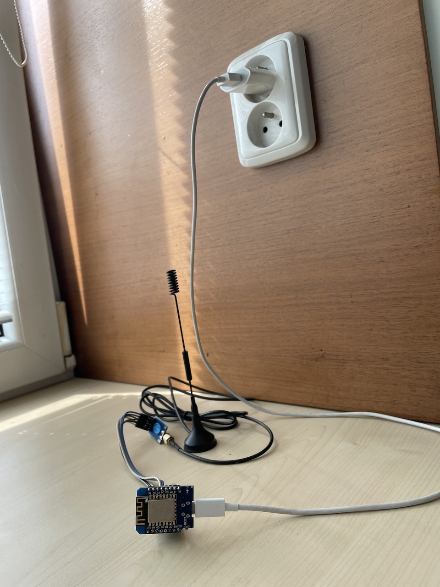
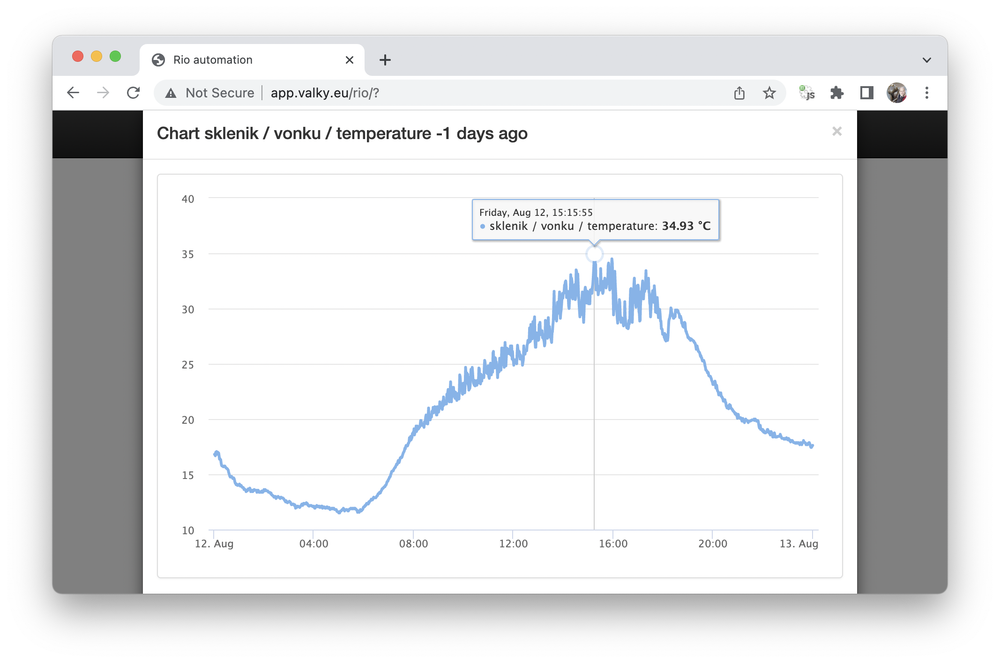

# Ulohy pre workshop 2

1. Co je to server? Ako prebieha HTTP request?




    gabrielvalky@Gabriels-MacBook-Air ~ % telnet 37.9.175.26 80
    GET /ahoj.html HTTP/1.0
    Host: gabo.guru


2. Motivacia - informacny system

  

  

2. Vytvorte vlastny server: 
  - nastavte spravne prihlasovacie udaje pre nasu wifi, 
  - zistite na akej IP adrese bezi (pouzite seriovej linky) a 
  - nechajte ho vypisat vlastne meno

    ```C
    #include <ESP8266WiFi.h>
    #include <WiFiClient.h>
    #include <ESP8266WebServer.h>

    char* ssid = "******";
    char* password = "******";
     
    ESP8266WebServer server(80);

    void handleRoot() 
    {
     server.send(200, "text/html", "Ahoj, ja sa volam Gabo!");
    }

    void setup(void)
    {
      Serial.begin(9600);
      
      WiFi.begin(ssid, password);
     
      while (WiFi.status() != WL_CONNECTED) 
      {
        delay(500);
        Serial.print(".");
      }
     
      Serial.print("\n");
      Serial.print("Connected to ");
      Serial.print(ssid);
      Serial.print("\n");
      Serial.print("IP address: ");
      Serial.print(WiFi.localIP());
      Serial.print("\n");
     
      server.on("/", handleRoot);
      server.begin();
    }

    void loop(void)
    {
      server.handleClient();
    }
    ```

3. Skuste vyuzit niektore html tagy (b-bold, u-underline, hr-line, body bgcolor)

    ```C
    #include <ESP8266WiFi.h>
    #include <WiFiClient.h>
    #include <ESP8266WebServer.h>

    char* ssid = "******";
    char* password = "******";
     
    ESP8266WebServer server(80);

    char* html = R""(
    <HTML>
      <HEAD>
          <TITLE>My first web page</TITLE>
      </HEAD>
    <BODY>
      <CENTER>
          <B>Hello World.... </B>
      </CENTER> 
    </BODY>
    </HTML>
    )"";
      
    void handleRoot() 
    {
     server.send(200, "text/html", html);
    }

    void setup(void)
    {
      Serial.begin(9600);
      
      WiFi.begin(ssid, password);
     
      while (WiFi.status() != WL_CONNECTED) 
      {
        delay(500);
        Serial.print(".");
      }
     
      Serial.print("\n");
      Serial.print("Connected to ");
      Serial.print(ssid);
      Serial.print("\n");
      Serial.print("IP address: ");
      Serial.print(WiFi.localIP());
      Serial.print("\n");
     
      server.on("/", handleRoot);
      server.begin();
    }

    void loop(void)
    {
      server.handleClient();
    }
    ```

4. Viacej prelinkovanych dokumentov

    ```C
    #include <ESP8266WiFi.h>
    #include <WiFiClient.h>
    #include <ESP8266WebServer.h>
    #include <DHTesp.h>

    char* ssid = "********";
    char* password = "********";
     
    ESP8266WebServer server(80);
      
    void handleRoot() 
    {
      String html = R""(
    <HTML>
      <HEAD>
          <TITLE>My first web page</TITLE>
      </HEAD>
    <BODY>
      <CENTER>
          <a href="/ahoj">Klikni sem</a>
      </CENTER> 
    </BODY>
    </HTML>
    )"";

      server.send(200, "text/html", html);
    }

    void handleAhoj() 
    {
      server.send(200, "text/html", "Ahoj!");
    }

    void setup(void)
    {
      Serial.begin(9600);
      
      WiFi.begin(ssid, password);
     
      while (WiFi.status() != WL_CONNECTED) 
      {
        delay(500);
        Serial.print(".");
      }
     
      Serial.print("\n");
      Serial.print("Connected to ");
      Serial.print(ssid);
      Serial.print("\n");
      Serial.print("IP address: ");
      Serial.print(WiFi.localIP());
      Serial.print("\n");
     
      server.on("/", handleRoot);
      server.on("/ahoj", handleAhoj);
      server.begin();
    }

    void loop(void)
    {
      server.handleClient();
    }
    ```

5. Vycitanie udajov z teplomera
   - nezabudnite inicializovat napajanie pre senzor DHT22 vo funkcii setup

    ```C
    void handleMeraj() 
    {
      DHTesp dht;
      dht.setup(Ds, DHTesp::DHT22);
      
      String html = "Teplota: " + String(dht.getTemperature()) + " &deg;C<br>";
      html = html + "Vlhkost: " + String(dht.getHumidity()) + "%<br>";
      server.send(200, "text/html", html);
    }
    ```

6. Automaticke obnovenie
  - pridajte do generovanej stranky nasledujuci text

    ```html
    <script>setTimeout(() => document.location.reload(), 1000)</script>
    ```

7. TODO: Tlacitka na nastavenie farby led pasika

8. TODO: color chooser

9. Klient 
  - nahradte `creativepoint_ba1` za `creativepoint_svojemeno`
  - otvorte stranku: https://dweet.io/follow/creativepoint_svojemeno
  - otvorte stranku: https://dweet.io/get/latest/dweet/for/creativepoint_svojemeno

    ```C
    #include "ESP8266WiFi.h"
    #include "DHTesp.h"

    const char* ssid = "********";
    const char* password = "********";
    const char* id = "creativepoint_ba1";

    int counter = 0;

    DHTesp dht;

    void setup() 
    {  
      Serial.begin(115200);
      dht.setup(D4, DHTesp::DHT22);
      
      Serial.print("\n");
      Serial.print("Connecting to ");
      Serial.print(ssid);
      Serial.print("\n");
      WiFi.begin(ssid, password);
      
      while (WiFi.status() != WL_CONNECTED) 
      {
        delay(500);
        Serial.print(".");
      }

      Serial.print("\n");
      Serial.print("WiFi connected\n");
    }

    void loop() 
    {
      counter++;

      float humidity = dht.getHumidity();
      float temperature = dht.getTemperature();

      Serial.print("Connecting...\n");
      
      WiFiClient client;
      if (!client.connect("dweet.io", 80)) 
      {
        Serial.println("connection failed");
        return;
      }
      
      client.print("GET /dweet/for/");
      client.print(id);
      client.print("?counter=");
      client.print(counter);
      client.print("&humidity=");
      client.print(humidity);
      client.print("&temperature=");
      client.print(temperature);
      client.print(" HTTP/1.1\r\n");
      client.print("Host: dweet.io\r\n");
      client.print("Connection: close\r\n");
      client.print("\r\n");
      
      delay(1000);

      Serial.print("\n<<<< Response >>>>\n");
      while(client.available())
      {
        char c = client.read();
        Serial.print(c);
      }
      Serial.print("\n===================\n");
     
      // Repeat every 5 seconds
      delay(5000); 
    }
    ```


10. AP mode s dns serverom a captive portalom (esp vytvori vlastny accesspoint na ktory sa pripojime)
  - pouzite kod, doplnte chybajuce funkcie `handleRoot` a `handleMeraj`

    ```C
    #include <ESP8266WiFi.h>
    #include <WiFiClient.h>
    #include <ESP8266WebServer.h>
    #include <DHTesp.h>
    #include <DNSServer.h>

    char* apSsid = "esp weather";
    char* apPassword = "11111111";

    IPAddress         apIP(10, 10, 10, 1);
    ESP8266WebServer  server(80);
    DNSServer         dnsServer;  
      
    void setup(void)
    {
      Serial.begin(9600);

      WiFi.mode(WIFI_AP);
      WiFi.softAPConfig(apIP, apIP, IPAddress(255, 255, 255, 0));
      dnsServer.start(53, "*", apIP);

      server.on("/", handleRoot);
      server.on("/meraj", handleMeraj);
      server.onNotFound(handleRoot);
      server.begin();
    }

    void loop(void)
    {
      server.handleClient();
      dnsServer.processNextRequest();
    }

    ```

11. Ako pridat obrazok

12. Fake login, eeprom collect
