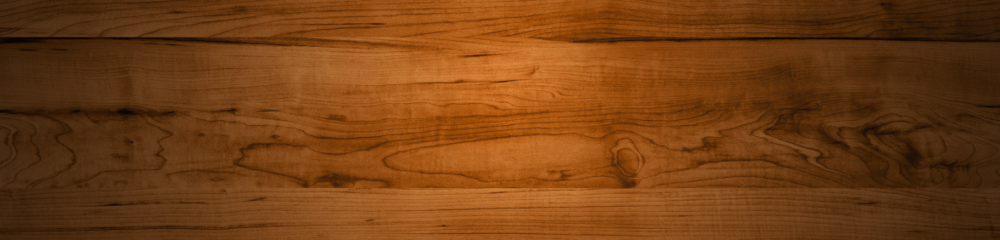

# Diff
## Diff 01 vs 00

 - [clean01/index.html](clean01/index.html) [live](https://rawgit.valky.eu/gabonator/Education/master/2022/Programming2/clean01/index.html)

```diff
11a12,13
> var vx = 0;
> var vy = 0;
19a22,23
>     x = x + vx;
>     y = y + vy;
```

## Diff 02 vs 01

 - [clean02/index.html](clean02/index.html) [live](https://rawgit.valky.eu/gabonator/Education/master/2022/Programming2/clean02/index.html)

```diff
13a14
> var radius = 20;
23a25,35
> 
>     if (x < 20)
>       vx = Math.abs(vx);
>     if (x > width-20)
>       vx = -Math.abs(vx);
> 
>     if (y < 20)
>       vy = Math.abs(vy);
>     if (y > height-20)
>       vy = -Math.abs(vy);
> 
```

## Diff 03 vs 02

 - [clean03/index.html](clean03/index.html) [live](https://rawgit.valky.eu/gabonator/Education/master/2022/Programming2/clean03/index.html)

```diff
12,13c12,15
< var vx = 0;
< var vy = 0;
---
> var vx = 5;
> var vy = -2;
> var ax = 0;
> var ay = 0.1;
22a25,28
>     vx = vx + ax;
>     vy = vy + ay;
>     vx = vx * 0.99;
>     vy = vy * 0.99;
33a40
>     {
34a42,45
>       y = height-20;
>       vy *= 0.8;
>       vx *= 0.8;
>     }
```

## Diff 04 vs 03

 - [clean04/index.html](clean04/index.html) [live](https://rawgit.valky.eu/gabonator/Education/master/2022/Programming2/clean04/index.html)

```diff
10,15c10,15
< var x = width/2;
< var y = height/2;
< var vx = 5;
< var vy = -2;
< var ax = 0;
< var ay = 0.1;
---
> var x = []; //width/2;
> var y = []; //height/2;
> var vx = []; //5;
> var vy = []; //-2;
> var ax = []; //0;
> var ay = []; //0.1;
17,18c17,18
< 
< var ball = document.createElement("img");
---
> var balls = []; 
> /*document.createElement("img");
21c21,38
< element.appendChild(ball);
---
> document.querySelector("#game").appendChild(ball);
> */
> 
> for (var i=0; i<10; i++)
> {
>   var b = document.createElement("img");
>   b.src = "red.png";
>   b.setAttribute("style", "position:absolute");
>   element.appendChild(b);
>   balls.push(b);
> 
>   x.push(Math.random()*width);
>   y.push(Math.random()*height);
>   vx.push(Math.random()*5-2.5);
>   vy.push(Math.random()*5-2.5);
>   ax.push(0);
>   ay.push(0);
> }
25,39c42,58
<     vx = vx + ax;
<     vy = vy + ay;
<     vx = vx * 0.99;
<     vy = vy * 0.99;
<     x = x + vx;
<     y = y + vy;
< 
<     if (x < 20)
<       vx = Math.abs(vx);
<     if (x > width-20)
<       vx = -Math.abs(vx);
< 
<     if (y < 20)
<       vy = Math.abs(vy);
<     if (y > height-20)
---
>   for (var i=0; i<balls.length; i++)
>   {
>     vx[i] = vx[i] + ax[i];
>     vy[i] = vy[i] + ay[i];
> //    vx[i] = vx[i] * 0.99;
> //    vy[i] = vy[i] * 0.99;
>     x[i] = x[i] + vx[i];
>     y[i] = y[i] + vy[i];
> 
>     if (x[i] < 20)
>       vx[i] = Math.abs(vx[i]);
>     if (x[i] > width-20)
>       vx[i] = -Math.abs(vx[i]);
> 
>     if (y[i] < 20)
>       vy[i] = Math.abs(vy[i]);
>     if (y[i] > height-20)
41,44c60,63
<       vy = -Math.abs(vy);
<       y = height-20;
<       vy *= 0.8;
<       vx *= 0.8;
---
>       vy[i] = -Math.abs(vy[i]);
>       y[i] = height-20;
>       vy[i] *= 0.8;
>       vx[i] *= 0.8;
47,48c66,68
<     ball.style.left = x-20;
<     ball.style.top = y-20;
---
>     balls[i].style.left = x[i]-20;
>     balls[i].style.top = y[i]-20;
>   }
```

## Diff 05 vs 04

 - [clean05/index.html](clean05/index.html) [live](https://rawgit.valky.eu/gabonator/Education/master/2022/Programming2/clean05/index.html)

```diff
24c24
< for (var i=0; i<10; i++)
---
> for (var i=0; i<100; i++)
29c29
<   element.appendChild(b);
---
>   document.querySelector("#game").appendChild(b);
43a44,65
>     ax[i] = 0;
>     ay[i] = 0.05;
>   
>     for (var j=0; j<balls.length; j++)
>       if (i!=j)
>       {
>         var ux = x[j] - x[i];
>         var uy = y[j] - y[i];
>         var angleRad = Math.atan2(uy, ux);
>         var dist = Math.sqrt(ux**2+uy**2);
>         if (dist < 20)
>         {
>           dist = 21-dist;
>           ax[i] -= Math.cos(angleRad)*(dist/50); 
>           ay[i] -= Math.sin(angleRad)*(dist/50); 
>         } else {
>           ax[i] += Math.cos(angleRad)*(dist/10000)**2; 
>           ay[i] += Math.sin(angleRad)*(dist/10000)**2; 
>         }
> 
>       }
> 
46,47c68,69
< //    vx[i] = vx[i] * 0.99;
< //    vy[i] = vy[i] * 0.99;
---
>     vx[i] = vx[i] * 0.99;
>     vy[i] = vy[i] * 0.99;
```

## Diff 06 vs 05

 - [clean06/index.html](clean06/index.html) [live](https://rawgit.valky.eu/gabonator/Education/master/2022/Programming2/clean06/index.html)

```diff
24c24
< for (var i=0; i<100; i++)
---
> for (var i=0; i<10; i++)
27c27
<   b.src = "red.png";
---
>   b.src = ["red.png", "green.png", "blue.png"][Math.floor(Math.random()*3)];
43,48c43,49
<   {
<     ax[i] = 0;
<     ay[i] = 0.05;
<   
<     for (var j=0; j<balls.length; j++)
<       if (i!=j)
---
>   {  
>     for (var j=i+1; j<balls.length; j++)
>     {
>       var ux = x[i] - x[j];
>       var uy = y[i] - y[j];
>       var dist = Math.sqrt(ux**2+uy**2);
>       if (dist<40)
50,54c51,65
<         var ux = x[j] - x[i];
<         var uy = y[j] - y[i];
<         var angleRad = Math.atan2(uy, ux);
<         var dist = Math.sqrt(ux**2+uy**2);
<         if (dist < 20)
---
>         var mtd = 40-dist;
>         var mtdx = ux/dist*mtd;
>         var mtdy = uy/dist*mtd;
>         var mtdl = Math.sqrt(mtdx**2+mtdy**2);
>         x[i] += mtdx/2;
>         y[i] += mtdy/2;
>         x[j] -= mtdx/2;
>         y[j] -= mtdy/2;
> 
>         mtdx /= mtdl;
>         mtdy /= mtdl;
>         var velx = vx[i] - vx[j];
>         var vely = vy[i] - vy[j];
>         var vn = velx*mtdx+vely*mtdy;
>         if (vn < 0)
56,61c67,74
<           dist = 21-dist;
<           ax[i] -= Math.cos(angleRad)*(dist/50); 
<           ay[i] -= Math.sin(angleRad)*(dist/50); 
<         } else {
<           ax[i] += Math.cos(angleRad)*(dist/10000)**2; 
<           ay[i] += Math.sin(angleRad)*(dist/10000)**2; 
---
>           var rest = 1;
>           var im = -(-(1+rest)*vn) / 2;
>           var impx = mtdx*im;
>           var impy = mtdy*im;
>           vx[i] -= impx;
>           vy[i] -= impy;
>           vx[j] += impx;
>           vy[j] += impy;
63d75
< 
64a77
>     }
68,69d80
<     vx[i] = vx[i] * 0.99;
<     vy[i] = vy[i] * 0.99;
```

## Diff 07 vs 06

 - [clean07/index.html](clean07/index.html) [live](https://rawgit.valky.eu/gabonator/Education/master/2022/Programming2/clean07/index.html)

```diff
10,24c10
< var x = []; //width/2;
< var y = []; //height/2;
< var vx = []; //5;
< var vy = []; //-2;
< var ax = []; //0;
< var ay = []; //0.1;
< var radius = 20;
< var balls = []; 
< /*document.createElement("img");
< ball.src = "red.png";
< ball.setAttribute("style", "position:absolute");
< document.querySelector("#game").appendChild(ball);
< */
< 
< for (var i=0; i<10; i++)
---
> class Ball
26,30c12,41
<   var b = document.createElement("img");
<   b.src = ["red.png", "green.png", "blue.png"][Math.floor(Math.random()*3)];
<   b.setAttribute("style", "position:absolute");
<   document.querySelector("#game").appendChild(b);
<   balls.push(b);
---
>   constructor(width, height)
>   {
>     this.width = width;
>     this.height = height;
>     this.element = document.createElement("img");
>     this.element.src = ["red.png", "green.png", "blue.png"][Math.floor(Math.random()*3)];
>     this.element.setAttribute("style", "position:absolute");
>     document.querySelector("#game").appendChild(this.element);
>     this.x = Math.random()*width;
>     this.y = Math.random()*height;
>     this.vx = Math.random()*5-2.5;
>     this.vy = Math.random()*5-2.5;
>     this.ax = 0;
>     this.ay = 0;
>   }
>   update()
>   {
>     this.vx = this.vx + this.ax;
>     this.vy = this.vy + this.ay;
>     this.x = this.x + this.vx;
>     this.y = this.y + this.vy;
> 
>     if (this.x < 20)
>       this.vx = Math.abs(this.vx);
>     if (this.x > this.width-20)
>       this.vx = -Math.abs(this.vx);
>     if (this.y < 20)
>       this.vy = Math.abs(this.vy);
>     if (this.y > this.height-20)
>       this.vy = -Math.abs(this.vy);
32,37c43,45
<   x.push(Math.random()*width);
<   y.push(Math.random()*height);
<   vx.push(Math.random()*5-2.5);
<   vy.push(Math.random()*5-2.5);
<   ax.push(0);
<   ay.push(0);
---
>     this.element.style.left = this.x-20;
>     this.element.style.top = this.y-20;
>   }
39a48,52
> var balls = []; 
> 
> for (var i=0; i<10; i++)
>   balls.push(new Ball(width, height))
> 
43,101c56
<   {  
<     for (var j=i+1; j<balls.length; j++)
<     {
<       var ux = x[i] - x[j];
<       var uy = y[i] - y[j];
<       var dist = Math.sqrt(ux**2+uy**2);
<       if (dist<40)
<       {
<         var mtd = 40-dist;
<         var mtdx = ux/dist*mtd;
<         var mtdy = uy/dist*mtd;
<         var mtdl = Math.sqrt(mtdx**2+mtdy**2);
<         x[i] += mtdx/2;
<         y[i] += mtdy/2;
<         x[j] -= mtdx/2;
<         y[j] -= mtdy/2;
< 
<         mtdx /= mtdl;
<         mtdy /= mtdl;
<         var velx = vx[i] - vx[j];
<         var vely = vy[i] - vy[j];
<         var vn = velx*mtdx+vely*mtdy;
<         if (vn < 0)
<         {
<           var rest = 1;
<           var im = -(-(1+rest)*vn) / 2;
<           var impx = mtdx*im;
<           var impy = mtdy*im;
<           vx[i] -= impx;
<           vy[i] -= impy;
<           vx[j] += impx;
<           vy[j] += impy;
<         }
<       }
<     }
< 
<     vx[i] = vx[i] + ax[i];
<     vy[i] = vy[i] + ay[i];
<     x[i] = x[i] + vx[i];
<     y[i] = y[i] + vy[i];
< 
<     if (x[i] < 20)
<       vx[i] = Math.abs(vx[i]);
<     if (x[i] > width-20)
<       vx[i] = -Math.abs(vx[i]);
< 
<     if (y[i] < 20)
<       vy[i] = Math.abs(vy[i]);
<     if (y[i] > height-20)
<     {
<       vy[i] = -Math.abs(vy[i]);
<       y[i] = height-20;
<       vy[i] *= 0.8;
<       vx[i] *= 0.8;
<     }
< 
<     balls[i].style.left = x[i]-20;
<     balls[i].style.top = y[i]-20;
<   }
---
>     balls[i].update();
```

## Diff 08 vs 07

 - [clean08/index.html](clean08/index.html) [live](https://rawgit.valky.eu/gabonator/Education/master/2022/Programming2/clean08/index.html)

```diff
20,23c20,23
<     this.x = Math.random()*width;
<     this.y = Math.random()*height;
<     this.vx = Math.random()*5-2.5;
<     this.vy = Math.random()*5-2.5;
---
>     this.x = 0;
>     this.y = 0;
>     this.vx = 0;
>     this.vy = 0;
26a27,31
>   setPosition(x, y)
>   {
>     this.x = x;
>     this.y = y;
>   }
50,51c55,64
< for (var i=0; i<10; i++)
<   balls.push(new Ball(width, height))
---
> for (var y=0; y<18; y++)
>   for (var x=0; x<11-(y%2); x++)
>   {
>     var b = new Ball(width, height);
>     if (y%2==0)
>       b.setPosition(x*36+20, 20+y*32);
>     else
>       b.setPosition(x*36+20+18, 20+y*32);
>     balls.push(b)
>   }
```

## Diff 09 vs 08

 - [clean09/index.html](clean09/index.html) [live](https://rawgit.valky.eu/gabonator/Education/master/2022/Programming2/clean09/index.html)

```diff
31a32,50
>   setAngle(angleDeg)
>   {
>     var angleRad = angleDeg/180*Math.PI;
>     this.vx = Math.cos(angleRad);
>     this.vy = -Math.sin(angleRad);
>   }
>   setSpeed(s)
>   {
>     this.vx *= s;
>     this.vy *= s;
>   }
>   hide()
>   {
>     this.element.style.visibility = "hidden";
>   }
>   show()
>   {
>     this.element.style.visibility = "visible";
>   }
62a82
>     b.hide();
65a86,90
> var fire = new Ball(width, height);
> fire.setPosition(width/2, height-50);
> fire.setAngle(45);
> fire.setSpeed(5);
> balls.push(fire);
```

## Diff 10 vs 09

 - [clean10/index.html](clean10/index.html) [live](https://rawgit.valky.eu/gabonator/Education/master/2022/Programming2/clean10/index.html)

```diff
42a43,46
>   isFire()
>   {
>     return this.vx != 0 || this.vy != 0;
>   }
51c55,87
<   update()
---
>   isHidden()
>   {
>     return this.element.style.visibility == "hidden";
>   }
>   distance(b)
>   {
>     return Math.sqrt((this.x-b.x)**2 + (this.y-b.y)**2);
>   }
>   getColor(c)
>   {
>     return this.element.src;
>   }
>   setColor(c)
>   {
>     this.element.src = c;
>   }
>   hit(balls)
>   {
>     var besti = -1;
>     for (var i=0; i<balls.length; i++)
>       if (balls[i].isHidden())
>       {
>         if (besti == -1 || 
>             this.distance(balls[i]) < this.distance(balls[besti]))
>           besti = i;
>       }
>     if (besti != -1)
>     {
>       balls[besti].show();
>       balls[besti].setColor(this.getColor());
>     }
>   }
>   update(balls)
62a99
>     {
63a101,105
>       if (this.isFire())
>       {
>         this.hit(balls);
>       }
>     }
94c136
<     balls[i].update();
---
>     balls[i].update(balls);
```

## Diff 11 vs 10

 - [clean11/index.html](clean11/index.html) [live](https://rawgit.valky.eu/gabonator/Education/master/2022/Programming2/clean11/index.html)

```diff
58a59,62
>   isVisible()
>   {
>     return !this.isHidden();
>   }
70a75,78
>   randomColor()
>   {
>     this.element.src = ["red.png", "green.png", "blue.png"][Math.floor(Math.random()*3)];
>   }
88a97,111
>     if (this.isFire())
>     {
>       for (var i=0; i<balls.length; i++)
>         if (!balls[i].isFire() && 
>             balls[i].isVisible() &&
>             this.distance(balls[i]) < 40)
>         {
>           this.hit(balls);
>           this.setPosition(this.width/2, this.height-40);
>           this.setAngle(20+Math.random()*140);
>           this.setSpeed(5);
>           this.randomColor();
>           break;
>         }
>     }
103a127,130
>         this.setPosition(this.width/2, this.height-40);
>         this.setAngle(20+Math.random()*140);
>         this.setSpeed(5);
>         this.randomColor();
```

## Diff 12 vs 11

 - [clean12/index.html](clean12/index.html) [live](https://rawgit.valky.eu/gabonator/Education/master/2022/Programming2/clean12/index.html)

```diff
78a79,91
>   nearbyBalls(balls)
>   {
>     var aux = [];
>     for (var i=0; i<balls.length; i++)
>       if (balls[i].isVisible() && !balls[i].isFire() && 
>           balls[i].element != this.element && 
>           balls[i].distance(this) < 40)
>       {
>         aux.push(balls[i]);
>       }
>     return aux;
>   }
> 
89c102,111
<     if (besti != -1)
---
> 
>     if (besti == -1)
>       return;
> 
>     balls[besti].show();
>     balls[besti].setColor(this.getColor());
> 
>     var process = [balls[besti]];
>     var matching = [];
>     while (process.length > 0)
91,92c113,121
<       balls[besti].show();
<       balls[besti].setColor(this.getColor());
---
>       var b = process.shift();
>       matching.push(b);
>       var nearby = b.nearbyBalls(balls);
>       for (var i=0; i<nearby.length; i++)
>         if (nearby[i].getColor() == this.getColor())
>         {
>           if (matching.indexOf(nearby[i]) == -1)
>             process.push(nearby[i]);
>         }
93a123
>     console.log(matching.length);
94a125
> 
```

## Diff 13 vs 12

 - [clean13/index.html](clean13/index.html) [live](https://rawgit.valky.eu/gabonator/Education/master/2022/Programming2/clean13/index.html)

```diff
90a91,102
>   topBalls(balls)
>   {
>     var aux = [];
>     for (var i=0; i<balls.length; i++)
>       if (balls[i].isVisible() && !balls[i].isFire() && 
>           balls[i].element != this.element && 
>           balls[i].y < 30)
>       {
>         aux.push(balls[i]);
>       }
>     return aux;
>   }
123c135,160
<     console.log(matching.length);
---
> 
>     if (matching.length >= 3)
>     {
>       for (var i=0; i<matching.length; i++)
>         matching[i].hide();
> 
>       var process = this.topBalls(balls);
>       var hanging = [];
>       while (process.length > 0)
>       {
>         var b = process.shift();
>         hanging.push(b);
>         var nearby = b.nearbyBalls(balls);
>         for (var i=0; i<nearby.length; i++)
>         {
>           if (hanging.indexOf(nearby[i]) == -1)
>             process.push(nearby[i]);
>         }
>       }
> 
>       for (var i=0; i<balls.length; i++)
>       {
>         if (hanging.indexOf(balls[i]) == -1 && !balls[i].isFire())
>           balls[i].hide();
>       }
>     }
```

## Diff 14 vs 13

 - [clean14/index.html](clean14/index.html) [live](https://rawgit.valky.eu/gabonator/Education/master/2022/Programming2/clean14/index.html)

```diff
46a47,50
>   isFalling()
>   {
>     return this.ay != 0;
>   }
83c87
<       if (balls[i].isVisible() && !balls[i].isFire() && 
---
>       if (balls[i].isVisible() && !balls[i].isFire() && !balls[i].isFalling() &&
95c99
<       if (balls[i].isVisible() && !balls[i].isFire() && 
---
>       if (balls[i].isVisible() && !balls[i].isFire() && !balls[i].isFalling() &&
157,158c161,163
<         if (hanging.indexOf(balls[i]) == -1 && !balls[i].isFire())
<           balls[i].hide();
---
>         if (balls[i].isVisible() && 
>             hanging.indexOf(balls[i]) == -1 && !balls[i].isFire())
>           matching.push(balls[i]);
159a165,179
> 
>       this.explode(balls, matching);
>     }
>   }
> 
>   explode(balls, expl)
>   {
>     for (var i=0; i<expl.length; i++)
>     {
>       expl[i].hide();
>       var b = new Ball(this.width, this.height);
>       b.setColor(expl[i].getColor());
>       b.setPosition(expl[i].x, expl[i].y);
>       b.ay = 0.1;
>       balls.push(b);
165c185
<     if (this.isFire())
---
>     if (this.isFire() && !this.isFalling())
192c212
<       if (this.isFire())
---
>       if (!this.isFalling() && this.isFire())
201a222,227
>     {
>       if (this.isFalling())
>       {
>         this.destroy();
>         return;
>       }
202a229
>     }
206a234,238
>   destroy()
>   {
>     document.querySelector("#game").removeChild(this.element);
>     delete this.element;
>   }
229a262
>   balls = balls.filter(b => b.element);
```

## Diff 15 vs 14

 - [clean15/index.html](clean15/index.html) [live](https://rawgit.valky.eu/gabonator/Education/master/2022/Programming2/clean15/index.html)

```diff
```

## Diff 16 vs 15

 - [clean16/index.html](clean16/index.html) [live](https://rawgit.valky.eu/gabonator/Education/master/2022/Programming2/clean16/index.html)

```diff
171a172
>     var sumx = 0, sumy = 0;
173a175,186
>       sumx += expl[i].x;
>       sumy += expl[i].y;
>     }
>     sumx /= expl.length;
>     sumy /= expl.length;
> 
>     for (var i=0; i<expl.length; i++)
>     {
>       var vectx = expl[i].x - sumx;
>       var vecty = expl[i].y - sumy;
>       var angle = Math.atan2(vecty, vectx) / Math.PI * 180;
> 
177a191
>       b.setAngle(angle);
```

## Diff 17 vs 16

 - [clean17/index.html](clean17/index.html) [live](https://rawgit.valky.eu/gabonator/Education/master/2022/Programming2/clean17/index.html)

```diff
4c4
< 
---
> <script src="controls.js"></script>
265c265,269
<     b.hide();
---
> 
>     if (y<5)
>       b.show();
>     else
>       b.hide();
273a278
> 
279a285,309
> 
> 
> class Handler
> {
>   onKeyLeft(b) 
>   { 
>     console.log("left", b); 
>   }
>   onKeyRight(b)
>   { 
>     console.log("right", b); 
>   }
>   onKeyFire(b)
>   { 
>     console.log("fire", b); 
>   }
>   onMouse(pt) 
>   {
>     console.log("mouse", pt);
>   }
> }
> 
> var handler = new Handler();
> new Controls(document.querySelector("#game"), handler);
> 
```

## Diff 18 vs 17

 - [clean18/index.html](clean18/index.html) [live](https://rawgit.valky.eu/gabonator/Education/master/2022/Programming2/clean18/index.html)

```diff
6,9d5
< var element = document.querySelector("#game");
< var width = parseInt(this.element.style.width);
< var height = parseInt(this.element.style.height);
< 
255,258c251,253
< var balls = []; 
< 
< for (var y=0; y<18; y++)
<   for (var x=0; x<11-(y%2); x++)
---
> class Game
> {
>   constructor()
260,277c255,258
<     var b = new Ball(width, height);
<     if (y%2==0)
<       b.setPosition(x*36+20, 20+y*32);
<     else
<       b.setPosition(x*36+20+18, 20+y*32);
< 
<     if (y<5)
<       b.show();
<     else
<       b.hide();
<     balls.push(b)
<   }
< 
< var fire = new Ball(width, height);
< fire.setPosition(width/2, height-50);
< fire.setAngle(45);
< fire.setSpeed(5);
< balls.push(fire);
---
>     this.balls = [];
>     var element = document.querySelector("#game");
>     this.width = parseInt(element.style.width);
>     this.height = parseInt(element.style.height);
279,284c260,274
< setInterval(() => 
< {
<   balls = balls.filter(b => b.element);
<   for (var i=0; i<balls.length; i++)
<     balls[i].update(balls);
< }, 10);
---
>     for (var y=0; y<18; y++)
>       for (var x=0; x<11-(y%2); x++)
>       {
>         var b = new Ball(this.width, this.height);
>         if (y%2==0)
>           b.setPosition(x*36+20, 20+y*32);
>         else
>           b.setPosition(x*36+20+18, 20+y*32);
> 
>         if (y<5)
>           b.show();
>         else
>           b.hide();
>         this.balls.push(b)
>       }
285a276,293
>     var fire = new Ball(this.width, this.height);
>     fire.setPosition(this.width/2, this.height-50);
>     fire.setAngle(45);
>     fire.setSpeed(5);
>     this.balls.push(fire);
> 
>     setInterval(() => 
>     {
>       this.update()
>     }, 10);
>   }
> 
>   update()
>   {
>     this.balls = this.balls.filter(b => b.element);
>     for (var i=0; i<this.balls.length; i++)
>       this.balls[i].update(this.balls);
>   }
287,288d294
< class Handler
< {
307,308c313,314
< var handler = new Handler();
< new Controls(document.querySelector("#game"), handler);
---
> var game = new Game();
> new Controls(document.querySelector("#game"), game);
```

## Diff 19 vs 18

 - [clean19/index.html](clean19/index.html) [live](https://rawgit.valky.eu/gabonator/Education/master/2022/Programming2/clean19/index.html)

```diff
276,280c276,282
<     var fire = new Ball(this.width, this.height);
<     fire.setPosition(this.width/2, this.height-50);
<     fire.setAngle(45);
<     fire.setSpeed(5);
<     this.balls.push(fire);
---
>     this.fire = new Ball(this.width, this.height);
>     this.fire.setPosition(this.width/2, this.height-50);
>     this.balls.push(this.fire);
> 
>     this.cannon = new Ball(this.width, this.height);
>     this.cannon.setPosition(this.width/2, this.height-50);
>     this.cannon.show();
292a295
>     this.cannon.update();
305a309,313
>     if (b)
>     {
>       this.fire.setAngle(45);
>       this.fire.setSpeed(5);
>     }
```

## Diff 20 vs 19

 - [clean20/index.html](clean20/index.html) [live](https://rawgit.valky.eu/gabonator/Education/master/2022/Programming2/clean20/index.html)

```diff
53a54,55
>     this.element.style.left = this.x-20;
>     this.element.style.top = this.y-20;
83c85
<       if (balls[i].isVisible() && !balls[i].isFire() && !balls[i].isFalling() &&
---
>       if (balls[i].element && balls[i].isVisible() && !balls[i].isFire() && !balls[i].isFalling() &&
95c97
<       if (balls[i].isVisible() && !balls[i].isFire() && !balls[i].isFalling() &&
---
>       if (balls[i].element && balls[i].isVisible() && !balls[i].isFire() && !balls[i].isFalling() &&
108c110
<       if (balls[i].isHidden())
---
>       if (balls[i].element && balls[i].isHidden())
157c159
<         if (balls[i].isVisible() && 
---
>         if (balls[i].element && balls[i].isVisible() && 
198c200
<         if (!balls[i].isFire() && 
---
>         if (balls[i].element && !balls[i].isFire() && 
202a205
> /*
207c210,212
<           break;
---
> */
>           this.destroy();
>           return;
224a230,232
>         this.destroy();
>         return;
> /*
228a237
> */
276,279d284
<     this.fire = new Ball(this.width, this.height);
<     this.fire.setPosition(this.width/2, this.height-50);
<     this.balls.push(this.fire);
< 
310a316,317
>       this.fire = new Ball(this.width, this.height);
>       this.fire.setPosition(this.width/2, this.height-50);
312a320,321
>       this.fire.show();
>       this.balls.push(this.fire);
```

## Diff 21 vs 20

 - [clean21/index.html](clean21/index.html) [live](https://rawgit.valky.eu/gabonator/Education/master/2022/Programming2/clean21/index.html)

```diff
288a289,299
>     this.angle = 90;
>     this.arrow = document.createElement("img");
>     this.arrow.setAttribute("src", "arrow.png");
>     this.arrow.setAttribute("style", "position:absolute");
>     this.arrow.style.left = this.width/2;
>     this.arrow.style.top = this.height-50;
>     document.querySelector("#game").appendChild(this.arrow);
>     this.updateArrow();
>     // zacat: "rotate(45deg)"
>     //translate(-23px, -20px) rotate(315deg) translate(22px, 0px)
> 
294c305,308
< 
---
>   updateArrow()
>   {
>     this.arrow.style.transform = "translate(-24px, -20px) rotate(-"+this.angle+"deg) translate(20px, 0px)"
>   }
```

## Diff 22 vs 21

 - [clean22/index.html](clean22/index.html) [live](https://rawgit.valky.eu/gabonator/Education/master/2022/Programming2/clean22/index.html)

```diff
285,288c285,286
<     this.cannon = new Ball(this.width, this.height);
<     this.cannon.setPosition(this.width/2, this.height-50);
<     this.cannon.show();
< 
---
>     this.left = false;
>     this.right = false;
299a298,301
>     this.cannon = new Ball(this.width, this.height);
>     this.cannon.setPosition(this.width/2, this.height-50);
>     this.cannon.show();
> 
310a313,318
>     if (this.left && this.angle < 160)
>       this.angle = this.angle + 1;
>     if (this.right && this.angle > 20)
>       this.angle = this.angle - 1;
>     this.updateArrow();
> 
319c327
<     console.log("left", b); 
---
>     this.left = b;
323c331
<     console.log("right", b); 
---
>     this.right = b;
330a339
>       this.fire.setColor(this.cannon.getColor());
332c341
<       this.fire.setAngle(45);
---
>       this.fire.setAngle(this.angle);
335a345
>       this.cannon.randomColor();
```

## Diff 23 vs 22

 - [clean23/index.html](clean23/index.html) [live](https://rawgit.valky.eu/gabonator/Education/master/2022/Programming2/clean23/index.html)

```diff
205,210d204
< /*
<           this.setPosition(this.width/2, this.height-40);
<           this.setAngle(20+Math.random()*140);
<           this.setSpeed(5);
<           this.randomColor();
< */
232,237d225
< /*
<         this.setPosition(this.width/2, this.height-40);
<         this.setAngle(20+Math.random()*140);
<         this.setSpeed(5);
<         this.randomColor();
< */
335d322
<     console.log("fire", b); 
350c337,340
<     console.log("mouse", pt);
---
>     var vx = pt.x - this.cannon.x;
>     var vy = pt.y - this.cannon.y;
>     this.angle = Math.floor(Math.atan2(-vy, vx) * 180 / Math.PI);
>     this.onKeyFire(true);
```

## Diff 24 vs 23

 - [clean24/index.html](clean24/index.html) [live](https://rawgit.valky.eu/gabonator/Education/master/2022/Programming2/clean24/index.html)

```diff
160c160
<             hanging.indexOf(balls[i]) == -1 && !balls[i].isFire())
---
>             hanging.indexOf(balls[i]) == -1 && !balls[i].isFire() && !balls[i].isFalling())
164a165,172
> 
>       var remaining = 0;
>       for (var i=0; i<balls.length; i++)
>       {
>         if (balls[i].element && balls[i].isVisible() && !balls[i].isFire() && !balls[i].isFalling())
>           remaining = remaining + 1;
>       }
>       console.log("Ostava ", remaining, "guliciek");
```

## Diff 25 vs 24

 - [clean25/index.html](clean25/index.html) [live](https://rawgit.valky.eu/gabonator/Education/master/2022/Programming2/clean25/index.html)

```diff
340c340,345
<       this.cannon.randomColor();
---
> 
>       var colors = this.balls.filter(b=>b.isVisible() && !b.isFire() && !b.isFalling())
>         .map(b=>b.getColor());
>       colors = colors.filter((v, i, a) => a.indexOf(v) === i);
>       var rcolor = colors[Math.floor(Math.random()*colors.length)];
>       this.cannon.setColor(rcolor);
```

## Diff 26 vs 25

 - [clean26/index.html](clean26/index.html) [live](https://rawgit.valky.eu/gabonator/Education/master/2022/Programming2/clean26/index.html)

```diff
172a173,176
>       if (remaining == 0)
>       {
>         console.log("Vyhral !");
>       }
203c207
<   update(balls)
---
>   checkHit(balls)
205,206d208
<     if (this.isFire() && !this.isFalling())
<     {
212,214c214
<           this.hit(balls);
<           this.destroy();
<           return;
---
>           return true;
215a216,225
>     return false;
>   }
> 
>   update(balls)
>   {
>     if (this.isFire() && !this.isFalling() && this.checkHit(balls))
>     {
>       this.hit(balls);
>       this.destroy();
>       return;
341c351,357
<       var colors = this.balls.filter(b=>b.isVisible() && !b.isFire() && !b.isFalling())
---
>       if (this.fire.checkHit(this.balls))
>       {
>         this.fire.destroy();
>         console.log("Prehral!");
>       }
> 
>       var colors = this.balls.filter(b=>b.element && b.isVisible() && !b.isFire() && !b.isFalling())
```

## Diff 27 vs 26

 - [clean27/index.html](clean27/index.html) [live](https://rawgit.valky.eu/gabonator/Education/master/2022/Programming2/clean27/index.html)

```diff
2a3,10
>   <div id="loser" class="wave" style="visibility:hidden">
>    <span style="--i:1">L</span>
>    <span style="--i:2">o</span>
>    <span style="--i:3">s</span>
>    <span style="--i:4">e</span>
>    <span style="--i:5">r</span>
>    <span style="--i:6">!</span>
>   </div>
3a12
> <link rel="stylesheet" href="wave.css">
271,289c280
<     var element = document.querySelector("#game");
<     this.width = parseInt(element.style.width);
<     this.height = parseInt(element.style.height);
< 
<     for (var y=0; y<18; y++)
<       for (var x=0; x<11-(y%2); x++)
<       {
<         var b = new Ball(this.width, this.height);
<         if (y%2==0)
<           b.setPosition(x*36+20, 20+y*32);
<         else
<           b.setPosition(x*36+20+18, 20+y*32);
< 
<         if (y<5)
<           b.show();
<         else
<           b.hide();
<         this.balls.push(b)
<       }
---
>     this.restart();
312a304,329
>   restart()
>   {
>     for (var i=0; i<this.balls.length; i++)
>       this.balls[i].destroy();
>     this.balls = [];
> 
>     var element = document.querySelector("#game");
>     this.width = parseInt(element.style.width);
>     this.height = parseInt(element.style.height);
> 
>     for (var y=0; y<18; y++)
>       for (var x=0; x<11-(y%2); x++)
>       {
>         var b = new Ball(this.width, this.height);
>         if (y%2==0)
>           b.setPosition(x*36+20, 20+y*32);
>         else
>           b.setPosition(x*36+20+18, 20+y*32);
> 
>         if (y<5)
>           b.show();
>         else
>           b.hide();
>         this.balls.push(b)
>       }
>   }
354a372
>         this.onLose();
370a389,403
> 
>   onLose()
>   {
>    document.querySelector("#loser").style.visibility = "visible";
>    setTimeout(()=>
>    {
>      this.onContinue();
>    }, 5000);
>   }
> 
>   onContinue()
>   {
>    document.querySelector("#loser").style.visibility = "hidden";
>    this.restart();
>   }
```

## Diff 28 vs 27

 - [clean28/index.html](clean28/index.html) [live](https://rawgit.valky.eu/gabonator/Education/master/2022/Programming2/clean28/index.html)

```diff
10a11,18
>   <div id="winner" class="wave" style="visibility:hidden">
>    <span style="--i:1">W</span>
>    <span style="--i:2">i</span>
>    <span style="--i:3">n</span>
>    <span style="--i:4">n</span>
>    <span style="--i:5">e</span>
>    <span style="--i:6">r</span>
>   </div>
17c25
<   constructor(width, height)
---
>   constructor(game)
19,20c27,29
<     this.width = width;
<     this.height = height;
---
>     this.game = game;
>     this.width = game.width;
>     this.height = game.height;
184a194
>         this.game.onWin();
207c217
<       var b = new Ball(this.width, this.height);
---
>       var b = new Ball(this);
295c305
<     this.cannon = new Ball(this.width, this.height);
---
>     this.cannon = new Ball(this);
317c327
<         var b = new Ball(this.width, this.height);
---
>         var b = new Ball(this);
328a339
>     this.playing = true;
357a369,370
>     if (!this.playing)
>       return;
360c373
<       this.fire = new Ball(this.width, this.height);
---
>       this.fire = new Ball(this);
391a405,408
>    if (!this.playing)
>      return;
>    this.playing = false;
> 
398a416,428
>   onWin()
>   {
>    if (!this.playing)
>      return;
>    this.playing = false;
> 
>    document.querySelector("#winner").style.visibility = "visible";
>    setTimeout(()=>
>    {
>      this.onContinue();
>    }, 5000);
>   }
> 
401a432
>    document.querySelector("#winner").style.visibility = "hidden";
```

## Diff 29 vs 28

 - [clean29/index.html](clean29/index.html) [live](https://rawgit.valky.eu/gabonator/Education/master/2022/Programming2/clean29/index.html)

```diff
290c290,293
<     this.restart();
---
> //    this.restart();
>     var element = document.querySelector("#game");
>     this.width = parseInt(element.style.width);
>     this.height = parseInt(element.style.height);
313a317
> 
320,323d323
<     var element = document.querySelector("#game");
<     this.width = parseInt(element.style.width);
<     this.height = parseInt(element.style.height);
< 
339d338
<     this.playing = true;
369,370d367
<     if (!this.playing)
<       return;
401a399,408
> }
> 
> class GameController extends Game
> {
>   constructor()
>   {
>     super();
>     this.playing = true;
>     this.restart();
>   }
432a440
>    this.playing = false;
437c445
< var game = new Game();
---
> var game = new GameController();
```

## Diff 30 vs 29

 - [clean30/index.html](clean30/index.html) [live](https://rawgit.valky.eu/gabonator/Education/master/2022/Programming2/clean30/index.html)

```diff
31c31
<     this.element.src = ["red.png", "green.png", "blue.png"][Math.floor(Math.random()*3)];
---
>     this.randomColor();
97c97
<     this.element.src = ["red.png", "green.png", "blue.png"][Math.floor(Math.random()*3)];
---
>     this.element.src = this.game.colors[Math.floor(Math.random()*this.game.colors.length)];
217c217
<       var b = new Ball(this);
---
>       var b = new Ball(this.game);
288a289
>     this.colors = [];
308,311d308
<     this.cannon = new Ball(this);
<     this.cannon.setPosition(this.width/2, this.height-50);
<     this.cannon.show();
< 
318c315
<   restart()
---
>   restart(levelconfig)
319a317,320
>     //this.levelconfig = levelconfig;
>     this.colors = levelconfig.colors;
>     if (this.cannon)
>       this.cannon.destroy();
333c334
<         if (y<5)
---
>         if (y<levelconfig.rows)
338a340,343
> 
>     this.cannon = new Ball(this);
>     this.cannon.setPosition(this.width/2, this.height-50);
>     this.cannon.show();
407c412,413
<     this.restart();
---
>     this.level = 1;
>     this.onContinue();
428c434
< 
---
>    this.level = this.level + 1;
440,441c446,449
<    this.playing = false;
<    this.restart();
---
>    this.playing = true;
> 
>    var levelconfig = {rows:3, colors:["red.png", "green.png", "blue.png", "mod200.png"]};
>    this.restart(levelconfig);
```

## Diff 31 vs 30

 - [clean31/index.html](clean31/index.html) [live](https://rawgit.valky.eu/gabonator/Education/master/2022/Programming2/clean31/index.html)

```diff
448c448,456
<    var levelconfig = {rows:3, colors:["red.png", "green.png", "blue.png", "mod200.png"]};
---
>    var levelconfig;
> 
>    if (this.level == 1)
>      levelconfig = {rows:3, colors:["red.png", "green.png"]};
>    else if (this.level == 2)
>      levelconfig = {rows:4, colors:["red.png", "green.png", "blue.png", "mod200.png"]};
>    else 
>      levelconfig = {rows:5, colors:["red.png", "green.png", "blue.png", "mod200.png"]};
> 
```

## Diff 32 vs 31

 - [clean32/index.html](clean32/index.html) [live](https://rawgit.valky.eu/gabonator/Education/master/2022/Programming2/clean32/index.html)

```diff
117c117
<           balls[i].y < 30)
---
>           balls[i].y < this.game.top+30)
255c255
<     if (this.y < 20)
---
>     if (this.y < this.game.top+20)
271a272,275
>       if (!this.isFire() && this.isVisible())
>       {
>         this.game.onLose(); // vsetko by malo vybuchnut
>       }
316a321
>     this.top = 0;
358a364,368
>       if (!this.balls[i].isFire() && !this.balls[i].isFalling())
>         this.balls[i].y += 0.1;
>     this.top += 0.1;
> 
>     for (var i=0; i<this.balls.length; i++)
```

## Diff 33 vs 32

 - [clean33/index.html](clean33/index.html) [live](https://rawgit.valky.eu/gabonator/Education/master/2022/Programming2/clean33/index.html)

```diff
2a3
> 
367c368,369
< 
---
>     document.querySelector("#bar").style.top = this.top-282;
>  	
```

## Diff 34 vs 33

 - [clean34/index.html](clean34/index.html) [live](https://rawgit.valky.eu/gabonator/Education/master/2022/Programming2/clean34/index.html)

```diff
183c183
<       this.explode(balls, matching);
---
>       this.game.explode(matching);
200,226d199
<   explode(balls, expl)
<   {
<     var sumx = 0, sumy = 0;
<     for (var i=0; i<expl.length; i++)
<     {
<       sumx += expl[i].x;
<       sumy += expl[i].y;
<     }
<     sumx /= expl.length;
<     sumy /= expl.length;
< 
<     for (var i=0; i<expl.length; i++)
<     {
<       var vectx = expl[i].x - sumx;
<       var vecty = expl[i].y - sumy;
<       var angle = Math.atan2(vecty, vectx) / Math.PI * 180;
< 
<       expl[i].hide();
<       var b = new Ball(this.game);
<       b.setColor(expl[i].getColor());
<       b.setPosition(expl[i].x, expl[i].y);
<       b.setAngle(angle);
<       b.ay = 0.1;
<       balls.push(b);
<     }
<   }
< 
415a389,415
> 
>   explode(expl)
>   {
>     var sumx = 0, sumy = 0;
>     for (var i=0; i<expl.length; i++)
>     {
>       sumx += expl[i].x;
>       sumy += expl[i].y;
>     }
>     sumx /= expl.length;
>     sumy /= expl.length;
> 
>     for (var i=0; i<expl.length; i++)
>     {
>       var vectx = expl[i].x - sumx;
>       var vecty = expl[i].y - sumy;
>       var angle = Math.atan2(vecty, vectx) / Math.PI * 180;
> 
>       expl[i].hide();
>       var b = new Ball(this);
>       b.setColor(expl[i].getColor());
>       b.setPosition(expl[i].x, expl[i].y);
>       b.setAngle(angle);
>       b.ay = 0.1;
>       this.balls.push(b);
>     }
>   }
432a433,449
> /*
>    var visible = [];
>    for (var i=0; i<this.balls.length; i++)
>      if (this.balls[i].element && this.balls[i].isVisible() && !this.balls[i].isFire() && !this.balls[i].isFalling())
>        visible.push(this.balls[i]);
>    this.explode(visible);
> */
> /*
>    var visible = [];
>    for (let ball of this.balls)
>      if (ball.element && ball.isVisible() && !ball.isFire() && !ball.isFalling())
>        visible.push(ball);
>    this.explode(visible);
> */
>    var visible = this.balls.filter(ball => ball.element && ball.isVisible() && 
>      !ball.isFire() && !ball.isFalling())
>    this.explode(visible);
```

## Diff 35 vs 34

 - [clean35/index.html](clean35/index.html) [live](https://rawgit.valky.eu/gabonator/Education/master/2022/Programming2/clean35/index.html)

```diff
297a298
>     this.scrollSpeed = levelconfig.speed;
339,340c340,346
<         this.balls[i].y += 0.1;
<     this.top += 0.1;
---
>         this.balls[i].y += this.scrollSpeed;
> 
>     if (this.scrollSpeed == 0)
>       this.top = this.top * 0.9;
>     else
>       this.top += this.scrollSpeed;
> 
358c364
<     if (b)
---
>     if (this.playing && b)
378,379c384,388
<       var rcolor = colors[Math.floor(Math.random()*colors.length)];
<       this.cannon.setColor(rcolor);
---
>       if (colors.length > 0)
>       {
>         var rcolor = colors[Math.floor(Math.random()*colors.length)];
>         this.cannon.setColor(rcolor);
>       }
433,446c442
< /*
<    var visible = [];
<    for (var i=0; i<this.balls.length; i++)
<      if (this.balls[i].element && this.balls[i].isVisible() && !this.balls[i].isFire() && !this.balls[i].isFalling())
<        visible.push(this.balls[i]);
<    this.explode(visible);
< */
< /*
<    var visible = [];
<    for (let ball of this.balls)
<      if (ball.element && ball.isVisible() && !ball.isFire() && !ball.isFalling())
<        visible.push(ball);
<    this.explode(visible);
< */
---
>    this.scrollSpeed = 0;
462a459
>    this.scrollSpeed = 0;
480c477
<      levelconfig = {rows:3, colors:["red.png", "green.png"]};
---
>      levelconfig = {rows:3, speed:0.5, colors:["red.png", "green.png"]};
482c479
<      levelconfig = {rows:4, colors:["red.png", "green.png", "blue.png", "mod200.png"]};
---
>      levelconfig = {rows:4, speed:0.1, colors:["red.png", "green.png", "blue.png", "mod200.png"]};
484c481
<      levelconfig = {rows:5, colors:["red.png", "green.png", "blue.png", "mod200.png"]};
---
>      levelconfig = {rows:5, speed:0.1, colors:["red.png", "green.png", "blue.png", "mod200.png"]};
```

## Diff 36 vs 35

 - [clean36/index.html](clean36/index.html) [live](https://rawgit.valky.eu/gabonator/Education/master/2022/Programming2/clean36/index.html)

```diff
298a299,300
>     this.wind = levelconfig.wind;
> 
365a368
>       this.angle = Math.min(Math.max(20, this.angle), 160);
370a374
>       this.fire.ax = this.wind;
477c481
<      levelconfig = {rows:3, speed:0.5, colors:["red.png", "green.png"]};
---
>      levelconfig = {rows:3, speed:0.0, wind:0.02, colors:["red.png", "green.png"]};
479c483
<      levelconfig = {rows:4, speed:0.1, colors:["red.png", "green.png", "blue.png", "mod200.png"]};
---
>      levelconfig = {rows:4, speed:0.0, wind:0, colors:["red.png", "green.png", "blue.png", "mod200.png"]};
481c485
<      levelconfig = {rows:5, speed:0.1, colors:["red.png", "green.png", "blue.png", "mod200.png"]};
---
>      levelconfig = {rows:5, speed:0.1, wind:0, colors:["red.png", "green.png", "blue.png", "mod200.png"]};
```

## Diff 37 vs 36

 - [clean37/index.html](clean37/index.html) [live](https://rawgit.valky.eu/gabonator/Education/master/2022/Programming2/clean37/index.html)

```diff
19a20
>   <div id="level" style="visibility:hidden">Level 1</div>
21a23
> <link rel="stylesheet" href="level.css">
473a476
>    this.showLevel();
479d481
< 
488a491,503
> 
>   showLevel()
>   {
>     var level = document.querySelector("#level");
>     level.innerHTML = "Level " + this.level;
>     level.style.visibility = "visible";
>     level.className = "level";
>     setTimeout(() =>
>     {
>       level.style.visibility = "hidden";
>       level.className = "";
>     }, 3000);
>   }
```

## Diff 38 vs 37

 - [clean38/index.html](clean38/index.html) [live](https://rawgit.valky.eu/gabonator/Education/master/2022/Programming2/clean38/index.html)

```diff
481,487c481
<    var levelconfig;
<    if (this.level == 1)
<      levelconfig = {rows:3, speed:0.0, wind:0.02, colors:["red.png", "green.png"]};
<    else if (this.level == 2)
<      levelconfig = {rows:4, speed:0.0, wind:0, colors:["red.png", "green.png", "blue.png", "mod200.png"]};
<    else 
<      levelconfig = {rows:5, speed:0.1, wind:0, colors:["red.png", "green.png", "blue.png", "mod200.png"]};
---
>    var levelconfig = this.getLevelConfig();
503a498,509
> 
>   getLevelConfig()
>   {
>     switch (this.level)
>     {
>       case 1: return {rows:3, speed:0.0, wind:0.02, colors:["red.png", "green.png"]};
>       case 2: return {rows:4, speed:0.0, wind:0, colors:["red.png", "green.png", "blue.png", "mod200.png"]};
>       case 3: return {rows:5, speed:0.1, wind:0, colors:["red.png", "green.png", "blue.png", "mod200.png"]};
>       default:
>         return {rows:5, speed:0.2, wind:0, colors:["red.png", "green.png", "blue.png", "mod200.png"]};
>     }
>   }
```

## Diff 39 vs 38

 - [clean39/index.html](clean39/index.html) [live](https://rawgit.valky.eu/gabonator/Education/master/2022/Programming2/clean39/index.html)

```diff
160a161
>       this.game.sounds.playDrop();
217a219
>       this.game.sounds.playHit();
227a230
>     {
228a232,234
>       if (this.isFire() && !this.isFalling())
>         this.game.sounds.playSpring();
>     }
229a236
>     {
230a238,240
>       if (this.isFire() && !this.isFalling())
>         this.game.sounds.playSpring();
>     }
235a246
>         this.game.sounds.playHit();
432a444,482
> class Sounds 
> {
>   constructor()
>   {
>     this.spring = new Audio("spring.mp3");
>     this.throwing = new Audio("throw.mp3");
>     this.win = new Audio("win.mp3");
>     this.lose = new Audio("lose.mp3");
>     this.hit = new Audio("hit.mp3");
>     this.drop = new Audio("drop.mp3");
>   }
>   playWin()
>   {
>     this.win.play();
>   }
>   playLose()
>   {
>     this.lose.play();
>   }
>   playThrow()
>   {
>     this.throwing.play();
>   }
>   playSpring()
>   {
>     this.spring.pause();
>     this.spring.currentTime = 0;
>     this.spring.play();
>   }
>   playHit()
>   {
>     this.hit.play();
>   }
>   playDrop()
>   {
>     this.drop.play();
>   }
> }
> 
437a488
>     this.sounds = new Sounds();
446a498
>    this.sounds.playLose();
463a516
>    this.sounds.playWin();
503c556
<       case 1: return {rows:3, speed:0.0, wind:0.02, colors:["red.png", "green.png"]};
---
>       case 1: return {rows:3, speed:0.0, wind:0, colors:["red.png", "green.png"]};
505c558
<       case 3: return {rows:5, speed:0.1, wind:0, colors:["red.png", "green.png", "blue.png", "mod200.png"]};
---
>       case 3: return {rows:5, speed:0.1, wind:0.01, colors:["red.png", "green.png", "blue.png", "mod200.png"]};
```

## Diff 40 vs 39

 - [clean40/index.html](clean40/index.html) [live](https://rawgit.valky.eu/gabonator/Education/master/2022/Programming2/clean40/index.html)

```diff
3c3
< 
---
>   
20a21,39
>   <div id="menu" class="menu" style="visibility:visible; z-index:100;">
> <!--    <div class="menu_white"></div>-->
>     <div class="menu_background"></div>
>     <div class="frozen">Frozen bubble</div>
>     <div style="padding-left:10px;">
>       <div class="chest_closed">1</div>
>       <div class="chest_closed">2</div>
>       <div class="chest_closed">3</div>
>       <div class="chest_open">4</div>
>       <div class="chest_open">5</div>
>       <div class="chest_closed">6</div>
>       <div class="chest_closed">7</div>
>       <div class="chest_closed">8</div>
>       <div class="chest_closed">9</div>
>       <div class="chest_closed">10</div>
>       <div class="chest_closed">11</div>
>       <div class="chest_closed">12</div>
>     </div>
>   </div>
23a43
> <link rel="stylesheet" href="menu.css">
493d512
< 
```

## Diff 41 vs 40

 - [clean41/index.html](clean41/index.html) [live](https://rawgit.valky.eu/gabonator/Education/master/2022/Programming2/clean41/index.html)

```diff
21,22c21,22
<   <div id="menu" class="menu" style="visibility:visible; z-index:100;">
< <!--    <div class="menu_white"></div>-->
---
>   <div id="menu" class="menu" style="visibility:hidden; z-index:100;">
>     <div class="menu_white"></div>
29,30c29,30
<       <div class="chest_open">4</div>
<       <div class="chest_open">5</div>
---
>       <div class="chest_closed">4</div>
>       <div class="chest_closed">5</div>
322c322,323
<       this.update()
---
>       if (this.engineRunning)
>         this.update()
332a334
>     this.engineRunning = true;
398a401,403
>     if (!this.engineRunning)
>       return;
> 
429a435,437
>     if (!this.engineRunning)
>       return;
> 
511c519,539
<     this.onContinue();
---
> 
>     this.unlockedLevels = [1];
>     this.showMenu();
>   }
>   showMenu()
>   {
>     this.engineRunning = false;
>     document.querySelector("#menu").style.visibility = "visible";
> //    document.querySelectorAll(".chest_open").forEach( elem => elem.className = "chest_closed" );
>     document.querySelectorAll(".chest_closed").forEach( elem => {
>       var l = parseInt(elem.innerHTML);
>       if (this.unlockedLevels.indexOf(l) != -1)
>         elem.className = "chest_open";
>     });
> 
>     document.querySelectorAll(".chest_open").forEach( elem => elem.onclick = (e) => {
>       var level = parseInt(e.target.innerHTML);
>       console.log("Set level: " + level);
>       this.level = level;
>       this.onContinue();
>     });
527c555,556
<      this.onContinue();
---
>      //this.onContinue();
>      this.showMenu();
537a567,568
>    if (this.unlockedLevels.indexOf(this.level+1) == -1)
>      this.unlockedLevels.push(this.level+1);
548a580
>    document.querySelector("#menu").style.visibility = "hidden";
575,577c607,620
<       case 1: return {rows:3, speed:0.0, wind:0, colors:["red.png", "green.png"]};
<       case 2: return {rows:4, speed:0.0, wind:0, colors:["red.png", "green.png", "blue.png", "mod200.png"]};
<       case 3: return {rows:5, speed:0.1, wind:0.01, colors:["red.png", "green.png", "blue.png", "mod200.png"]};
---
>       case 1: return {speed: 0.00, rows: 5, wind:0, colors: ["red.png", "green.png", "blue.png"]};
>       case 2: return {speed: 0.00, rows: 5, wind:0.03, colors: ["red.png", "green.png", "blue.png"]};
>       case 3: return {speed: 0.01, rows: 6, wind:0, colors: ["red.png", "green.png", "blue.png", "mod150.png"]};
>       case 4: return {speed: 0.04, rows: 3, wind:0, colors: ["bri050.png", "bri100.png", "bri150.png"]};
> 
>       case 5: return {speed: 0.01, rows: 6, wind:0, colors: ["red.png", "green.png", "blue.png", "mod150.png", "mod200.png"]};
>       case 6: return {speed: 0.01, rows: 5, wind:-0.05,  colors: ["red.png", "green.png", "blue.png", "bri150.png"]};
>       case 7: return {speed: 0.02, rows: 6, wind:0, colors: ["red.png", "green.png", "blue.png", "mod150.png", "mod200.png", "mod075.png"]};
>       case 8: return {speed: 0.07, rows: 4, wind:0.03, timeout:0, colors: ["red.png", "green.png", "blue.png"]};
> 
>       case 9: return {speed: 0.03, rows: 6, wind:0, colors: ["red.png", "green.png", "blue.png", "mod150.png", "mod200.png", "mod075.png", "bri050.png"]};
>       case 10: return {speed: 0.06, rows: 3, wind:0.02, colors: ["bri050.png", "bri100.png", "bri150.png", "bri200.png"]};
>       case 11: return {speed: 0.05, rows: 6, wind:0, colors: ["red.png", "green.png", "blue.png", "mod150.png", "mod200.png", "mod075.png"]};
>       case 12: return {speed: 0.08, rows: 5, wind:0.01, colors: ["red.png", "green.png", "blue.png", "mod150.png", "mod200.png", "mod075.png", "bri050.png"]};
579c622
<         return {rows:5, speed:0.2, wind:0, colors:["red.png", "green.png", "blue.png", "mod200.png"]};
---
>         return {speed: 0.08, rows: 7, wind:0, colors: ["red.png", "green.png", "blue.png", "mod150.png", "mod200.png", "mod075.png", "bri050.png", "bri150.png"]};
```

## Diff 42 vs 41

 - [clean42/index.html](clean42/index.html) [live](https://rawgit.valky.eu/gabonator/Education/master/2022/Programming2/clean42/index.html)

```diff
519,520c519,520
< 
<     this.unlockedLevels = [1];
---
>     this.loadUnlockedLevels();
> //    this.unlockedLevels = [1];
522a523,535
>   loadUnlockedLevels()
>   {
>     var persistent = localStorage.getItem("unlocked_levels");
>     if (persistent)
>       this.unlockedLevels = JSON.parse(persistent);
>     else
>       this.unlockedLevels = [1];
>   }
>   saveUnlockedLevels()
>   {
>     var persistent = JSON.stringify(this.unlockedLevels);
>     localStorage.setItem("unlocked_levels", persistent);
>   }
567a581
>    {
568a583,584
>      this.saveUnlockedLevels();
>    }
610c626
<       case 4: return {speed: 0.04, rows: 3, wind:0, colors: ["bri050.png", "bri100.png", "bri150.png"]};
---
>       case 4: return {speed: 0.06, rows: 3, wind:0, colors: ["bri050.png", "bri100.png", "bri150.png"]};
612,614c628,630
<       case 5: return {speed: 0.01, rows: 6, wind:0, colors: ["red.png", "green.png", "blue.png", "mod150.png", "mod200.png"]};
<       case 6: return {speed: 0.01, rows: 5, wind:-0.05,  colors: ["red.png", "green.png", "blue.png", "bri150.png"]};
<       case 7: return {speed: 0.02, rows: 6, wind:0, colors: ["red.png", "green.png", "blue.png", "mod150.png", "mod200.png", "mod075.png"]};
---
>       case 5: return {speed: 0.02, rows: 6, wind:0, colors: ["red.png", "green.png", "blue.png", "mod150.png", "mod200.png"]};
>       case 6: return {speed: 0.02, rows: 5, wind:-0.05,  colors: ["red.png", "green.png", "blue.png", "bri150.png"]};
>       case 7: return {speed: 0.04, rows: 6, wind:0, colors: ["red.png", "green.png", "blue.png", "mod150.png", "mod200.png", "mod075.png"]};
617c633
<       case 9: return {speed: 0.03, rows: 6, wind:0, colors: ["red.png", "green.png", "blue.png", "mod150.png", "mod200.png", "mod075.png", "bri050.png"]};
---
>       case 9: return {speed: 0.05, rows: 6, wind:0, colors: ["red.png", "green.png", "blue.png", "mod150.png", "mod200.png", "mod075.png", "bri050.png"]};
```

## Diff 43 vs 42

 - [clean43/index.html](clean43/index.html) [live](https://rawgit.valky.eu/gabonator/Education/master/2022/Programming2/clean43/index.html)

```diff
1a2,5
> <head>
> <meta content="width=device-width" name="viewport"/>
> <meta name="viewport" content="width=device-width,initial-scale=0.9,minimum-scale=0.9,maximum-scale=3.9" />
> </head>
43a48
> <link rel="stylesheet" href="phone.css">
626c631
<       case 4: return {speed: 0.06, rows: 3, wind:0, colors: ["bri050.png", "bri100.png", "bri150.png"]};
---
>       case 4: return {speed: 0.08, rows: 3, wind:0, colors: ["bri050.png", "bri100.png", "bri150.png"]};
```

