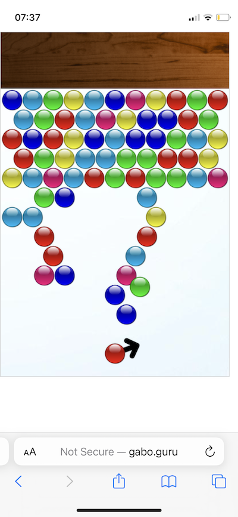
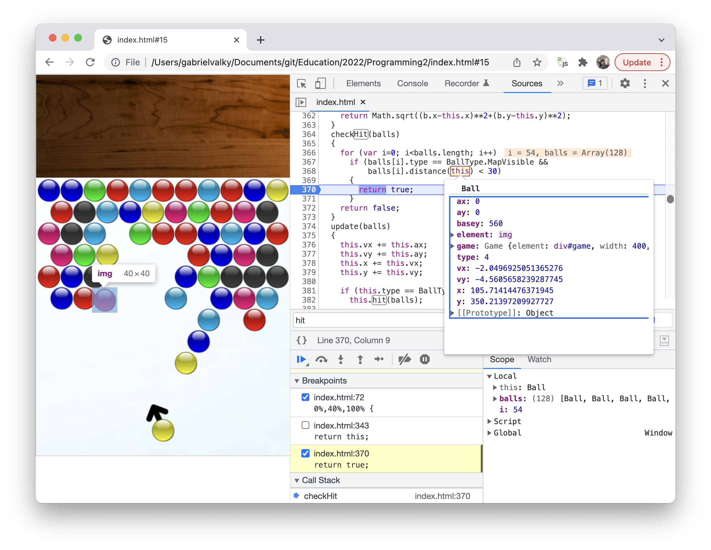

# Programovaci bootcamp
V sérii štyroch workshopov si postupne naprogramujeme jednoduchú 2D hru v štýle "Frozen bubble”. Hru bude možné ovládať klávesnicou, myšou alebo dotykovým displejom. Keďže bude vytvorená v jazyku Javascript, budeme ju môcť spustiť na počítači, ľubovolnom telefóne alebo aj na niektorých smart TV.
Jednoduchý 2D engine s fyzikou nám pomôže vysvetliť pojmy ako súradnicová sústava, vektor rýchlosti a zrýchlenia. Pre prácu s vektormi a pre určenie ich veľkosti a smeru budeme používať goniometrické funkcie a Pytagorovu vetu.
Bootcamp je určený pre účastníkov, ktorí už majú základné skúsenosti s programovaním, alebo už absolvovali ľubovolný workshop, kde sa programovalo.

Klikni pre spustenie hry:

## Workshop 1
Prvý workshop je určený na oboznámenie sa s vývojárskymi nástrojmi, ktoré sú súčasťou programu Chrome. Pozrieme sa na to, ako použiť Chrome na editovanie HTML kódu a taktiež ako takýto kód generovať prostredníctvom Javascriptu. Pre začiatočníkov si vysvetlíme, ako definovať a zavolať funkciu, ako "debugovať" neznámy kód, ako sa zapíše pole a ako adresujeme jeho prvky. 
V druhej polovici si vyskúšame dynamické vytvorenie nových HTML elementov s pomocou DOM (Document object model). Naprogramujeme si jednoduchý ping-pong, v ktorom sa gulička bude bude odrážať od stien hernej plochy. Vyskúšame vytvoriť jednoduchý fyzikálny model v ktorom sa bude na guličku pôsobiť gravitácia, tlmenie alebo vietor.

## Workshop 2
Ďalej budeme rozširovať program, ktorý sme vytvorili na predošlom workshope. Namiesto jednej guličky skúsime program naškálovať na 100 pohybujúcich sa guličiek. Pozrieme sa, ako takúto úlohu realizovať s pomocou polí a tried. Naučíme sa ako využiť generátor náhodných čísel pre vytvorenie rôznofarebných guličiek. Fyzikálny model rozšírime o výpočet kolízie dvoch gúľ. 
Jednoduchý herný engine rozšírime o ovládanie klávesnicou a myšou a pridáme animácie zobrazujúce víťazstvo a prehru.

## Workshop 3
Základom každej dobrej hry je nastavenie náročnosti tak, aby hra nebola príliš nudná a zároveň nie taká náročná, aby hráča frustrovala. Skúsime nadizajnovať levely hry tak, aby sa postupne náročnosť stupňovala a popri tom sme občas hráča prekvapili novou hernou mechanikou. Pridáme ďalšie herné prvky a animácie.
  
## Workshop 4
Upravíme hru, aby bola plnohodnotne hrateľná na telefóne. Zavesíme ju na verejne dostupný web server. Pridáme úvodnú obrazovku s výberom levelov a zvukové efekty. V tejto fáze by sme mali dosiahnuť kvalitnú hru, ktorá udrží pozornosť užívateľa. V porovnaní s hrami na Google play alebo Apple store nebude potrebné na telefón nič inštalovať, iba zadať správnu adresu do prehliadača.
