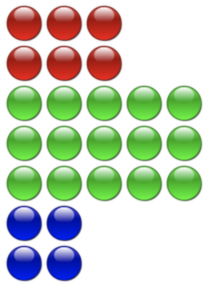

# 1. Zaklady programovania, DOM, fyzika

## 1.1. Opakovanie
  - chrome ako html editor
  - img src
  - generovanie html cez javascript
  - funkcia, pouzit konzolu na testovanie
  - **Uloha 1.1.1**

```html
<script>
// Co robi funkcia pokus?

function pokus(pocet, farba)
{
    var x = 1
    while (x <= pocet)
    {
        document.write("");
        x = x + 1
    }
    document.write("<br>")
}
</script>
```

  - **Uloha 1.1.2**

```html
<script>
// Co robi funkcia vykresli?
function vykresli(stlpcov, riadkov, farba)
{
    var y = 1
    while (y <= riadkov)
    {
        var x = 1
        while (x <= stlpcov)
        {
            document.write("");
            x = x + 1
        }
        document.write("<br>")
        y = y + 1
    }
}
</script>
```

  - prepis na for
  - **Uloha 1.1.3:** Nakreslit nasledujuci obazok s pomocou funkcie `vykresli`



  - Zellers algorithm
  - Nastudujte [Zellerov algoritmus](https://en.wikipedia.org/wiki/Determination_of_the_day_of_the_week)
  - Krokujte s debuggerom a zistite aky bol den v den vasho narodenia, prepis na matematicky vyraz
  - Funkcia `Math.floor`, modulo `%`
  - **Uloha 1.1.4**

```html
<script>
function Zeller(D, M, Y)
{    
    if (M < 3)
    {
        M = M + 12;
        Y = Y - 1;
    }
    
    var C = Math.floor(Y / 100);
    var K = Y - (100 * C);
    var S = Math.floor(13 * (M+1)/5) + Math.floor(K / 4) + Math.floor(C / 4) + D + K - (2 * C) + (7 * C);
    var ans = S % 7
    var dniVTyzdni = ["Sobota", "Nedela", "Pondelok", "Utorok", "Streda", "Stvrtok", "Piatok"]
    return dniVTyzdni[ans];
}

document.write(Zeller(15, 4, 1985))
</script>
```

  - debugovanie
  - Co vracia `Math.random()`? Ako to upravit aby vracalo nahodnu hodnotu v rozsahu 0..100
  - Nahodnu celociselnu hodnotu 1..6?
  - Nahodnu celociselnu hodnotu v rozsahu 10..100?
  - pole farieb
  - Aku hodnotu ma `p[1]`
  - **Uloha 1.1.5**

```html
<script>
// Aku hodnotu ma p[1], aku hodnotu ma p[1.5],  aku hodnotu ma p[10], aku hodnotu ma p.length?
// Co napisat aby nam vratilo cervenu farbu?
// Vypisat nahodnu farbu

p = ["cervena", "zelena", "modra", "biela", "cierna"]
</script>
```

## 1.2. Document object model
  - vytvorenie gulicky, program [clean00](clean00/index.html) [live](https://rawgit.valky.eu/gabonator/Education/master/2022/Programming2/clean00/index.html)
  - **Uloha 1.2.1**

```html
<script>
var element = document.querySelector("#game");
var ball = document.createElement("img");
ball.src = "red.png";
ball.setAttribute("style", "position:absolute");
element.appendChild(ball);
</script>
```

  - doplnit rozmery (parseint, ukazat v debugu suffix px), doplnit interval, sudadnice nastavit na stred
  - TEORIA - odkrokovat program, zmenit css styl canvasu, zistit suradnice, nastavit suradnice,
  - aku suradnicu musim nastavit aby bola gulicka uplne vpravo dole? (aby sa dotykala stien)
  - TEORIA - suradnicova sustava, vektor rychlosti, TODO: obrazok
  - `setInterval`, testovanie suradnic, vypocet offsetu gulicky, skontrolovanie rohov
  - vektor rychlosti [clean01](clean01/index.html) [live](https://rawgit.valky.eu/gabonator/Education/master/2022/Programming2/clean01/index.html)
  - odrazy [clean02](clean02/index.html) [live](https://rawgit.valky.eu/gabonator/Education/master/2022/Programming2/clean02/index.html)
  - gravitacia a tlmenie [clean03](clean03/index.html) [live](https://rawgit.valky.eu/gabonator/Education/master/2022/Programming2/clean03/index.html)
  - viacej guliciek [clean04](clean04/index.html) [live](https://rawgit.valky.eu/gabonator/Education/master/2022/Programming2/clean04/index.html)
  - DEMO: odpudzujuce sa magnety [live](https://rawgit.valky.eu/gabonator/Education/master/2022/Programming2/clean05/index2.html)

```javascript
    // damping 0.92, gravitaciu 0, 0.1, 0.2, 0.3
    ax[i] = 0;
    ay[i] = 0.1;
  
    for (var j=0; j<balls.length; j++)
      if (i!=j)
      {
        var ux = x[j] - x[i];
        var uy = y[j] - y[i];
        var angleRad = Math.atan2(uy, ux);
        var dist = Math.sqrt(ux**2+uy**2);
        if (dist < 50)
        {
          dist = 50-dist;
          ax[i] -= Math.cos(angleRad)*(dist/50)*3; 
          ay[i] -= Math.sin(angleRad)*(dist/50)*3; 
        } 
      }
```

  - demo: vodna hladina [clean5](clean05/index.html) [live](https://rawgit.valky.eu/gabonator/Education/master/2022/Programming2/clean05/index.html) - simulacia vesmiru, tvorba gule, kvapka, adhezia

```javascript
    // damping 0.9, skusit gravitaciu 0.1, 0.01, 0.003
    ax[i] = 0;
    ay[i] = 0.05;
  
    for (var j=0; j<balls.length; j++)
      if (i!=j)
      {
        var ux = x[j] - x[i];
        var uy = y[j] - y[i];
        var angleRad = Math.atan2(uy, ux);
        var dist = Math.sqrt(ux**2+uy**2);
        if (dist < 20)
        {
          dist = 21-dist;
          ax[i] -= Math.cos(angleRad)*(dist/50); 
          ay[i] -= Math.sin(angleRad)*(dist/50); 
        } else {
          ax[i] += Math.cos(angleRad)*(dist/10000)**2; 
          ay[i] += Math.sin(angleRad)*(dist/10000)**2; 
        }

      }
```

  - demo: pruzny odraz [clean6](clean06/index.html) [live](https://rawgit.valky.eu/gabonator/Education/master/2022/Programming2/clean06/index.html)

```javascript
  // damping 1
  for (var i=0; i<balls.length; i++)
  {  
    for (var j=i+1; j<balls.length; j++)
    {
      var ux = x[i] - x[j];
      var uy = y[i] - y[j];
      var dist = Math.sqrt(ux**2+uy**2);
      if (dist<40)
      {
        var mtd = 40-dist;
        var mtdx = ux/dist*mtd;
        var mtdy = uy/dist*mtd;
        var mtdl = Math.sqrt(mtdx**2+mtdy**2);
        x[i] += mtdx/2;
        y[i] += mtdy/2;
        x[j] -= mtdx/2;
        y[j] -= mtdy/2;

        mtdx /= mtdl;
        mtdy /= mtdl;
        var velx = vx[i] - vx[j];
        var vely = vy[i] - vy[j];
        var vn = velx*mtdx+vely*mtdy;
        if (vn < 0)
        {
          var rest = 1;
          var im = -(-(1+rest)*vn) / 2;
          var impx = mtdx*im;
          var impy = mtdy*im;
          vx[i] -= impx;
          vy[i] -= impy;
          vx[j] += impx;
          vy[j] += impy;
        }
      }
    }
```

