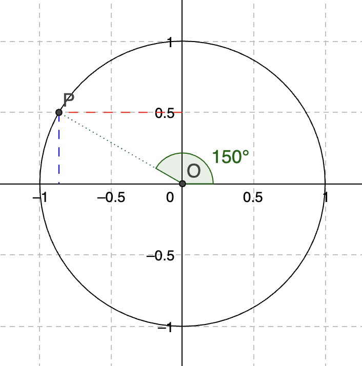
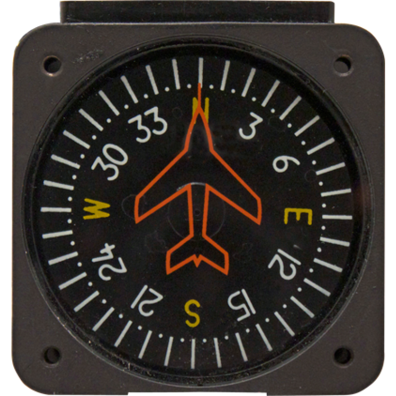
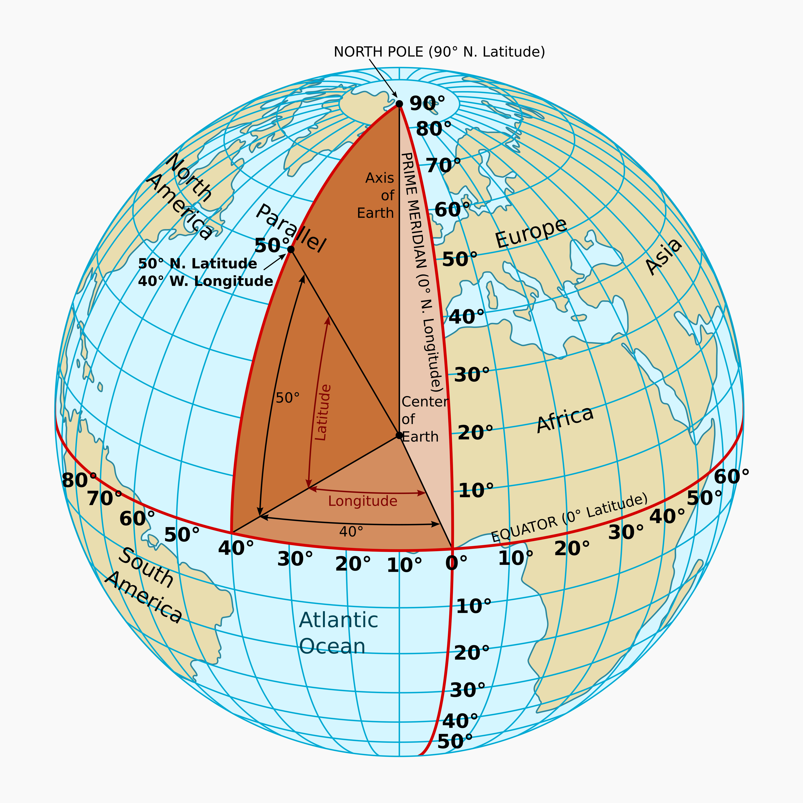

# Opakovanie pred tretim workshopom

## Suradnicove systemy







## Sorty

- [bubble sort a exchange sort](https://rawgit.valky.eu/gabonator/Education/master/2022/Programming2/sortdemo.html) 

## program 1 - stvorce

```javascript
for (var i=0; i<10; i++)
{
  document.write("stvorec so stranou", i, "ma obsah", "<br>")
}
```

- Upravte program tak, aby vypisal pre hodnoty od 1 po 10:

```
Stvorec so stranou 1 ma obvod 4 a obsah 1
Stvorec so stranou 2 ma obvod 8 a obsah 4
Stvorec so stranou 3 ma obvod 12 a obsah 9
...
```

## program 2 - pizza

- Napiste program, ktory vypise rozmer pizze v rozsahu 15cm az 50cm s krokom 1cm a napise ku nej ci je pizza mala, stredna alebo velka
- V ponuke https://pizzeriaab.sk/jedalny-listok/ pisu, ze maju tri velkosti pizze (28cm - mala, 32cm - stredna, 40cm - velka)

```
Pizza s priemerom 15 cm je mala
...
Pizza s priemerom 26 cm je mala
Pizza s priemerom 27 cm je mala
Pizza s priemerom 28 cm je mala
...
Pizza s priemerom 32 cm je stredna
...
Pizza s priemerom 40 cm je velka
Pizza s priemerom 50 cm je velka
```

## program 3 - posledna cifra (last digit)

```javascript
for (var i=1; i<=100; i++)
{
  document.write("Posledna cifra cisla", i, "je")
}

```

- Vypiste poslednu cifru z cisel 1 az 100

```
...
Posledna cifra cisla 54 je 4
Posledna cifra cisla 55 je 5
Posledna cifra cisla 56 je 6
Posledna cifra cisla 57 je 7
...
```

## program 4 - parne cisla (even/odd)


```javascript
for (var i=1; i<=100; i++)
{
  if (true)
    document.write("Cislo", i, "je parne")
  else
    document.write("Cislo", i, "je neparne")
}

```

- Upravte program tak, aby spravne vypisal ci je cislo parne alebo neparne

```
...
Cislo 5 je neparne
Cislo 6 je parne
Cislo 7 je neparne
Cislo 8 je parne
...
```
