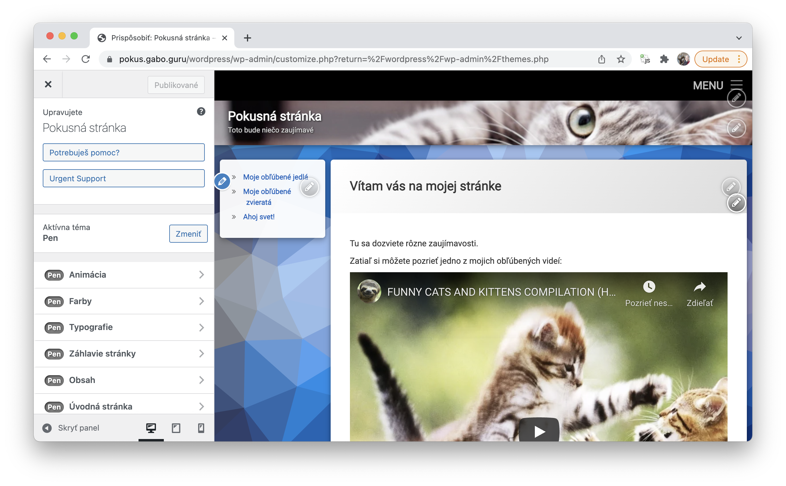
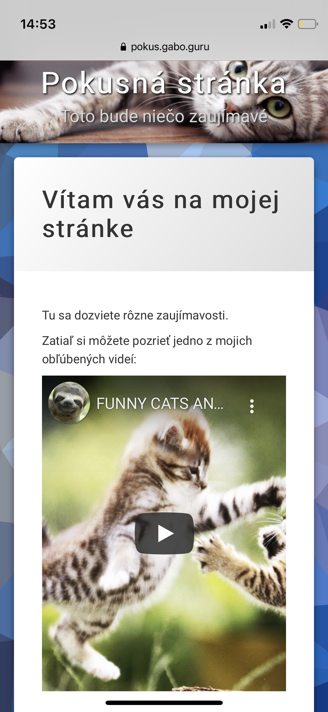

# Web1: Vytvor si vlastný web





## Annotacia

Webová stránka je pre firmu často prvým kontaktom s potenciálnym zákazníkom. Tak ako aj pri osobných stretnutiach je dôležité zanechať dobrý prvý dojem, tak aj webová stránka prezrádza mnohé o kvalitách a schopnostiach možného budúceho obchodného partnera.

Či už návštevník prichádza na stránku z mobilného telefónu alebo počítača s UHD monitorom, rozloženie prvkov na stánke sa musí vhodne prispôsobiť. Dôraz kladieme na čitateľnosť textu, ktorá je pre zvýšenie pútavosti vhodne doplnená názornými obrázkami vhodnej veľkosti. Technológia pre prispôsobenie sa cieľovému zariadeniu, či už sa jedná o veľkosť alebo orientáciu displeja, spôsob ovládania prstom alebo myšou nazývame responzívny dizajn.

Kvalitný obsah a vzájomne prepojené partnerské web stránky zaručujú dobré výsledky pri vyhľadávaní cez google alebo iný nástroj aj bez investovania do SEO optimalizácií.

Všetky požiadavky pre moderný web, responzívny dizajn a jednoduchú úpravu dizajnu riešia takzvané CMS (content management system) systémy. Po inštalácii na webový server sa spravujú cez jednoduché rozhranie podobné bežnému textovému editoru.

Pre tento workshop zvolíme program Wordpress, ktorý je jedným z najobľúbeneších bezplatných CMS systémov. Jeho výhodou je jednoduchá inštalácia a správa, a taktiež množstvo pluginov, ktorými vieme rozširovať jeho funkcionalitu, napríklad pridaním eshopu. 

Naučíme sa ako ďalej postupovať ak už máme registrovanú doménu a spárovanú s niektorým z web hostingových programov. Využijeme FTP prístup na uloženie nových súborov a vytvorenie jednoduchej testovacej stránky. Po stiahnutí a inštalácii Wordpressu ho nakonfigurujeme a skúsime vytvoriť zopár jednoduchých stránok. Aby sme našu novú stránku trochu ozvláštnili, vyberieme si jednu z mnohých farebých schém, ktoré wordpress ponúka.

Vytvorená webová prezentácia bude nasledujúci mesiac dostupná online. FTP prístupy, ktoré dostanete, môžete naďalej využívať po obmedzenú dobu a stránku upravovať aj po skončení workshopu.

Na workshop potrebujete: Počítač s webovým prehliadačom a mobilný telefón pre kontrolu responzívnosti webu. Pripravte si niekoľko krátkych textov s obrázkami alebo youtube videami o vašej skutočnej alebo fiktívnej firme, vašej osobe alebo myšlienke, ktorú chcete prostredníctvom webovej prezetácie ukázať svetu. 

Workshop je vhodný aj pre úplných začiatočníkov, treba však ovládať prácu so súbormi a textovým editorom ako MS Office Word. Poskytneme vám  všetky potrebné informácie ku inštalácii Wordpressu na novo založený web a vysvetlíme si nasledujúce pojmy: WEB, URL, DNS, HTTP, HTML, FTP, PHP, CMS, server, databáza a WordPress

## Prezentacia / osnova
- [Prezentacia](prezentacia.pdf)

## Poznamky
- https://www.zlavynahosting.sk/porovnanie-webhostingov/
- https://www.websupport.sk/
- vytvorit subdomenu
- vytvorit index.html

```html
<html>
    <head>
        <meta charset="UTF-8">
    </head>
    <body>
        Toto je moja prvá stránka
    </body>
</html>
```

- ziskat obrazok "Copy image location"
- https://www.timeforkids.com/wp-content/uploads/2020/08/animalVoting.jpg?w=640
- url argumenty
- premenovat

```html
<html>
    <head>
        <meta charset="UTF-8">
    </head>
    <body>
        Toto je moja prvá stránka
        
    </body>
</html>
```
- stiahnut wordpress 
- https://sk.wordpress.org/latest-sk_SK.zip
- nastavit wordpress
- instalacia
- redirect

```html
<html>
    <head>
        <meta http-equiv="refresh" content="0; url=/wordpress"/>
    </head>
</html>

<!--
<html>
    <head>
        <meta charset="UTF-8">
    </head>
    <body>
        Toto sú asi surikaty:<br>
        
    </body>
</html>
-->
```

- upravit welcome stranku
- otestovat na telefone
- nainstalovat PEN temu
- obrazky na pozadi -> stranka -> stmievajte svetla
- pata stranky -> vypnut
- kontaktne informacie -> feed
- nastavenie -> citanie -> o stranke -> ulozit zmeny
- pozor na widgety
- pozadie nepouzivat obrazok (obrazok na pozadi -> stranka -> dynamicky obrazok na pozadi)
- zahlavie stranky -> registracia -> vzdy, nabadat
