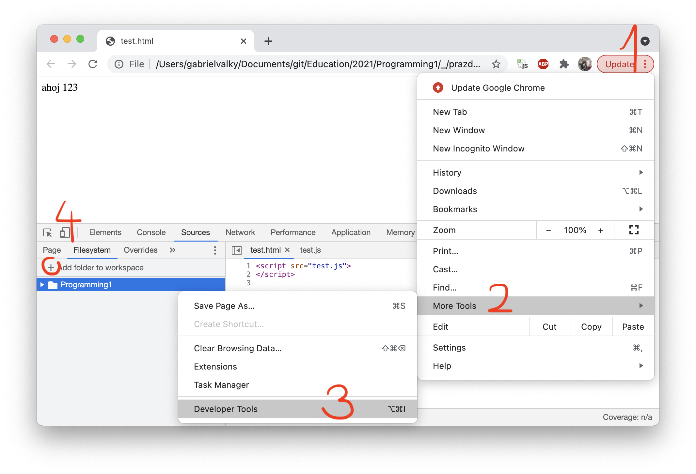
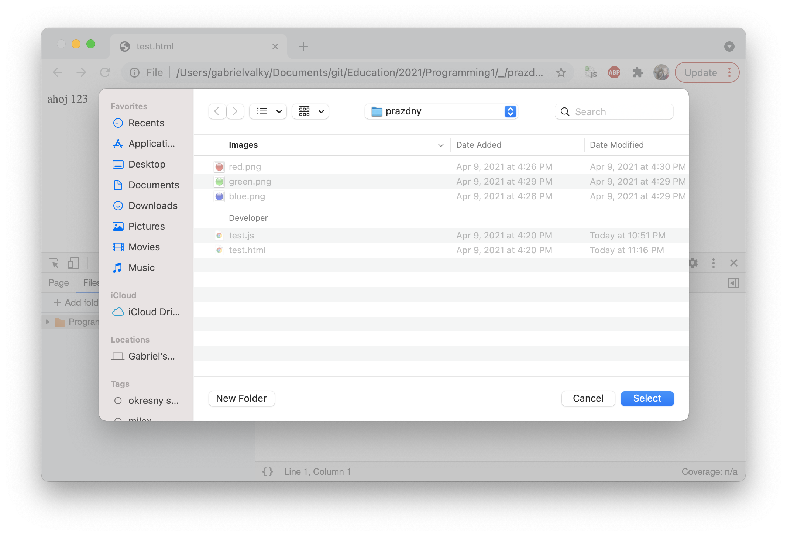
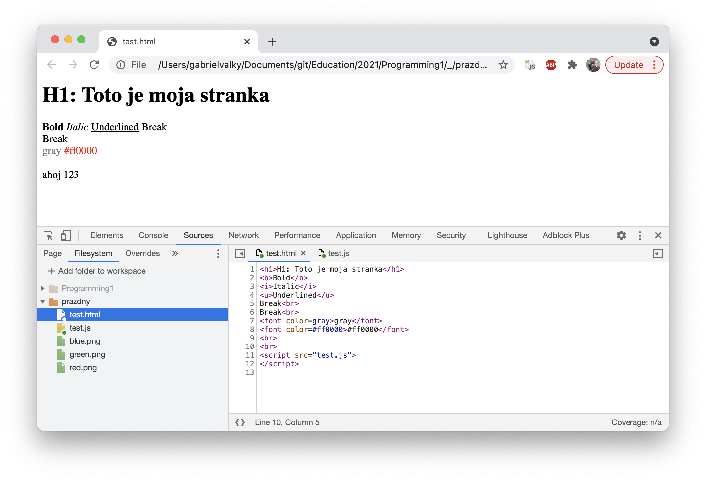

# Programovane: Sokoban

## Priprava

- **nainstalovat anglicku klavesnicu**, zistit ako sa prepinaju klavesnice
- nainstalovat a updatnut Chrome
- stiahnite si [balicek](prazdny.zip)
- rozbalte a otvorte test.html v Chrome
- otvorte developer konzolu (Ctrl + Shift + J, alebo tri bodky vpravo hore, More Tools -> Developer Tools)
  
- pridajte adresar s rozbalenym balickom Source -> Filesystem -> Add folder to workspace
  
- vyskusajte modifikovat test.html. Pri kazdom zmenenom subore sa zobrazi hviezdicka. Treba subor ulozit (Ctrl + S) a refreshnut stranku (Ctrl + R)
  
- Prepinte sa na Anglicku klavesnicu (popripade nainstalujte ak este nemate, kedze Slovenske rozlozenie klaves je nevhodne na programovanie) a skuste prepisat nasledovny kod (pre kontrolu ci viete najst kazdy specialny znak):

```html
<html>
<script>
function pocitaj(pocet)
{
  var sum = 1;
  var sign = -1;

  for (var i = 1; i < pocet; i++)
  {
      sum += sign / (2 * i + 1);
      sign = -sign;
  }
  return 4 * sum;
}

document.write("Pi je " + pocitaj(200000).toFixed(5));
document.write("<br>Mam rad " + ["pomarance", "jablka", "jahody"][Math.floor(Math.random()*3)]);
</script>
</html>
```

- Pri programovani pouzivame rozne druhy zatvoriek a symbolov. Nastavte si anglicku klavesnicu, a zistite ako sa pisu nasledujuce znaky:
  - plus +
  - minus -
  - krat *
  - deleno /
  - percento %
  - rovna sa =
  - zatvorka lava (
  - zatvorka prava )
  - zlozena zatvorka lava {
  - zlozena zatvorka prava }
  - hranata zatvorka lava [
  - hranata zatvorka prava ]
  - symbol mensie <
  - symbol vacsie >
  - vykricnik !
  - bodka .
  - ciarka ,
  - bodkociarka ;
  - or (pipe, zvisla ciara) |
  - and (ampersand) &
  - uvodzovka dvojita "
  - uvodzovka jednoducha '
