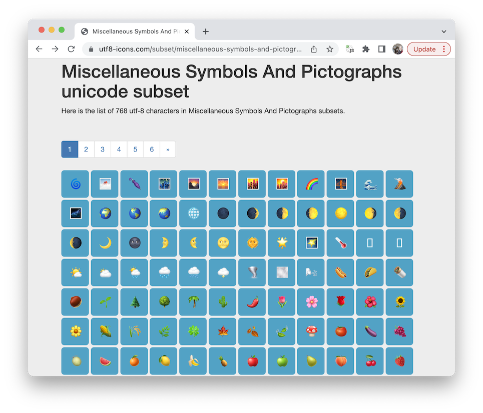

# Programovane: Sokoban

## Anotácia besedy:
Aké sú naše možnosti pri vytváraní hier, ak sme progamátori začiatočníci? Dokáže aj indie developer (jednotlivec) konkurovať veľkým herným štúdiám? Ako speňažiť hru? Na besede si zodpovieme niekoľko podobných otázok, ktoré by mohli budúceho herného vývojára zaujímať. Počas workshopu budeme intenzívne pracovať s UTF8 emotikonmi, a preto je vhodné vysvetliť si, čo je to “bajt”, ako je text uchovaný na harddisku a prečo sa niekdy pri prehrávaní videa zobrazia titulky s chybnými znakmi. 

## Anotácia workshopu:
Ak sa opýtate programátora, aký bol jeho prvý program ktorý napísal, tak jednou z častých odpovedí bude: “Hra”.
Programovanie hry je zábavnou cestou k budovaniu základneho algoritmického myslenia. Ak sa vám podarí rozpohybovať panáčika, pridáte bludisko z ktorého má nájsť východ a ďalšie herné prvky, až dostanete program, ktorý dokáže udržať pozornosť hráča celé hodiny.
Niekedy hra nadchne vizuálnym spracovaním, inokedy prelomovou hernou mechanikou a nie výnimočne aj kombináciou oboch. 
Na tomto workshope sa zameriame na jednoduchú mechaniku, základne stavebné prvky ťahovej puzzle hry a namiesto sofistikovanej grafiky použijeme UTF8 emotikony, ktoré poznáte z chatovacích aplikácií. 
Hru budeme vytvárať priamo v prehliadači Chrome v jazyku Javascript s použitím HTML DOM (Document object model) technológie, ktorá poskytuje výkonný renderovací nastroj na ľubovolnú 2D hru.

Na konci prvého workshopu bude mať každý účastník vytvorenú unikátnu hru v Javascripte, ktorú bude tvoriť zhruba 100 riadkov kódu.

Na druhom workshope pridáme do hry ďaľšie prvky ako dvere, kľúče, posúvateľné objekty a vytvoríme hru typu Sokoban. Pre spestrenie hernej mapy pridáme aj textúry reprezentujúce trávu a steny bludiska. Hra je v tomto bode “ťahová”, neexistuje v nej čas a kým hráč nestlačí klávesu, nič sa nedeje. 
Ako budeme hru ďalej rozvíjať, závisí od šikovnosti účastníkov. Možností je viacero:
- Úprava renderera, aby nevykresľoval celú mapu naraz, ale iba blízke okolie hráča. Vďaka tomu bude prechod bludiskom oveľa komplikovanejší
- Pridanie časového elementu: môžeme rozanimovať niektoré predmety v hre, alebo pridať nepriateľa, ktorý sa nás snaží chytiť
- Viac levelov: Po dosiahnutí cieľa zobrazíme nasledujuci level

## Obrazky

## Priprava

- [Priprava pre ucastnikov](priprava/priprava.md)

## Ulohy
- [Zoznam uloh](ulohy.md)
