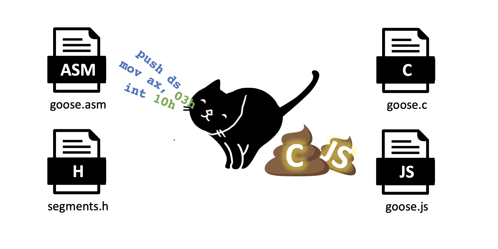
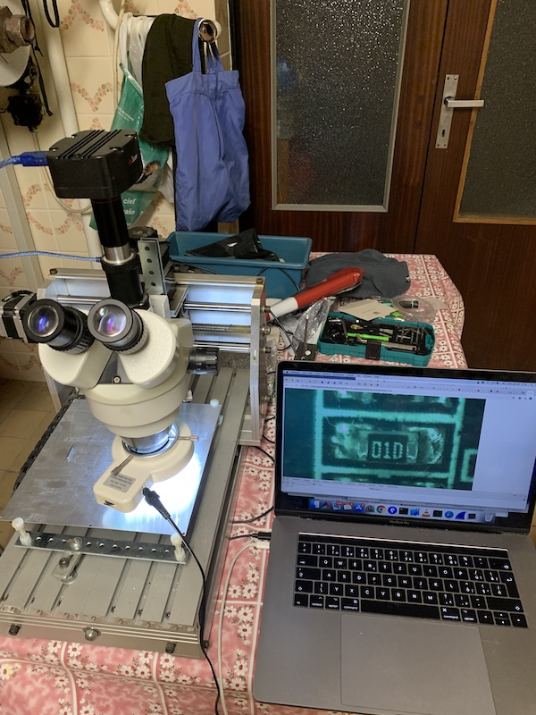
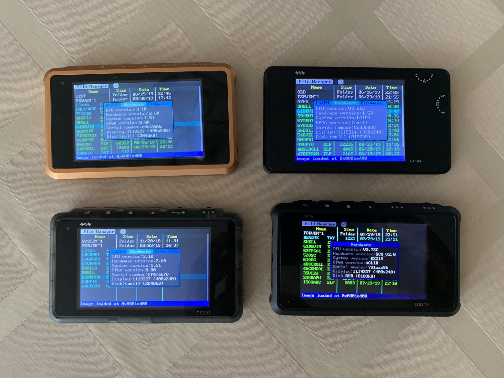
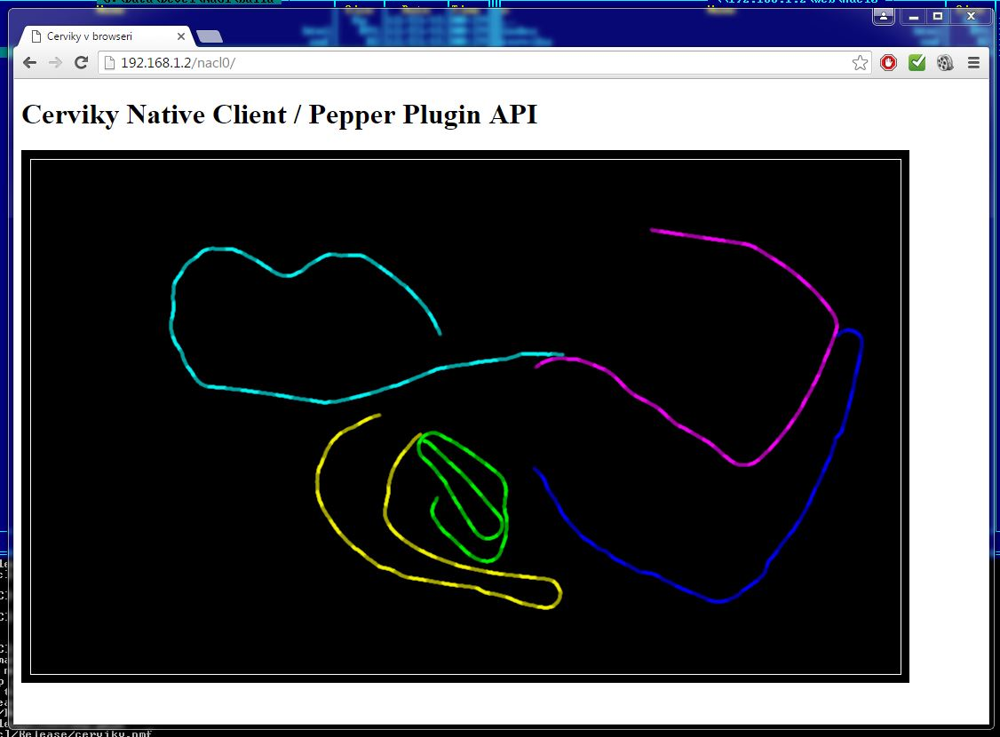
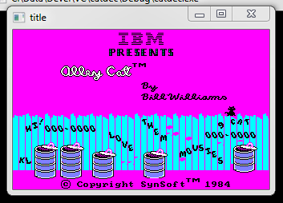
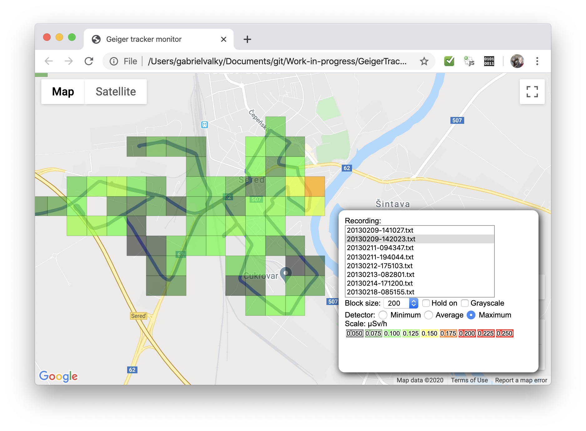
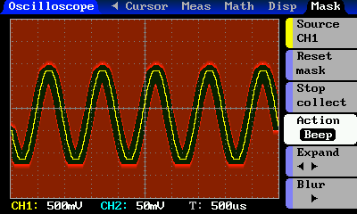

# Gabriel valky

In this list you will see some interesting projects I was working on

## 2022

### Webfox HD
- [webfox](res/2022_webfox.png)
- Porting DOS game with advanced copy protection into javascript
- used Cicoparser with Ghidra
- HD remake: custom renderer with 4x upscaled game map split into layers to build three level parallax
- Gameplay: smooth scrolling, extended view from 320x200 to 400x200
- Game music: Amiga MODs converted into MIDI with nodejs, remastered and rendered in Garageband
- Added sound effects
- Play online: [https://l.valky.eu/webfox](https://l.valky.eu/webfox)

### Gabuino
- [gabuino](res/2022_gabuino.jpg)
- Arduino like IDE with debugging and advanced visualisation features. 
- Cloud compilation targeting the RAM of STM32F103 achieves incredible deployment speed. 
- The application is built and flashed in under 300ms. 
- No software package necessary to install, everything runs in web browser with the help of web usb technology.
- Project: [https://github.com/gabonator/LA104/tree/master/system/apps_featured/117_gabuino](https://github.com/gabonator/LA104/tree/master/system/apps_featured/117_gabuino)
- Video: Gabuino: Arduino with debugging and a lot of more

## 2021

### Alta gate reverse engineering
- [ag1k](res/2021_ag1kfpga.png)
- Reverse engineering of encryption algorithm
- https://github.com/gabonator/Education/tree/master/2021/AltaGateReverse
- Building standalone package for automated building of FPGA images for Alta Gate devices with Intel/Altera Quartus
- https://github.com/gabonator/LA104/discussions/81
- Reverse engineering of flashing protocol for AltaGate FPGAs
- Flashing utility with integrated validation (the same codebase shared between verilator and FPGA)
- https://github.com/gabonator/LA104/tree/master/system/apps/123_fpga

### Cicoparser
- [CicoParser](https://github.com/gabonator/Education/tree/master/2021/CicoParser) is a set of tools for conversion of IBM PC DOS applications into modern operating systems. Instead of emulation of the computer CPU, memory and peripherals, CicoParser translates assembly code of the program into C language and therefore achieves much higher performance than emulation. This also offers unlimited possibilities to extend or improve the original application
- 
- Video: Full game reverse engineering in 20 minutes

## 2020

### LA104 Logic analyser custom firmware
- Custom firmware for LA104 logic analyser
- Full featured hardware hacker toolkit
- 

### RF Toolkit

Ultimate toolkit for hacking OOK/ASK wireless devices (weather stations, wireless keys...) using CC1101 transceiver
- Hardware / software project running on LA104 (Arm M3 STM32F103)
- useful for capturing weather station signals / all wireless devices using OOK/ASK modulation
- synthesizing fake packets and sending them back to weather stations
- web usb analyser running in web browser with RTL433 library (very popular library for decoding ook modulations)
- spectrum analyser

### Voice controlled beer hoist
- Hardware / software project with offline hotword voice analyser running on Raspberry pi
- Project in progress. Raspberry pi runs snowboy hotword detection library. Recognized commands are sent through bluetooth to arduino based controller which controls hoist. Precise control of hoist is achieved using hall sensor counting the hoists drum turns. 
- [Code](https://github.com/gabonator/Projects/tree/master/BeerHoist)
- video:

### Reverse engineering of USB camera protocol
- Reverse engineering, USB protocol, software
- Laboratory grade 10Mpx camera for use in microscopes with no support for OSX
- Protocol was captured on windows machine using their own camera software with Wireshark
- Simple bayer demosaicing and exposure control
- [Code](https://github.com/gabonator/Work-in-progress/blob/master/AmScope/main.cpp)

## 2019

### Laser projector experiments
- Software project, protocol reverse engineering
- Galvanometer based laser RGB projector system allows remote control using bluetooth. Protocol was reverse engineered by analysing android application supplied by the manufacturer.
- [Protocol reverse engineering](https://github.com/gabonator/Work-in-progress/tree/master/RgbLaserProjector)
- Various 2D / 3D geometry generating algorithms were designed in javascript, the animation was generated offline and then uploaded to the projector
- See online: [wormhole](https://rawgit.valky.eu/gabonator/Work-in-progress/master/LaserApps/wormhole/index.html), [spiral](https://rawgit.valky.eu/gabonator/Work-in-progress/master/LaserApps/spiral3d/index.html)
- [Code](https://github.com/gabonator/Work-in-progress/tree/master/LaserApps)
- Development of interactive version using ILDA interface is in progress...
- Video:
 

### Lectures for Creative point (Slovak business agency)

- Technology related lectures on electronics
- Teaching how to make simple arduino base projects for attendees with no previous engineering experience, e.g.: [Midi synthesizer with capacitive sensing](https://github.com/gabonator/Education/tree/master/2019/MidiSynth), [Simple IoT weather station](https://github.com/gabonator/Education/tree/master/2019/creativePointWeather), [Laser projector with two servo motors](https://github.com/gabonator/Education/tree/master/2019/Servo)...

### Webusb oscilloscope with DS203
- Microcontroller software project with WebUSB technology
- WebUSB allows web browser to talk to USB peripherals
- [Full project description](https://github.com/gabonator/Education/blob/master/2019/WebUsb/readme.md)
- Video: 

### Operating system for ARM M3 (STM32F103)
- Microcontroller software project
- [Full project description](https://github.com/gabonator/LA104)
- 

## 2018

### Rigidity measurement system with CDC
- Hardware / software project with ESP8266 and load sensor
- The rigidity and damping effect of plastic shock absorber for HVAC systems is being analysed. The plastic absorber introduces small hole in its piston to allow the air to flow in and out when the piston is pressed. The manufacturer wanted to examine the behaviour of the absorber and verify if the damping attributes are in allowed range.
- System is based on Load sensor cell which measures what force is produced when the CDC machine pulls the piston in and out. Measured values are transmitted over WiFi to software running on computer (web based application communicating through websockets with the ESP8266 MCU)
- [Code](https://github.com/gabonator/Projects/tree/master/CncRigidityMeas)
- Video: 

## 2016

### Tuneller in NaCl
- Software, Pepper NaCl
- Google's Native Client technology allows running native code in web browser
- Multiplayer tunellers game (in C++) was designed and players can join the game just by opening a web page
- NaCl techology later was deprecated by google and replaced by Wasm
- [Code](https://github.com/gabonator/Work-in-progress/tree/master/ChromeNaCl/tuneller)
- Picture of another NaCl game, screenshot TBD: 

### Custom MESH wireless stack
- Software, hardware, microcontroller
- Allows building complex mesh networks with CC1101 transceiver
- [Full project description](https://github.com/gabonator/Work-in-progress/tree/master/PanstampSwap)

### Download manager with voice captcha cracker
- Software project, signal analysis
- Integration with Synology disk station
- [Voice recognition](https://github.com/gabonator/Work-in-progress/tree/master/SynologySearchEngine/UlozToCz)
- [Synology download station integration](https://github.com/gabonator/SynologyUlozTo)

## 2014

### HW Reverse engineering of Garmin HUD
- Hardware, reverse engineering
- Garmin HUD display is a device which shows you the driving instructions after pairing with compatible navigation app over bluetooth
- [Code](https://github.com/gabonator/Work-in-progress/tree/master/GarminHud)
- [Hackaday article](http://hackaday.com/2014/03/30/controlling-the-garmin-hud-with-bluetooth/)
- Video:

### DOS Games running in web browser
- Software project, reverse engineering
- Games were disassembled using IDA, generated assemby was fed through processor which turns the instructions into javascript or C++
- Web browser simulates graphics card and programmable interrupt controller and other necessary components
- 
- Play online: [Alley cat](https://rawgit.valky.eu/gabonator/Work-in-progress/master/DosGames/CicParser2017/js/test.html), [Star goose](https://rawgit.valky.eu/gabonator/Work-in-progress/master/DosGames/JsGoose/index.html)
- Code: [Alley cat](https://github.com/gabonator/Work-in-progress/tree/master/DosGames/CicParser2017), [Star goose](https://github.com/gabonator/Work-in-progress/tree/master/DosGames/JsGoose)

## 2013

### Label generator for CNC machine
- Software
- CNC G-code generator for engraving labels
- [Projet description and code](https://github.com/gabonator/Projects/tree/master/TypoCnc)
- [Try online](https://rawgit.valky.eu/gabonator/Projects/master/TypoCnc/typo.html)

### Geiger tracker
- Hardware / Software project
- Geiger Counter and GPS is attached to a laptop computer and this mobile station measures levels od ionizing radiation during driving and results are visualized in a map
- [See online](https://rawgit.valky.eu/gabonator/Work-in-progress/master/GeigerTracker/visualization/index.html)
- [Code](https://github.com/gabonator/Work-in-progress/tree/master/GeigerTracker/visualization)

### DS203 Oscilloscope firmware
- Software microcontroller project
- DS203 oscilloscope firmware with advanced features
- [Full project description](https://github.com/gabonator/DS203)
- 

## Papers:
- 2013 [Greenhouse monitoring system](http://gabo.valky.eu/?data/research/elitech2013.txt)
- 2012 [Signal processing and reconstruction](http://iris.elf.stuba.sk/JEEEC/data/pdf/7s_112-19.pdf)
- 2012 [ECG measurement system with novel visualization](http://gabo.valky.eu/data/about/bhi2012_paper.pdf)

## Todo:
- Moooby.tv flash multiplayer games 
- ORK100
- AtomClock
- Webotherm
- add thesis to papers
- keybug
- rift ravo reverse engineering
